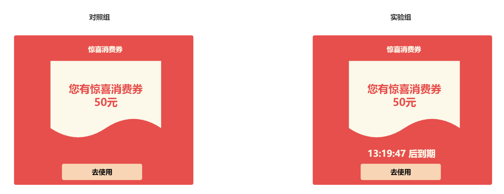
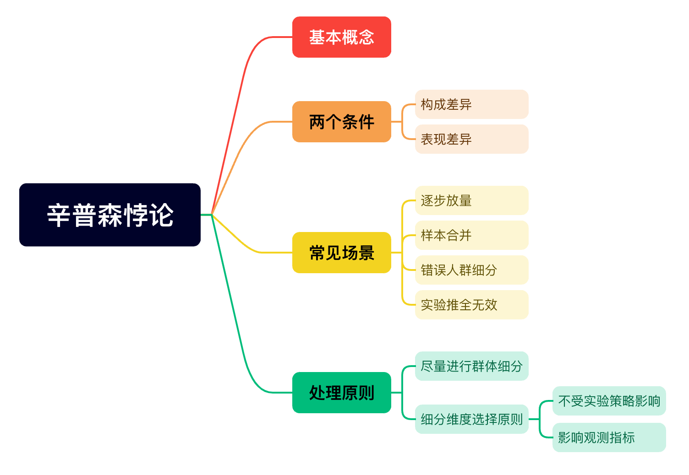

# 我的策略真的有效吗？——AB实验第10期

> 嗨~ 大家周末好呀，很开心再次与大家见面，苏晓糖前面9期聚焦于AB实验的基本流程，接下来的数期内容会重点讨论一些AB实验中的常见问题，敬请期待哦~ 本期内容苏晓糖则会讨论AB实验中的一个经典性的问题——辛普森悖论。好啦，闲话不多说，一起进入咱们本期的内容主题吧！

## 情景导入

以第9期内容中优惠券弹窗实验为例，假设在进行实验数据回收时发现实验组相对对照组的人均GMV有提升，但是细分到高消费人群和低消费人群后进行对比发现均无提升，请问这是什么原因导致的呐？请停下来思考10秒钟哦~

## 内容框架

本期内容主要讨论统计学中的经典悖论——辛普森悖论，主要内容包括以下3个方面：

- 基本概念
- 两个条件：构成差异、表现差异
- 常见场景：逐步放量、错误的人群细分、样本合并、实验推全无效

## 基本概念

在AB实验中，聚合数据的趋势与子群体数据的趋势表现相反或矛盾时，就可能出现辛普森悖论。以情景导入中的问题为例，为不失一般性，假设大盘中高消费人群和低消费人群比例构成为10%:90%，对照组和实验组中流量各10000人，高消费人群GMV均为10000元，低消费人群GMV均为1元，**由于分流的随机性**，对照组中高消费人群:低消费人群=10%:90%，实验组中高消费人群:低消费人群=10.1%:89.9%, 则可能出现以下表格数据：

| 版本        | 高消费人群              | 低消费人群          | 合计                      |
| ----------- | ----------------------- | ------------------- | ------------------------- |
| 对照组      | 1000人，人均GMV 10000元 | 9000人，人均GMV 1元 | 10000人，人均GMV 1000.9元 |
| 实验组      | 1010人，人均GMV 10000元 | 8990人，人均GMV 1元 | 10000人，人均GMV 1010.9元 |
| 人均GMV提升 | 0元                     | 0元                 | 10元                      |

从上表中，我们可以发现，由于高消费人群和低消费人群的人均GMV相差10000倍，由于分流的随机性，即使实验组中高消费人群和低消费人群的人群比例构成仅略有偏离，也导致实验组的人均GMV相较于对照组提升了10元(约1%)。很显然，该差异并非新策略带来，而是由于对照组和实验组中的高消费人群和低消费人群的比例构成存在差异导致。

## 两个条件

在基本概念部分中，我们可以发现辛普森悖论出现需要同时满足两个条件：

- 不同子群体的指标表现存在差异
- 子群体的构成存在差异，哪怕差异很小

仍旧以情景导入中的问题为例，我们来分别探讨假设以上任意一个条件不满足时会出现什么情况：

- 假设不同子群体的指标表现无差异，比如高消费人群和低消费人群的GMV均为1000元，我们发现无论是在高消费人群中、低消费人群群还是高消费人群和低消费人群合并后，对照组和实验组均无差异。

  | 版本        | 高消费人群              | 低消费人群              | 合计                     |
  | ----------- | ----------------------- | ----------------------- | ------------------------ |
  | 对照组      | 1000人，人均GMV 10000元 | 9000人，人均GMV 10000元 | 10000人，人均GMV 10000元 |
  | 实验组      | 1010人，人均GMV 10000元 | 8990人，人均GMV 10000元 | 10000人，人均GMV 10000元 |
  | 人均GMV提升 | 0元                     | 0元                     | 0元                      |

- 假设子群体的构成完全一致，比如高消费人群:低消费人群 = 10%:90%, 我们发现无论是在高消费人群中、低消费人群群还是高消费人群和低消费人群合并后，对照组和实验组均无差异。

  | 版本        | 高消费人群              | 低消费人群          | 合计                      |
  | ----------- | ----------------------- | ------------------- | ------------------------- |
  | 对照组      | 1000人，人均GMV 10000元 | 9000人，人均GMV 1元 | 10000人，人均GMV 1000.9元 |
  | 实验组      | 1000人，人均GMV 10000元 | 9000人，人均GMV 1元 | 10000人，人均GMV 1000.9元 |
  | 人均GMV提升 | 0元                     | 0元                 | 0元                       |

由此可见，当以上任意一个条件不满足时，辛普森悖论就不会出现。

## 常见场景

在AB实验中，可能出现辛普森悖论常见于以下4个场景：**逐步放量、错误的人群细分、样本合并、实验推全无效**。

### 逐步放量

在第4期中，我们讨论过基于逐步放量原则来避免实验风险，即逐步提升实验组分配实验总流量的比例(如5%→10%→20%→30%→50%)。假设我们在第一天的流量分配设定为 对照组:实验组=95%:5%, 第二天的流量分配设定为对照组:实验组=50%:50%。第一天入组用户的人均GMV均为1000元，第二天入组用户的人均GMV均为900元，实验策略本没有效果，但是因为流量配比发现变化的影响，两天的样本合并后，实验组的新策略反而人均GMV下降了56.4元。

| 版本        | 第一天                 | 第二天                | 合计                     |
| ----------- | ---------------------- | --------------------- | ------------------------ |
| 对照组      | 9500人，人均GMV 1000元 | 5000人，人均GMV 900元 | 14500人，人均GMV 965.5元 |
| 实验组      | 500人，人均GMV 1000元  | 5000人，人均GMV 900元 | 5500人，人均GMV 909.1元  |
| 人均GMV提升 | 0元                    | 0元                   | -56.4元                  |

因此，**在使用逐步放量的实验场景下，我们要对不同放量阶段的指标表现进行分组对比分析，防止潜在的辛普森悖论导致我们做出错误的实验决策**。

### 错误的人群细分

在第9期中，我们提到**在进行维度下钻时，应使用不受实验策略影响的分类维度进行分析**，其中一个原因是，假设使用受实验策略影响后的分类维度进行细分，可能会存在辛普森悖论的问题。以情景导入中的问题为例，假设我们使用实验开始前的用户活跃度进行细分，有以下结果，实验策略对高活跃用户人均GMV提升10元，低活跃用户人均GMV提升5元，总体提升6.5元：

| 版本        | 高活跃                | 低活跃               | 合计                 |
| ----------- | --------------------- | -------------------- | -------------------- |
| 对照组      | 3000人，人均GMV 200元 | 7000人，人均GMV 50元 | 10000人，人均95元    |
| 实验组      | 3000人，人均GMV 210元 | 7000人，人均GMV 55元 | 10000人，人均101.5元 |
| 人均GMV提升 | 10元                  | 5元                  | 6.5元                |

假设实验策略会提升用户活跃度，即让实验前低活跃用户变成高活跃用户，若我们使用变化后的标签进行分组分析，可能会出现以下结果，用户活跃度由低活跃转为高活跃，一般而言，会产生两种影响：

- 该部分活跃度提升用户的人均GMV要比始终是低活跃的用户人均GMV高，该用户跃迁至高活跃群组，必然导致低活跃用户的人均GMV下滑，如从原来的50元下滑至45元

- 该部分活跃度提升用户的人均GMV要比始终是高活跃的用户人均GMV低，该用户跃迁至高活跃群组，必然导致高活跃用户的人均GMV下滑，如从原来的200元下滑至186.2元

  从而出现下表中的结果，细拆活跃度后，实验组高活跃用户和低活跃用户的人均GMV均下降，但整体有所提升。

| 版本        | 高活跃                  | 低活跃               | 合计                 |
| ----------- | ----------------------- | -------------------- | -------------------- |
| 对照组      | 3000人，人均GMV 200元   | 7000人，人均GMV 50元 | 10000人，人均95元    |
| 实验组      | 4000人，人均GMV 186.2元 | 6000人，人均GMV 45元 | 10000人，人均101.5元 |
| 人均GMV提升 | -13.8元                 | -5元                 | 6.5元                |

因此，在进行实验数据分析时，**应避免使用可能受到实验策略影响发生变化的维度进行细分分析**。

### 样本合并

有时我们会在不同的客户端、不同的国家(或地区)分别进行实验，然后将实验数据进行合并分析的场景。同时不同的客户端类型、不同的国家(或地区)的客户结构可能存在差异，因此新策略在不同的实验中可能存在差异性，如iOS端的实验效果与Android端不同。以情景导入的问题为例，假设我们将实验分别在iOS和Android两端进行实验，然后将两个客户端的实验数据合并分析，并进行实验决策，此时很可能遇到辛普森悖论的问题。假设实验1(iOS端)的流量配比为 1:1，实验2(Android端)的流量配比为 3:4，则可能会出在两个实验中的数据均表明实验策略对人均GMV存在提升作用，但合并后，实验组的人均GMV反而下降。

| 版本        | 实验1(iOS端)           | 实验2(Android端)      | 合计                  |
| ----------- | ---------------------- | --------------------- | --------------------- |
| 对照组      | 1000人，人均GMV 1000元 | 3000人，人均GMV 600元 | 4000人，人均GMV 700元 |
| 实验组      | 1000人，人均GMV 1010元 | 4000人，人均GMV 610元 | 4000人，人均GMV 690元 |
| 人均GMV提升 | 10元                   | 10元                  | -10元                 |

从此处的例子来看，我们**应当避免对不同实验下的样本进行合并分析**。

### 实验推全无效

**有时我们发现在实验期间有效的策略，在推全后发现大盘数据表现没有预期的提升。其中的一个原因是辛普森悖论问题引起的，即实验期间的流量构成与推全后的大盘流量构成存在差异**。以情景导入中的问题为例，假设在实验期间发现，实验组新策略使人均GMV提升 90元，且老用户对新策略的表现更敏感(1元 vs 100元)，：

| 版本        | 新用户               | 老用户                | 合计                     |
| ----------- | -------------------- | --------------------- | ------------------------ |
| 对照组      | 1000人，人均GMV 50元 | 9000人，人均GMV 100元 | 10000人，人均GMV 95元    |
| 实验组      | 1000人，人均GMV 51元 | 9000人，人均GMV 200元 | 10000人，人均GMV 185.1元 |
| 人均GMV提升 | 1元                  | 100元                 | 90.1元                   |

同时有新用户:老用户=1:9，假设最近我们在大量拉新，流量构成变为新用户:老用户=7:3，此时大盘人均GMV变为95.7元(51×0.7+200×0.3)，与实验期间的对照组整体表现基本一致。

因此当我们发现实验策略在推全后大盘表现没有明显变化，很可能是因为推全后的大盘流量构成发生了巨大的变化。

## 如何处理辛普森悖论

在常见的四个场景中，我们发现逐步放量、样本合并、实验推全无效的三个场景似乎都指向尽量通过细分群体的表现进行实验决策，而错误的人群细分场景则说明应避免通过细分群体的表现进行实验决策。细分或不细分似乎都可能遇到辛普森悖论，那我们到底应该如何进行处理呐？ **基本原则就是，无论总体情况如何，都建议选择那些不受实验策略影响，且会影响观测指标的分类维度进行下钻分析，如客户端类型、实验开始前的用户活跃度、实验开始前的用户消费水平。**

## 资源推荐

- 《硅谷增长黑客实战笔记》——曲卉著
