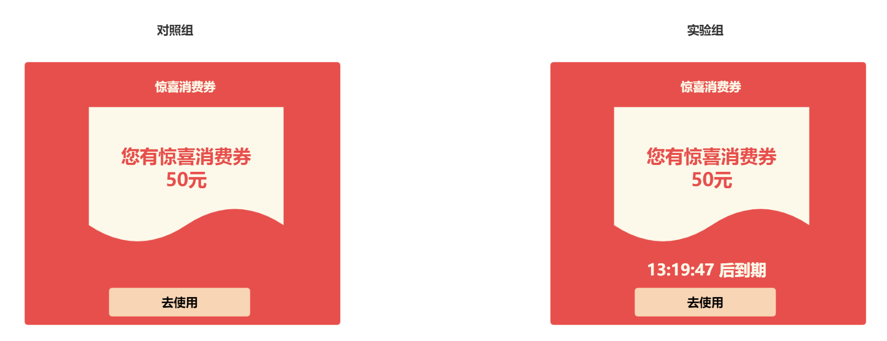
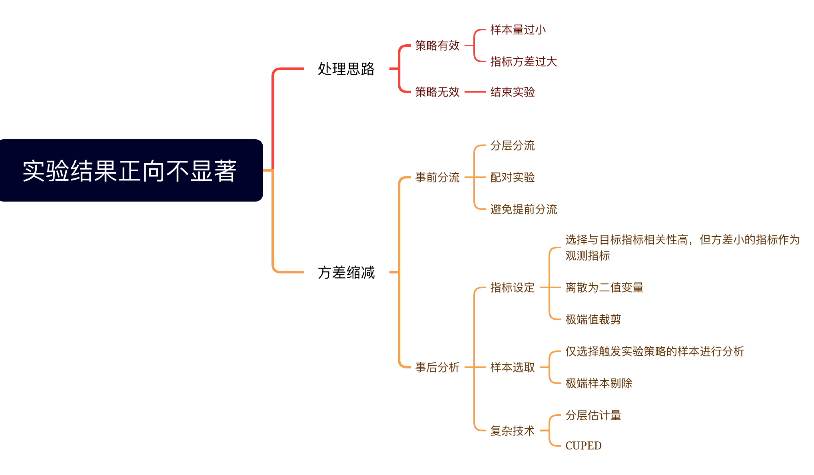
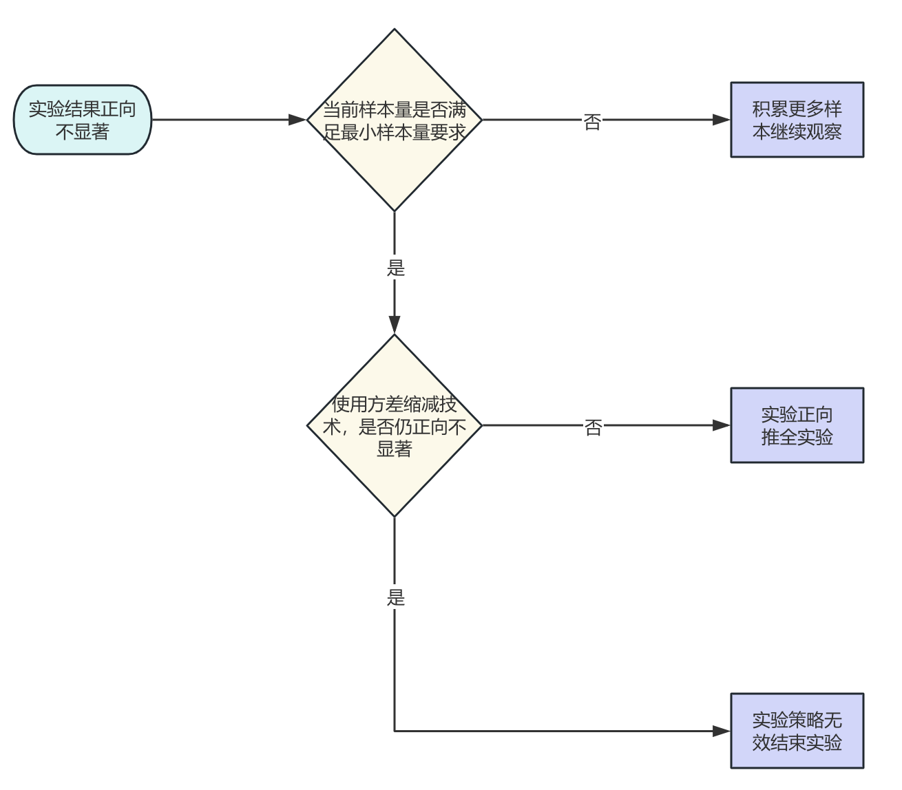

# 我的策略真的有效吗？——AB实验第11期

> 小伙伴们大家好呀，很开心再次与大家见面~ 在上一期内容中，苏晓糖讨论了AB实验中的辛普森悖论，并且辛普森悖论可能导致我们得出错误的实验结论，希望可以给予大家一些启发。而在本期内容中，苏晓糖则会讨论另一个大家会比较感兴趣的问题，实验结果显示正向不显著时我们应该如何处理。好啦，闲话不多说，马上进入今天的正题吧~

## 情景导入

以<font color=red>第9期</font>内容中优惠券弹窗实验为例，假设在进行实验数据回收时发现实验组相对对照组的人均GMV有提升，但是结果不显著，你会如何处理呐？请停下来思考10秒钟哦~



## 内容框架

本期内容主要讨论实验结果不显著时的一些处理思路，主要内容包括以下两个部分：

- 基本的处理思路
- 方差缩减技术



## 处理思路

通常来讲，AB实验效果正向不显著，只有两种原因：

- 实验策略实际有效但因为样本量不够或指标方差过大导致

- 实验策略实际无效，正向的结果仅仅是随机性导致的

  一般而言，第二种原因无法直接证明的，因此我们会先进行第一种原因的验证，如果第一种原因不能成立，我们才会认为实验策略无效。基本的流程可以参考下图：

  

## 方差缩减

在AB实验效果不显著时，可以通过方差缩减技术，来缩小对样本量的要求。而方差缩减技术，主要有两类：**事前分流和事后分析**。

**事前分流，即通过特殊的实验分流设计，来缩减方差的方法。其主要涉及三类方法：分层分流、配对实验设计、避免提前分流**。

### 事前分流—分层分流

在实验开始前，根据已知特征将总体分成若干层，确保每层内的个体同质性较高，然后在每层内随机分配用户到控制组或实验组。这样，组间差异主要来自处理效果，而非层间差异，从而减少方差。

在普通的AB实验分流中，我们采用hash分流进行，本质就是简单随机抽样，因此其**每个实验版本**的样本均值$\bar{X}$的方差为$Var(\bar{X})=\frac{\sigma^2}{N}$。假如我们使用某个分层特征进行分层抽样，其中某个实验版本的总样本量为N，对应分层h下的样本量为$n_h$, 分层h下的样本量占比$W_h=\frac{n_h}{N}$，层h的均值为${\mu}_h$，层h的方差为$\sigma^2_h$，则有：

分层统计量$\bar{X}_{strat}=\sum_{h=1}^{L}{W_h\bar{X}_h}$, 且有$E(\bar{X}_{strat})=\sum_{h=1}^{L}{W_hE(\bar{X}_h)}=\sum_{h=1}^{L}{W_h\mu_h}=\mu$。

分层统计量的方差为$Var(\bar{X}_{strat})=\sum_{h=1}^{L}{W_h^2Var(\bar{X}_h)}=\sum_{h=1}^{L}{W_h^2\frac{\sigma^2_h}{n_h}}=\frac{1}{N}\sum_{h=1}^{L}{W_h\sigma^2_h}$。

一般而言，层内方差$\sigma^2_h$小于等于总体方差$\sigma^2$,即$\sum_{h=1}^{L}{W_h\sigma^2_h}\le \sigma^2$，因此分层统计量是总体均值的无偏估计量，且其方差也小于简单随机抽样的样本方差。

以情景导入中的问题为例，假设用户渠道构成为自然流量 : 付费流量=3 : 7，则通过使用用户渠道进行分层分流，则可以基于分流结果计算实验效应的显著性，其中：

- 对照组人均GMV为$\bar{GMV}_{strat,对照组}={W_{自然流量}\bar{GMV}_{自然流量,对照组}+W_{付费流量}\bar{GMV}_{付费流量,对照组}}={0.3\bar{GMV}_{自然流量,对照组}+0.7\bar{GMV}_{付费流量,对照组}}$
- 实验组人均GMV为$\bar{GMV}_{strat,实验组}={W_{自然流量}\bar{GMV}_{自然流量,实验组}+W_{付费流量}\bar{GMV}_{付费流量,实验组}}={0.3\bar{GMV}_{自然流量,实验组}+0.7\bar{GMV}_{付费流量,实验组}}$
- 对照组人均GMV的方差为$Var(\bar{GMV}_{strat,对照组})=\frac{1}{N_{对照组}}(W_{自然流量}\sigma^2_{自然流量，对照组}+W_{付费流量}\sigma^2_{付费流量，对照组})=\frac{1}{N_{对照组}}(0.3\sigma^2_{自然流量，对照组}+0.7\sigma^2_{付费流量，对照组})$
- 实验组人均GMV的方差为$Var(\bar{GMV}_{strat,实验组})=\frac{1}{N_{实验组}}(W_{自然流量}\sigma^2_{自然流量，实验组}+W_{付费流量}\sigma^2_{付费流量，实验组})=\frac{1}{N_{实验组}}(0.3\sigma^2_{自然流量，实验组}+0.7\sigma^2_{付费流量，实验组})$

因此实验效应为$\bar{GMV}_{strat,实验组}-\bar{GMV}_{strat,对照组}$，实验效应的方差为$Var(\bar{GMV}_{strat,对照组})+Var(\bar{GMV}_{strat,实验组})$，详细的代码实现可以见附录部分。

### 事前分流—配对实验

配对实验是一种特殊的实验设计，通过将样本按照某些特征(影响目标结果的特征)进行匹配，然后将每一对中的两个样本随机划分到对照组或实验组，从而降低实验方差。假设样本i的配对样本为样本-i，则有：

配对实验的实验效应估计量为$\hat\tau=\frac{1}{N}\sum_{i=0}^N{D_i}=\frac{1}{N}\sum_{i=0}^N{(X_{i,实验组}-X_{-i,对照组})}$，且有$E(\hat\tau)=\frac{1}{N}\sum_{i=0}^N{E(D_i)}=\tau$

配对实验的实验效应估计量的方差为$Var(\hat{\tau})=\frac{1}{N^2}\sum_{i=0}^NVar(D_i)=\frac{Var(D_i)}{N}$，其中$Var(D_i)=\frac{1}{N^2}\sum_{i=0}^N(Var(X_{i,实验组})+Var(X_{-i,对照组})-2Cov(X_{i,实验组},X_{-i,对照组}))$，$X_{i,对照组}$和$X_{-i,实验组}$之间正相关性越强，配对实验的实验效应的方差越小。**值得注意的是，配对实验设计的有效性，需要匹配的有效性来保证，假设匹配结果不好，比如匹配到的配对样本与原样本相似性很差，则配对实验会引入偏差。**

以情景导入中的问题为例，假设实验前我们有N个样本，并且选用一些会影响GMV的特征来进行匹配，如渠道、最近N天的GMV、生命周期、最近N天的交易频率、最近一次交易时长等特征，为每个样本进行1对1无放回匹配，得到匹配结果后，随机将没对样本中的两个样本分配到对照组和实验组，则可以基于分配结果计算实验相应的显著性，其中：

实验效应为$\frac{1}{N}\sum_{i=0}^N(GMV_{i,实验组}-GMV_{-i,对照组})$，实验效应的方差为$\frac{1}{N}Var(GMV_{i,实验组}-GMV_{-i,对照组})$。

### 事前分流—避免提前分流

在<font color=red>第4期</font>中，我们讨论过分流时机的设定，一般而言分流时机收到三个因素的影响：成本、可控制性和时效性。在此处谈到的避免提前分流与其并不矛盾，在成本、可控制性和时效性可满足的条件下，推荐尽量将分流时机设定在最接近实验策略生效的位置上。直观来讲，**由于用户需要经历若干步骤才能到达实验策略生效位置，因此分流位置和实验策略生效位置越远，引入的随机性越大，导致指标的方差越大**。


**事后分析，即实验分流设计保持不变，通过一些特殊方法来缩减方差的方法。其主要涉及三类方法：指标设计层面、样本选取层面、复杂技术(事后分层估计量、控制变量法、CUPED)**。

### 事后分析—指标设计

假设我们在进行实验数据分析时，设定的指标为绝对值类型指标，比如GMV，由于可能存在大客户，导致GMV的指标的方差过大，从而使实验结果显著的样本量需求较大。此时我们可以采取一下三种方式来缩减方差：

- **更换与目标指标相关性高，但方差更小的指标作为替代指标**。以情景导入中的问题为例，我们可以选择与GMV相关性较高的下单率作为替代指标，一般来讲转化率指标远低于绝对值类型的指标。假设我们发现新策略显著提升了下单率，虽然对GMV的正向提升不显著，我们也认为新策略带来了正向收益。
- **将目标指标进行离散化转换为比例类指标**。该方法通过人为设定的一个阈值，超过阈值设为1，低于阈值设为0，从而构造一个新的二值变量，基于该二值变量，计算超过阈值的比例作为观察指标。但该方法会存在，阈值如何选择的问题。通常有两类思路：具有业务含义的阈值(比如我们的目标是使每个用户的GMV超过100元，则可以将阈值设定为100元)、统计上的阈值(比如实验前的人均GMV、GMV中位数等)。
- **针对极端值进行裁剪**。该方法通过人为设定指标的上限(下限)，将超过上限(低于下限)的样本指标统一裁剪为上限(下限)，然后基于裁剪后的结果，计算实验效应和显著性。同样该方法也会面临上限(下限)如何设定的问题。通常也有两类思路：具有业务含义的阈值(比如客单价通常介于100-500元之间，则可以将上限设定在500元)、统计上的阈值(比如实验前GMV的75分位数、$3\sigma$准则等)。

### 事后分析—样本选取

事后分析的第二种思路是进行分析样本的选取。通常会有两类方式：

- **仅选择触发了实验策略的样本进行分析**。在进行实验分流时，因为会受到时效性、可控制性和成本三个因素的影响，分流位置往往与实验策略生效位置并不一致。我们知道，如果用户仅仅触发了分流，但未到达实验策略生效位置，则用户理论上肯定不会收到实验策略的影响。如果我们将这部分用户纳入到我们的实验效应显著性分析中，一定会引入额外的方差。因此建议在实验效应分析时，仅选择实际触发了实验策略的样本进行分析。
- **极端样本剔除**。与针对极端值进行裁剪的思路相近，只不过当指标超过上下限时，一个采用剔除逻辑，一个采用裁剪逻辑。再此不再进行过多的赘述。

### 事后分析—事后分层估计量

事后分层估计，则是在实验结束后，根据收集到的数据将样本分层(如基于实验前特征)，然后调整估计量以反映层的总体比例，来缩减方差的方法。

假如其中某个实验版本的样本量为N，对应分层h下的样本量为$n_h$, 分层h下的样本量占比$W_h=\frac{n_h}{N}$，层h的均值为${\mu}_h$，层h的方差为$\sigma^2_h$，则有：

事后分层估计量为$\bar{X}_{post-strat}=\sum_{h=1}^{L}{W_h\bar{X}_h}$，且有$E(\bar{X}_{strat})=\sum_{h=1}^{L}{W_hE(\bar{X}_h)}=\sum_{h=1}^{L}{W_h\mu_h}=\mu$。

事后分层估计量的方差$Var(\bar{X}_{post-strat})\approx 
\frac{1}{N}\sum_{h=1}^{L} W_h \sigma_h^2 + \frac{1}{N^2}\sum_{h=1}^{L} (1 - W_h) \sigma_h^2
\approx \frac{1}{N}\sum_{h=1}^{L} W_h \sigma_h^2$。大样本下与事前分层的样本方差接近。因此事后分层统计量是总体均值的无偏估计量，且其方差也小于简单随机抽样的样本方差。

以情景导入中的问题为例，假设我们使用用户渠道作为分层，则有：

- 付费流量分层的权重为：$\hat{W}_{付费流量}=\frac{n_{付费流量,对照组}+n_{付费流量,实验组}}{N_{对照组}+N_{实验组}}$
- 自然流量分层的权重为：$\hat{W}_{自然流量}=\frac{n_{自然流量,对照组}+n_{自然流量,实验组}}{N_{对照组}+N_{实验组}}$

- 对照组人均GMV为$\bar{GMV}_{strat,对照组}={\hat{W}_{自然流量}\bar{GMV}_{自然流量,对照组}+\hat{W}_{付费流量}\bar{GMV}_{付费流量,对照组}}$
- 实验组人均GMV为$\bar{GMV}_{strat,实验组}={\hat{W}_{自然流量}\bar{GMV}_{自然流量,实验组}+\hat{W}_{付费流量}\bar{GMV}_{付费流量,实验组}}$
- 对照组人均GMV的方差为$Var(\bar{GMV}_{strat,对照组})=\frac{1}{N_{对照组}}(\hat{W}_{自然流量}\sigma^2_{自然流量，对照组}+\hat{W}_{付费流量}\sigma^2_{付费流量，对照组})$
- 实验组人均GMV的方差为$Var(\bar{GMV}_{strat,实验组})=\frac{1}{N_{实验组}}(\hat{W}_{自然流量}\sigma^2_{自然流量，实验组}+\hat{W}_{付费流量}\sigma^2_{付费流量，实验组})$

因此实验效应为$\bar{GMV}_{strat,实验组}-\bar{GMV}_{strat,对照组}$，实验效应的方差为$Var(\bar{GMV}_{strat,对照组})+Var(\bar{GMV}_{strat,实验组})$，详细的代码实现可以见附录部分。

### 事后分析—CUPED

利用实验前的数据(统计周期建议与实验周期保持一致)作为协变量调整实验后的指标。通过计算调整后的Y值，减少组间比较的方差。

假设Y为目标变量，X为实验前的目标变量，$\mu_{Y}$为目标变量Y的均值，$\mu_X$为协变量X的均值，则有：

调整后变量 $\epsilon=Y-\beta(X-\mu_X)$，且有$E(\epsilon)=E(Y)-\beta(E(X)-E(\mu_X))=\mu_Y$。

变量$\epsilon$的方差$Var(\epsilon)=Var(Y)+\beta^2Var(X-\mu_X)-2\beta Cov(Y, X-\mu_X)=Var(Y)+\beta^2Var(X)-2\beta Cov(Y, X)$。当$\beta=\frac{Cov(Y, X)}{Var(X)}$时，$Var(\epsilon)$取最小值$Var(Y)-\frac{Cov^2(Y, X)}{Var(X)}=Var(Y)(1-\rho^2)$。其中$\rho$为$X$和$Y$的相关系数。

因此构造的变量均值与调整前目标变量相等，且其方差也小于调整前的目标变量的方差。

实验收益的估计量为$\bar \epsilon_{实验组}-\bar \epsilon_{对照组}$，实验收益估计量的方差为$Var(\bar \epsilon_{对照组})+Var(\bar \epsilon_{实验组组})=\frac{1}{n_{对照组}}Var(\epsilon_{对照组})+\frac{1}{n_{实验组}}Var(\epsilon_{实验组})$。

以情景导入中的问题为例，假设我们使用实验前的用户GMV作为协变量，则：

- 使用对照组的样本，拟合线性回归得到$\beta$:  $GMV=\alpha+\beta GMV_{pre-period}+\epsilon$

- 使用实验组和对照组的样本，计算$\bar{GMV}_{pre-period}$。

- 计算对照组调整后变量的均值: $\bar \epsilon_{对照组}=\frac{1}{N_{对照组}}\sum_{i=0}^{N_{对照组}}(GMV_i-\beta(GMV_{i,pre-period}-\bar GMV_{pre-period})) $

- 计算实验组调整后变量的均值:$\bar \epsilon_{实验组}=\frac{1}{N_{实验组}}\sum_{i=0}^{N_{实验组}}(GMV_i-\beta(GMV_{i,pre-period}-\bar GMV_{pre-period}))$

- 计算对照组调整后变量均值的方差: $Var(\bar \epsilon_{对照组})=\frac{1}{N_{对照组}}Var(\epsilon_{对照组})$

- 计算实验组调整后变量均值的方差: $Var(\bar \epsilon_{实验组})=\frac{1}{N_{实验组}}Var(\epsilon_{实验组})$

  因此实验效应为$\bar \epsilon_{实验组}-\bar \epsilon_{对照组}$，实验效应的方差为$Var(\bar \epsilon_{对照组})+Var(\bar \epsilon_{实验组})$。

## 资源推荐

- 《关键迭代：可信赖的线上对照实验》——罗恩·科哈维（Ron Kohavi）+黛安·唐（Diane Tang）

## 附录

### 模拟数据生成

```python
import numpy as np
import pandas as pd
import statsmodels.api as sm
from scipy import stats

# 设置随机种子
np.random.seed(42)

# 实验参数
n = 10000  # 总样本量
tau = 0.1  # 真实处理效应
strata_weights = np.array([0.5, 0.3, 0.2])  # 层权重
n_strata = len(strata_weights)

# 生成分层变量
strata = np.random.choice([0, 1, 2], size=n, p=strata_weights)

# 生成协变量X（实验前指标）
X = np.zeros(n)
for s in range(n_strata):
    mask = (strata == s)
    size = mask.sum()
    if s == 0:
        X[mask] = np.random.normal(10, 2, size)
    elif s == 1:
        X[mask] = np.random.normal(20, 4, size)
    else:
        X[mask] = np.random.normal(30, 6, size)

# 生成处理组分配（整体随机化）
treatment = np.random.choice([0, 1], size=n, p=[0.5, 0.5])

# 生成结果变量Y（实验后指标）
epsilon = np.random.normal(0, 3, n)  # 噪声项
Y = X + tau * treatment + epsilon

# 创建数据框
df = pd.DataFrame({
    'strata': strata,
    'X': X,
    'treatment': treatment,
    'Y': Y
})

# 事前分层采样数据（分层随机化）
df_stratified = df.copy()
df_stratified['treatment_stratified'] = 0
for s in range(n_strata):
    mask = (df_stratified['strata'] == s)
    size = mask.sum()
    df_stratified.loc[mask, 'treatment_stratified'] = np.random.choice(
        [0, 1], size=size, p=[0.5, 0.5]
    )

```

### 事前分流

```python
def stratified_sampling(df, strata_weights: np.ndarray=np.array([0.5, 0.3, 0.2])):
    # 存储每个分层的均值
    strata_means_control = []
    strata_means_treated = []
    # 存储每个分层的 方差
    strata_vars_control = []
    strata_vars_treated = []

    #存储每个分层的样本量
    strata_sizes = []


    for s in range(n_strata):
        df_strata = df[df['strata'] == s]
        control = df_strata[df_strata['treatment'] == 0]['Y']
        treated = df_strata[df_strata['treatment'] == 1]['Y']
        
        strata_means_control.append(control.mean())
        strata_means_treated.append(treated.mean())

        strata_vars_control.append(control.var())
        strata_vars_treated.append(treated.var())
        
        strata_sizes.append(len(df_strata))
    # 计算ATE
    ate = np.dot(strata_weights, np.array(strata_means_treated)) - np.dot(strata_weights, np.array(strata_means_control))

    n_control = len(df[df['treatment'] == 0])
    n_treated = len(df[df['treatment'] == 1])
    #计算ATE的方差
    var_ate = 1 / n_control * np.dot(strata_weights, np.array(strata_vars_control)) + 1 / n_treated * np.dot(strata_weights, np.array(strata_vars_treated))
    se = np.sqrt(var_ate)
    ci_low = ate - 1.96 * se
    ci_high = ate + 1.96 * se
    t_stat = ate / se
    p_value = 2 * (1 - stats.norm.cdf(abs(t_stat)))
    
    return {
        'method': 'Post-Stratification',
        'ate': ate,
        'se': se,
        'ci_low': ci_low,
        'ci_high': ci_high,
        'p_value': p_value
    }
```

### 事后分层

```python
def stratified_sampling(df, strata_weights: np.ndarray=np.array([0.5, 0.3, 0.2])):
    # 存储每个分层的均值
    strata_means_control = []
    strata_means_treated = []
    # 存储每个分层的 方差
    strata_vars_control = []
    strata_vars_treated = []

    #存储每个分层的样本量
    strata_sizes = []


    for s in range(n_strata):
        df_strata = df[df['strata'] == s]
        control = df_strata[df_strata['treatment'] == 0]['Y']
        treated = df_strata[df_strata['treatment'] == 1]['Y']
        
        strata_means_control.append(control.mean())
        strata_means_treated.append(treated.mean())

        strata_vars_control.append(control.var())
        strata_vars_treated.append(treated.var())
        
        strata_sizes.append(len(df_strata))
    # 计算ATE
    ate = np.dot(strata_weights, np.array(strata_means_treated)) - np.dot(strata_weights, np.array(strata_means_control))

    n_control = len(df[df['treatment'] == 0])
    n_treated = len(df[df['treatment'] == 1])
    #计算ATE的方差
    var_ate = 1 / n_control * np.dot(strata_weights, np.array(strata_vars_control)) + 1 / n_treated * np.dot(strata_weights, np.array(strata_vars_treated)) +\
                1/n_control**2 *np.dot(1-strata_weights, np.array(strata_vars_control)) + 1/n_treated**2 *np.dot(1-strata_weights, np.array(strata_vars_treated))
    se = np.sqrt(var_ate)
    ci_low = ate - 1.96 * se
    ci_high = ate + 1.96 * se
    t_stat = ate / se
    p_value = 2 * (1 - stats.norm.cdf(abs(t_stat)))
    
    return {
        'method': 'Post-Stratification',
        'ate': ate,
        'se': se,
        'ci_low': ci_low,
        'ci_high': ci_high,
        'p_value': p_value
    }
```

### CUPED

```python
def cuped(df):
    # 使用对照组估计θ
    control_df = df[df['treatment'] == 0]
    X_mean = df['X'].mean()
    model = sm.OLS(control_df['Y'], sm.add_constant(control_df['X'])).fit()
    theta = model.params[1]
    
    # 计算调整后的Y
    df['Y_adj'] = df['Y'] - theta * (df['X'] - X_mean)
    
    control = df[df['treatment'] == 0]['Y_adj']
    treated = df[df['treatment'] == 1]['Y_adj']
    
    ate = treated.mean() - control.mean()
    var_ate = control.var()/len(control) + treated.var()/len(treated)
    se = np.sqrt(var_ate)
    ci_low = ate - 1.96 * se
    ci_high = ate + 1.96 * se
    t_stat = ate / se
    p_value = 2 * (1 - stats.norm.cdf(abs(t_stat)))
    
    return {
        'method': 'CUPED',
        'ate': ate,
        'se': se,
        'ci_low': ci_low,
        'ci_high': ci_high,
        'p_value': p_value
    }
```

