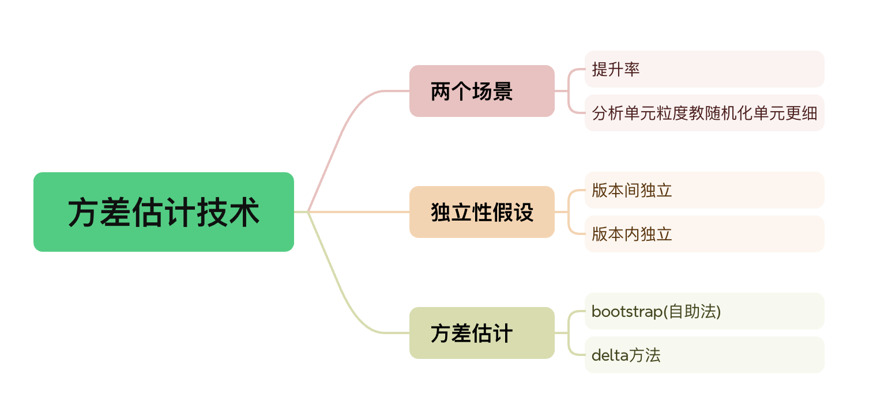

# 我的策略真的有效吗？——AB实验第12期

> 嗨~ 各位小伙伴们大家好呀，很开心又能在周末与大家准时见面，在第11期内容中介绍了在实验效果正向不显著时使用的方差缩减技术，而本期内容则会讨论指标方差的另一个问题——方差估计。在某些特殊场景下，我们可能会碰到指标方差无法使用明确公式计算的情况，此时我们应该怎么办呐？带着问题，和苏晓糖一起享受本期内容盛宴吧~ 

## 情景导入

现在仍以<font color=red>第9期</font>中的优惠券弹窗实验为案例，假设我们的随机化单元选定为用户ID，观测指标选择人均GMV的提升率，你会如何进行假设检验的显著性计算呐？请停下来思考10秒钟哦~


## 内容框架

本期主要讨论AB实验中的指标方差估计技术，核心内容包含以下2个核心内容：

- 使用场景：提升率指标、比率指标、分位数指标
- 方差估计：bootstrap(自助法)、delta方法、方差计算结果对比



## 使用场景

### 提升率指标

回归到情景导入中的问题，假设我们的观测指标设定为人均GMV的提升率，即：
$$
\begin{align}\bar{GMV}提升率&=\frac{\bar{GMV}_{实验组}-\bar{GMV}_{对照组}}{\bar{GMV}_{对照组}}=\frac{\bar{GMV}_{实验组}}{\bar{GMV}_{对照组}}-1 其中:\\\bar{GMV}_{对照组}&=\frac{\sum_{i=0}^{N_{对照组}}{GMV_i}}{N_{对照组}}\\
\bar{GMV}_{实验组}&=\frac{\sum_{i=0}^{N_{实验组}}{GMV_i}}{N_{实验组}}\end{align}
$$

为了计算提升率指标的显著性，需要知道提升率指标的方差，那应当如何计算人均GMV的增长率的方差呐？可以确定的一点是，人均GMV的增长率方差很显然不等于实验组人均GMV的方差和对照组人均GMV的平方的比值，即下式中的第3个式子为不等号，原因是对照组的人均GMV是一个随机变量，而非常量。至于具体的计算方式，我们会在方差估计技术中予以回答。
$$
\begin{align}var(\bar{GMV}_{提升率}) &= var(\frac{\bar{GMV}_{实验组}}{\bar{GMV}_{对照组}}-1)\\&=var(\frac{\bar{GMV}_{实验组}}{\bar{GMV}_{对照组}})\\
&\ne\frac{var(\bar{GMV}_{实验组})}{\bar{GMV}_{对照组}^2}
\end{align}
$$


### 比率指标

继续以情景导入中的问题为例，假设实验中选定的随机化单元为用户粒度，我们的核心指标设定为优惠券的平均核销率：
$$
\begin{align}\bar{核销率}_j = \frac{\sum_{i=1}^{N_{j}}X_{ij}}{\sum_{i=1}^{N_{j}}Y_{ij}}\end{align}
$$
其中：j为对照组或实验组，$N_j$表示版本j的样本数，$X_{ij}$表示版本j中第i个个体核销优惠券张数，$Y_{ij}$表示版本j中第i个个体拥有的优惠券张数。

同时基于对照组和实验组独立性，平均核销率提升绝对值的方差为：
$$
var(\bar{核销率}_{实验组}-\bar{核销率}_{对照组})=var(\bar{核销率}_{实验组})+var(\bar{核销率}_{对照组})
$$
因此问题转变为对照组或实验组的平均核销率方差计算问题。再次回归到平均核销率的指标定义上，核销率本质上是将分析单元定义在优惠券粒度之上(如对分析单元理解有问题请回看<font color=red>第5期</font>)，分析单元粒度小于随机化单元粒度，版本内的个体独立性假设的违背。因此：
$$
\begin{align}
var(\bar{核销率}_j)&\ne\frac{\sigma^2_j}{{\sum_{i=1}^{N_{j}}Y_{ij}}}，其中:\\
\sigma^2_j&=\frac{1}{({\sum_{i=1}^{N_{j}}Y_{ij}})-1}\sum_{i=1}^{N_j}\sum_{k=1}^{Y_{ij}}(I(第i个个体第k张券状态=核销)-\bar{核销率}_j)^2
\end{align}
$$
其中：$I(\cdot)$为示性函数。

那如何去计算平均核销率的方差呐？我们可以尝试对平均核销率做简单的变化，就可以把其转化为类似于提升率中均值/均值的形式：
$$
\begin{align}\bar{核销率}_j &= \frac{\sum_{i=1}^{N_{j}}X_{ij}}{\sum_{i=1}^{N_{j}}Y_{ij}}\\
&=\frac{\frac{1}{N_j}\sum_{i=1}^{N_{j}}X_{ij}}{\frac{1}{N_j}\sum_{i=1}^{N_{j}}Y_{ij}}\\
&=\frac{\bar X_j}{\bar Y_j}
\end{align}
$$
其中，$\bar X_j$代表版本j中的个体人均核销优惠券张数，$\bar{Y}_j$代表版本j中的个体人均拥有的优惠券张数。

### 分位数指标

继续以情景导入中的问题为例，假设我们的观测指标设定为GMV的80分位数，此时我们的指标方差很难如比率类指标那样改写成随机化单元粒度下的两个指标的比率。此时我们的指标方差又该如何计算呐？

## 方差估计技术

常用的方差估计技术有两类：delta方法和bootstrap方法。两个方法各有优劣，下面我们就来介绍两类方法在提升率指标下的使用。

### delta方法

#### 一元delta方法

假设随机变量序列$\{Y_n\}$满足渐进正态分布即：
$$
\sqrt{n}(Y_n-\theta) \overset{d}{\rightarrow} N(0, \sigma^2)
$$
假设存在标量函数$f$和常数$\theta$,有函数$f$在常数$\theta$处可导且不为0，则有$\{f(Y_n)\}$满足渐进正态分布即：
$$
\sqrt{n}(f(Y_n)-f(\theta))\overset{d}{\rightarrow} N(0, [f'(\theta)]^2\sigma^2)
$$
证明方法可以见附录。

#### 多元delta方法

假设多元随机变量序列$\{\vec Y_n\}$,其中 $\vec Y_n=\begin{pmatrix}Y_{n1}\\Y_{n2}\\Y_{n3}\\...\\Y_{nk}\end{pmatrix}$,满足渐进正态分布即：
$$
\sqrt n(\vec Y_n-\vec \theta)\overset{d}{\rightarrow} N(0, \Sigma)
$$
其中$\Sigma$为多元随机变量的协方差矩阵，假设存在多元随机变量序列标量函数$f$和常数向量$\vec \theta$, 有函数$f$在$\theta$处的梯度存在且不为0，则有$\{f(\vec Y_n)\}$满足渐进正态分布即：
$$
\sqrt{n}(f(\vec Y_n)-f(\vec \theta)) \overset{d}{\rightarrow}N(0, [\nabla f(\vec \theta)]^T\Sigma [\nabla f(\vec \theta)])
$$
其中：$[\nabla f(\vec \theta)]^T=[\frac{\partial f}{\partial Y_{n1}}(\vec \theta)),\frac{\partial f}{\partial Y_{n2}}(\vec \theta)),...,\frac{\partial f}{\partial Y_{nk}}(\vec \theta))]$

因此，从delta方法的本质来讲，就是使用函数$f$**在随机变量的均值处的切线近似**函数$f$,从而求得函数$f$的方差。

以提升率类指标为例，现在使用多元delta方法估计其方差$var(\frac{\bar{GMV}_{实验组}}{\bar{GMV}_{对照组组}})$。由于$\bar{GMV}_{实验组}$和$\bar{GMV}_{对照组}$均服从渐进正态分布，两个随机变量的比值必然也服从渐进正态分布。
$$
\begin{align}
\sqrt n(\vec Y_n-\vec \theta)&\sim N(0, \Sigma), 其中\\
\vec Y_n &=\begin{pmatrix}\bar {GMV}_{实验组}\\\bar {GMV}_{对照组}\end{pmatrix},\\
\vec {\theta}&=\begin{pmatrix}\mu_{实验组}\\ \mu_{对照组}\end{pmatrix},\\
\Sigma&=\begin{pmatrix}var(\bar{GMV}_{实验组}),&cov(\bar{GMV}_{实验组},\bar{GMV}_{实验组})\\cov(\bar{GMV}_{实验组},\bar{GMV}_{对照组}),&var(\bar{GMV}_{对照组})\end{pmatrix}
\end{align}
$$
另$f(\vec Y_n)=\frac{\bar{GMV}_{实验组}}{\bar{GMV}_{对照组}}$,则函数$f$在$\vec \theta$处的梯度为
$$
\begin{align}[\nabla f(\vec \theta)]^T&=(\frac{\partial f}{\partial \bar{GMV}_{实验组}}(\vec \theta),\frac{\partial f}{\partial \bar{GMV}_{对照组}}( \vec \theta))\\
&=(\frac{1}{\mu_{对照组}}, -\frac{\mu_{实验组}}{\mu_{对照组}^2})\end{align}
$$
基于多元delta方法，我们有：
$$
\begin{align}var(\frac{\bar{GMV}_{实验组}}{\bar{GMV}_{对照组组}})&=var(f(\vec Y_n))\\
&= [\nabla f(\vec \theta)]^T\Sigma [\nabla f(\vec \theta)]\\
&=(\frac{1}{\mu_{对照组}}, -\frac{\mu_{实验组}}{\mu_{对照组}^2})\begin{pmatrix}var(\bar{GMV}_{实验组}),&cov(\bar{GMV}_{实验组},\bar{GMV}_{实验组})\\cov(\bar{GMV}_{实验组},\bar{GMV}_{对照组}),&var(\bar{GMV}_{对照组})\end{pmatrix}\begin{pmatrix}\frac{1}{\mu_{对照组}}\\-\frac{\mu_{实验组}}{\mu_{对照组}^2}\end{pmatrix}\\
&=(\frac{1}{\mu_{对照组}}, -\frac{\mu_{实验组}}{\mu_{对照组}^2})\begin{pmatrix}var(\bar{GMV}_{实验组}),&0\\0,&var(\bar{GMV}_{对照组})\end{pmatrix}\begin{pmatrix}\frac{1}{\mu_{对照组}}\\-\frac{\mu_{实验组}}{\mu_{对照组}^2}\end{pmatrix}\\
&=(\frac{var(\bar{GMV}_{实验组})}{\mu_{对照组}}, -\frac{\mu_{实验组}var(\bar{GMV}_{对照组})}{\mu_{对照组}^2})\begin{pmatrix}\frac{1}{\mu_{对照组}}\\-\frac{\mu_{实验组}}{\mu_{对照组}^2}\end{pmatrix}\\
&=\frac{var(\bar{GMV}_{实验组})}{\mu^2_{对照组}}+\frac{\mu^2_{实验组}var(\bar{GMV}_{对照组})}{\mu_{对照组}^4}\\
&=\frac{var(\bar{GMV}_{实验组})}{\hat\mu^2_{对照组}}+\frac{\hat\mu^2_{实验组}var(\bar{GMV}_{对照组})}{\hat\mu_{对照组}^4}
\end{align}
$$
其中第一个等号，使用函数$f$的定义得到，第二个等号使用多元delta方法得到，第7个等号是因为我们一般不知道总体的均值，可以使用样本均值代入，在情景导入的案例中，则为对照组或实验组样本的人均GMV。

假设我们实验中回收的数据如下表：

| 版本   | 样本量 | 样本均值   | 样本标准差 |
| ------ | ------ | ---------- | ---------- |
| 对照组 | $N_1$  | $\bar x_1$ | $s^2_1$    |
| 实验组 | $N_2$  | $\bar x_2$ | $s^2_2$    |

则我们有实验组相较于对照组样本均值的提升率方差为$\frac{s^2_1/N_1}{(\bar x_1)^2}+\frac{s^2_2/N_2}{(\bar x_2)^4}$。

### bootstrap(自助法) 

bootstrap方法计算指标方差，假设当前的样本可以充分的代表总体。因此使用当前样本进行重复有放回采样，基于多次的采样获取的多个观测指标的方差，来近似代表目标指标的方差。基本流程如下：

- 从当前样本中重复有放回的**抽取当前样本量数量**的个体组成一个新样本$X_i$

- 基于新样本计算对应指标$indicator_i$

- 重复前两个步骤N次，由此获得N个样本 $X_1,X_2...X_N$, 每个样本都对应一个指标 $indicator_1,indicator_2...indicator_N$

- 使用获得的N个指标计算方差用来代替目标指标的方差

  以情景导入中的问题问题为例，假设我们想计算人均GMV提升率指标的方差，我们按照以下方式进行估算：

  | 抽样次数 | 对照组抽取的样本                             | 实验组抽取的样本                             | 对照组抽取的样本GMV均值 | 实验组抽取的样本GMV均值 | 人均GMV提升率                                          |
  | -------- | -------------------------------------------- | -------------------------------------------- | ----------------------- | ----------------------- | ------------------------------------------------------ |
  | 1        | $\{GMV_{11},GMV_{12}...GMV_{1,N_{对照组}}\}$ | $\{GMV_{11},GMV_{12}...GMV_{1,N_{实验组}}\}$ | $\bar{GMV}_{1 ,对照组}$ | $\bar{GMV}_{1, 实验组}$ | $\frac{\bar{GMV}_{1,实验组}}{\bar{GMV} _{1,对照组}}-1$ |
  | 2        | $\{GMV_{21},GMV_{22}...GMV_{2,N_{对照组}}\}$ | $\{GMV_{21},GMV_{22}...GMV_{2,N_{实验组}}\}$ | $\bar{GMV}_{2,对照组}$  | $\bar{GMV}_{2,实验组}$  | $\frac{\bar{GMV}_{2,实验组}}{\bar{GMV}_{2,对照组}}-1$  |
  | 3        | $\{GMV_{31},GMV_{32}...GMV_{3,N_{对照组}}\}$ | $\{GMV_{31},GMV_{32}...GMV_{3,N_{实验组}}\}$ | $\bar{GMV}_{3,对照组}$  | $\bar{GMV}_{3,实验组}$  | $\frac{\bar{GMV}_{3,实验组}}{\bar{GMV}_{3,对照组}}-1$  |
  | …        | …                                            | …                                            | …                       | …                       | …                                                      |
  | N        | $\{GMV_{N1},GMV_{N2}...GMV_{N,N_{对照组}}\}$ | $\{GMV_{N1},GMV_{N2}...GMV_{N,N_{实验组}}\}$ | $\bar{GMV}_{N,对照组}$  | $\bar{GMV}_{N,实验组}$  | $\frac{\bar{GMV}_{N,实验组}}{\bar{GMV}_{N,对照组}}-1$  |

进行了N次抽样后，获取到N个人均GMV提升率，使用N个人均GMV提升率的方差用来近似代替真实的人均GMV提升率的方差。具体代码实现方法可以参考附录。1

### 方差估算方法对比

两种方法各有优劣，具体的有：

- delta方法：计算量很小，成本较低，但是对于没有明确可微函数式的指标不适用，比如分位数指标。

- bootstrap方法：简单容易理解，使用场景更广，但是如果数据量较大，进行booststrap的成本会很高，效率降低。

  因此苏晓糖建议，优先使用delta方法进行方差计算，若delta方法无法解决，则使用bootstrap进行方差计算。

| 方法      | 优势                         | 劣势                                             |
| --------- | ---------------------------- | ------------------------------------------------ |
| delta方法 | 计算量小，成本低             | 不适用于没有明确函数式的指标方差，如分位数的方差 |
| bootstrap | 简单容易理解，且适用场景更广 | 计算量大，成本高                                 |

## 资源推荐

- 《关键迭代：可信赖的线上对照实验》——罗恩·科哈维（Ron Kohavi）+黛安·唐（Diane Tang）

## 附录

### 一元delta方法证明

由于存在标量函数$f$和常数$\theta$,有函数$f$在常数$\theta$处可导且不为0，则我们可以对标量函数$f$在常数$\theta$处使用泰勒公式展开有：
$$
f(Y_n)=\frac{1}{0!}f(\theta) + \frac{1}{1!}f'(\theta)(Y_n-\theta)+O[(Y_n-\theta)]
$$
移项整理得到：
$$
f'(\theta)(Y_n-\theta)=f(Y_n)-f(\theta)
$$
两侧同时乘以$\sqrt{n}$有：
$$
f'(\theta)\sqrt n(Y_n-\theta)=\sqrt n(f(Y_n)-f(\theta))
$$
由于
$$
\sqrt{n}(Y_n-\theta) \overset{d}{\rightarrow} N(0, \sigma^2)
$$
 因此有
$$
\sqrt{n}(f(Y_n)-f(\theta))\overset{d}{\rightarrow} N(0, [f'(\theta)]^2\sigma^2)
$$
至此，一元delta方法结论得以证明。

### 多元delta方法证明

由于存在标量函数$f$和常数向量$\vec \theta$,有函数$f$在常数向量$\vec \theta$处可导且不为0，则我们可以对标量函数$f$在常数向量$\vec \theta$处使用泰勒公式展开有：
$$
f(\vec Y_n)=\frac{1}{0!}f(\vec \theta) + \frac{1}{1!}\nabla f(\vec \theta)(\vec Y_n-\vec \theta)+O[(\vec Y_n-\vec \theta)]
$$
移项整理得到：
$$
[\nabla f(\vec \theta)]^T(\vec Y_n-\vec \theta)=f(\vec Y_n)-f(\vec \theta)
$$
两侧同时乘以$\sqrt{n}$有：
$$
[\nabla f(\vec \theta)]^T\sqrt n(\vec Y_n-\vec \theta)=\sqrt n(f(\vec Y_n)-f(\vec \theta))
$$
由于
$$
\sqrt{n}(\vec Y_n-\vec \theta) \overset{d}{\rightarrow} N(0, \Sigma)
$$
因此有
$$
\sqrt{n}(f(\vec Y_n)-f(\vec \theta)) \overset{d}{\rightarrow} N(0, [\nabla f(\vec \theta)]^T\Sigma \nabla f(\vec \theta))
$$
至此，多元delta方法结论得以证明。

### delta方法代码实现

```python
import os
import sys

import numpy as np
import pandas as pd

import matplotlib.pyplot as plt


# 设置中文显示
plt.rcParams['font.sans-serif'] = ['Hiragino Sans GB']  # 指定默认字体
plt.rcParams['axes.unicode_minus'] = False  # 解决负号显示问题

# 设置主题
plt.style.use('ggplot')

treat = np.random.normal(100, 20, 2001)
control = np.random.normal(90, 30, 1998)

# 将负值设为0
treat[treat < 0] = 0
control[control < 0] = 0

def delta_method(treat, control):
    n_treat = len(treat)
    n_control = len(control)
    mean_treat = np.mean(treat)
    mean_control = np.mean(control)
    var_treat = np.var(treat, ddof=1)
    var_control = np.var(control, ddof=1)

    increase_rate = mean_treat / mean_control - 1
    increase_rate_var = (var_treat / n_treat) / (mean_control ** 2) + (var_control / n_control) * (mean_treat ** 2) / (mean_control ** 4)
    return {
        'n_treat': n_treat,
        'n_control': n_control,
        'treat_mean': mean_treat,
        'control_mean': mean_control,
        'increase_rate': increase_rate,
        'treat_var': var_treat,
        'control_var': var_control,
        'increase_rate_var': increase_rate_var,
        'ci_low': increase_rate - 1.96 * np.sqrt(increase_rate_var),
        'ci_high': increase_rate + 1.96 * np.sqrt(increase_rate_var)
    }
```

### bootstrap的代码实现

```python
import os
import sys

import numpy as np
import pandas as pd

import matplotlib.pyplot as plt


# 设置中文显示
plt.rcParams['font.sans-serif'] = ['Hiragino Sans GB']  # 指定默认字体
plt.rcParams['axes.unicode_minus'] = False  # 解决负号显示问题

# 设置主题
plt.style.use('ggplot')

treat = np.random.normal(100, 20, 2001)
control = np.random.normal(90, 30, 1998)

# 将负值设为0
treat[treat < 0] = 0
control[control < 0] = 0

def bootstrap(treat, control, n_bootstrap=1000):
    """计算两组数据的均值差的bootstrap置信区间"""
    n_treat = len(treat)
    n_control = len(control)
    mean_treat = []
    mean_control = []

    for _ in range(n_bootstrap):
        sample1 = np.random.choice(treat, size=n_treat, replace=True)
        sample2 = np.random.choice(control, size=n_control, replace=True)
        mean_treat.append(np.mean(sample1))
        mean_control.append(np.mean(sample2))

    boot_diffs = (np.array(mean_treat) - np.array(mean_control)) / np.array(mean_control)

    return {
        'n_treat': n_treat,
        'n_control': n_control,
        'treat_mean': np.mean(treat),
        'control_mean': np.mean(control),
        'increase_rate': np.mean(boot_diffs),
        'increase_rate_var': np.var(boot_diffs, ddof=1),
        'ci_low': np.percentile(boot_diffs, 2.5),
        'ci_high': np.percentile(boot_diffs, 97.5)
    }
```


