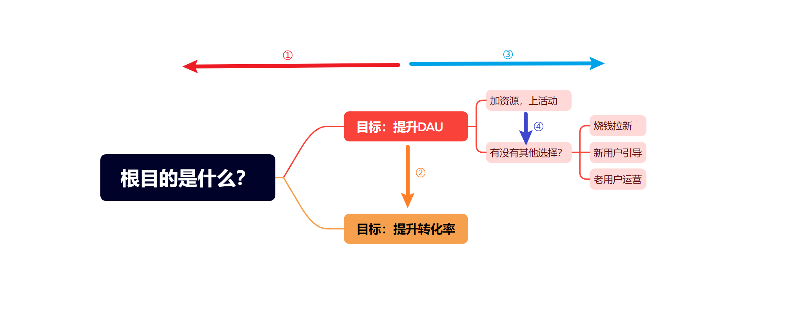

# 我的策略真的有效吗？——AB实验第2期

> 小伙伴们好呀，很开心又和大家见面了~苏晓糖又又来更新了，苏晓糖会循着AB实验的基本流程进行逐一分享，所以猜到今天我要分享的内容是什么啦嘛？什么？大声一点？嗯嗯[点头ing.jpg]，是的没有错，就是咱们的第一步**确定目标**，给回答对的你加个鸡腿！好啦，闲话不多说，请跟随苏晓糖一起尽享盛宴吧！

## 情景导入

假设你是一名互联网策略产品经理，对大盘DAU负责，如果想要提升DAU提升10%，你会如何做？请停下来认真思考3分钟~你的答案是什么呐？

我相信肯定会有很多小伙伴脑海中的浮现出的第一个答案就是搞大转盘，搞种花浇水、签到任务或小游戏等各种各样的促活活动，但这合理吗[摊手.emoji]？假设你的答案是这样，请再进一步思考以下几个层面的问题：

1. 根目的是什么？也即为什么要提升DAU，DAU提升了有哪些好处？

2. 为什么现在是做DAU而不是转化率？也即为什么是现在做不是以后做？

3. 除了做活动之外有没有其他选择？比如砸钱大量拉新？新用户的引导流程？老用户的运营？

   

##   内容框架

为了帮助大家提前对本期内容获得更宏观的了解，在本部分重点围绕以下几个问题进行展开：

- 如何推导根目的？
- 如何确定合理的目标？
- 如何选择最优的杠杆点？

## 如何推导根目的

一个企业短期内可以通过烧钱圈地实现快速发展，由于资本天生有盈利诉求，如果长期无法实现收益>=成本的要求，那所有的企业愿景、使命都是空谈，迟早关门大吉。因此你所做的事情一定是为了企业的终极目标盈利

## 确定目标

本部分的内容主要

## 资源推荐

- 《硅谷增长黑客实战笔记》——曲卉著
- 《运营之光：我的互联网运营方法论和自白》——黄有璨著
- 《波士顿咨询工作法 精准发现问题》——内田和成著
- 《学会提问》——尼尔·布朗(Neil Browne)著