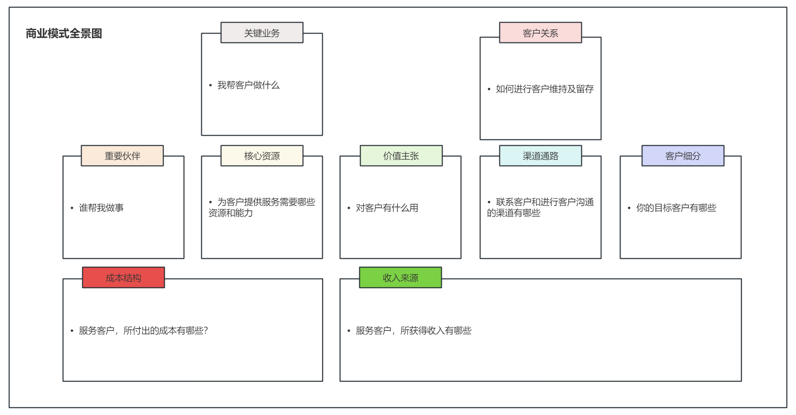
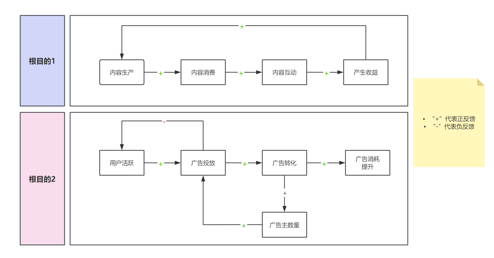

# 我的策略真的有效吗？——AB实验第2期

> 小伙伴们好呀，很开心又和大家见面了~苏晓糖又又来更新了，苏晓糖会循着AB实验的基本流程进行逐一分享，所以猜到今天我要分享的内容是什么啦嘛？什么？大声一点？嗯嗯[点头ing.jpg]，是的没有错，就是咱们的第一步**确定目标**，给回答对的你加个鸡腿！好啦，闲话不多说，请跟随苏晓糖一起尽享盛宴吧！

## 情景导入

假设你是一名策略产品经理，对用户的活跃度负责，如果想要将用户活跃度(如DAU)提升10%，你会如何做？请停下来认真思考3分钟~你的答案会是什么呐？

我相信肯定会有很多小伙伴脑海中的浮现出的第一个答案就是搞大转盘，搞种花浇水、签到任务或小游戏等各种各样的促活活动，但这合理吗[摊手.emoji]？假设你的答案是这样，请再进一步思考以下几个层面的问题：

1. 根目的是什么？也即为什么要提升DAU，DAU提升了有哪些好处？

2. 为什么现在是做DAU而不是转化率？也即为什么是现在做不是以后做？

3. 除了做活动之外有没有其他选择？比如砸钱大量拉新？新用户的引导流程？老用户的运营？

   

##   内容框架

AB实验不是且永远不可能是目的，唯一的目的是更好地帮助企业实现其商业目标。苏晓糖之所以将确立目标作为AB实验的首要步骤并给出5星的重要度评级，主要原因是希望向大家传递**全局意识**、**目标导向意识**和**投入产出意识**的重要性。无论你是数据分析师、产品经理、运营，我都强烈建议你完成本期内容的阅读，我相信你一定会从本期内容中有所收获。本期内容重点会围绕以下几个问题进行展开：

- 如何推导根目的？
- 如何确定合理的目标或北极星指标？
- 如何选择最优的杠杆点？

## 如何推导根目的

一个企业短期内可以通过烧钱圈地实现快速发展，但是资本天生有盈利诉求，假设长期无法实现收益超过成本的要求，那所有的企业愿景、使命都是空谈，大概率吃枣药丸。而推导根目的的**主要原因是要明确自己/部门的定位，保证所有的动作都是致力于提升企业的盈利能力**。推导根目的的的**重要方式是从企业的商业模式切入，搞清楚所做的事情如何影响企业利润**。

通常来讲，常见的商业模式主要有三种：

- **直接向用户某种商品或服务获得盈利**，比如路边小吃店售卖小吃，一手交钱一手交货
- **免费+增值服务**，比如大家常玩的王者荣耀，基本使用免费，但是想要更好看的皮肤特效，那么请选择支付方式
- **免费+流量变现**，比如号称时间消耗机器的抖音，用户使用免费，但是其他第三方想在抖音推广自己的产品或服务，不好意思请花钱买流量，做推广，这就是大家在刷视频时时长刷到的广告来源

为了帮助大家更好的理解商业模式，请看下图中经典的商业模式分析框架。该框架主要分为四个部分：①基础设施区(包含关键业务、重要伙伴、核心资源)  ②价值创造区(包含客户关系、价值主张、渠道通路、客户细分)  ③成本区(包含成本结构)  ④收入区(包含收入来源) 。而四个核心部分之间的关系是**价值创造依赖于基础设施，价值创造创造收入，基础设施产生成本，最终实现企业的利润收入**。

- 
  

现在再次归到本章提出的问题当中，假设现在你所在的公司要求你负责提升DAU，那你会在上面的商业画布中哪些部分发挥作用呐？提升DAU的根目的是什么呐？相信大家可能会有不同的答案，并且每种答案都有可能具备一定合理性，但这并不重要，重要的是我们在思考。在此苏晓糖给出自己的一些浅薄的看法，仅供参考：

- 假设我是一款内容APP的策略产品经理，目的是提升APP的DAU，我可能会在以下环节发挥作用：

  - 客户细分：①内容消费者 ②内容生产者 ③广告主
  - 价值主张：①提升内容消费者获取信息的效率 ②提升内容生产者获得的收益和关注 ③ 提升广告主推广产品和获取用户的效率
  - 渠道通路：①EDM ②SMS ③电话销售 ④企业官网 ⑤IM推送 等等
  - 客户关系：①内容创作大赛 ②广告投放优化论坛 ③消费内容短期激励 等等
  - 关键业务：①内容分发 ②广告推广 ③内容创作工具
  - 核心资源：①内容推荐系统 ②广告投放系统 ③内容收益后台系统
  - 成本结构：①人力成本 ②研发成本 ③营销成本
  - 收入来源：①广告消耗收入

- 提升APP-DAU的根目的可能是:

  - 实现内容生态的持续优化，优化内容生产->内容消费->内容互动->产生收益->更多内容生产的增长闭环，强化商业化基础

  - 实现更高的商业化收入，用户活跃->更多的广告投放->更多的广告转化->更多的广告消耗和广告主数量

    

## 确定目标

如果没有明确且准确的目标，那不如一开始就不要出发。作为一名在互联网行业的打工仔要时刻具备强目标导向的意识。本部分的内容主要关注如何选择合理的目标或北极星指标，选择北极星指标需要遵循以下几个原则：

- 这个指标是否能够反映产品的价值主张？
- 这个指标是否能够反应用户的活跃程度？
- 这个指标是否能够契合产品当前所处的生命周期？探索期、成长期、成熟期和衰退期的侧重点会有所不同
- 这个指标是否具备可操作性和可拆解性？
- 这个指标变好是否能够反应企业的商业模型运转更加良好？
- 这个指标时效性如何？是否有滞后问题？

假设现在你是一名处于成熟期阶段的内容APP的策略产品经理，现在想要制定全公司的北极星指标，你会选择什么样的指标呐？苏晓糖列出了一些可能的指标，假设每项最高5分，你会分别对这些指标打多少分呐？哪个指标评分最高呐？

| 原则                       | DAU  | 内容浏览人次 | APP使用时长 | 7日留存率 | 转化率 | 广告收入 |
| :------------------------- | ---- | ------------ | ----------- | --------- | ------ | -------- |
| 价值主张的反应程度         | 2    | 5            |             |           |        |          |
| 用户活跃度的反应程度       | 3    | 4            |             |           |        |          |
| 产品生命周期的契合度       | 3    | 5            |             |           |        |          |
| 可操作性                   | 3    | 4            |             |           |        |          |
| 与商业模型运转状况的相关性 | 2    | 4            |             |           |        |          |
| 时效性                     | 5    | 5            |             |           |        |          |
| **总分**                   | 18   | 27           |             |           |        |          |

## 最优杠杆点

假设你将产品DAU在现有基础上提升10%，你会如何做呐？这个问题主要由两个子问题构成：

- 产品DAU的影响因素有哪些？

- 操作这些影响因素的投入产出比如何？优先级？

### 增长模型

增长模型主要是将目标拆解成若干个影响因子，增长的搭建主要有两个维度：①**横向拆解(维度下拆)**：不同群组的用户是否存在显著差异 ②**乘法纵向(漏斗拆解)**：以终为始，从目标倒推梳理用户行为旅程。以提升产品DAU为例，苏晓糖可能会做以下的拆解：

- 加法拆解：新用户、存量活跃用户和沉默用户显然是不同的用户群体

- 乘法拆解：不同的用户成为DAU中的一员，可能会经历不同的行为路径

  - 新用户：看到广告->进入落地页->下载APP->注册成功->当日活跃->再次活跃
  - 存量用户：当日活跃->再次活跃
  - 沉默用户：召回内容下发->回到APP活跃

  因此苏晓糖可能会基于以上的简单拆解会搭建如下的增长模型：
  $$
  \begin{align*}
  DAU &＝(新用户+存量用户+沉默用户)×留存率\\
      &=流量×注册成功率×新用户留存率 + 存量用户×存量用户留存率+沉默用户×再次活跃率
  \end{align*}
  $$

### ROI模型

ROI模型是基于增长模型，对不同的影响因子的投入成本和投入收益进行评分，帮助我们确定一个更加合理的优先级。其中：

- 投入成本：主要考量操作对应影响因子，评估需要投入的人力、研发和时间等成本

- 投入收益：主要考量操作对应影响因子，可能会给我们带来多大的收益。收益的评估主要有两种方式：①参考行业竞品水平 ②矮子里挑大个，即将表现差的细分用户群与表现好的细分用户群对齐 

  假设当前内容APP的的数据如下：

| 影响因子       | 是否可操作 | 当前水平 | 参考水平                 | 预期收益                                                     | 预计成本                                               | 投入产出比 |
| -------------- | ---------- | -------- | ------------------------ | ------------------------------------------------------------ | ------------------------------------------------------ | ---------- |
| 前端流量UV     | 是         | 10,000   | 无，但很容易通过投放加量 | 在其他因素不变时，UV翻倍，对DAU的贡献大约是10,000×5%×(1/(1-10%))=556 | 假设CAC不变，流量翻倍，成本翻倍                        | 不高       |
| 注册成功率     | 是         | 5%       | 某渠道最高注册率6%       | 在其他因素不变时，留存率变为6%，对DAU的贡献大约是10,000×1%×(1/(1-10%))=111 | 成本低，参考行业方案，简化注册流程                     | 较高       |
| 新用户留存率   | 是         | 10%      | 行业平均水平12-15%       | 在其他因素不变时，留存率变为12%，对DAU的贡献大约是10,000×5%×(1/(1-12%))=568 | 成本较低，新用户引导流程优化                           | 高         |
| 存量用户UV     | 否         | 20,000   | ——                       | ——                                                           |                                                        |            |
| 存量用户留存率 | 是         | 90%      | 80%                      | 高于行业平均水平，优化空间不大                               | ——                                                     |            |
| 沉默用户UV     | 否         | 20,0000  | ——                       | ——                                                           |                                                        |            |
| 再次活跃率     | 是         | 1%       | 无                       | 在其他因素不变时，假设再次活跃率提升0.5%，对DAU的贡献大约是 20,0000×0.5%=1000 | 成本极低，可以通过多种渠道触达沉默用户，对用户进行激活 | 极高       |

针对以上的影响因子的投入产出分析，我们可能会得出最终的优先级，比如我们认为沉默用户的召回率优化>新用户留存率优化>新用户注册流程优化>前端扩量。

## 资源推荐

- 《硅谷增长黑客实战笔记》——曲卉著
- 《运营之光：我的互联网运营方法论和自白》——黄有璨著
- 《波士顿咨询工作法 精准发现问题》——内田和成著
- 《学会提问》——尼尔·布朗(Neil Browne)著