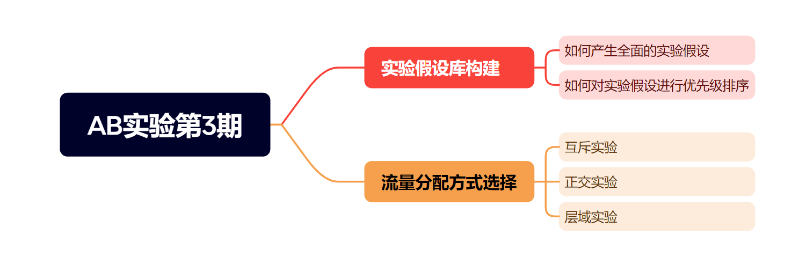
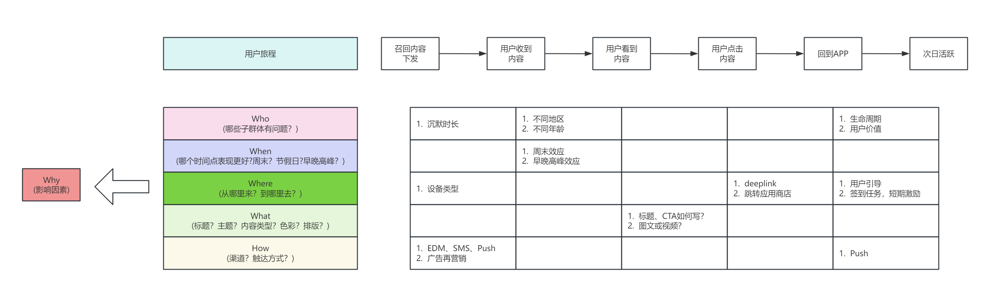
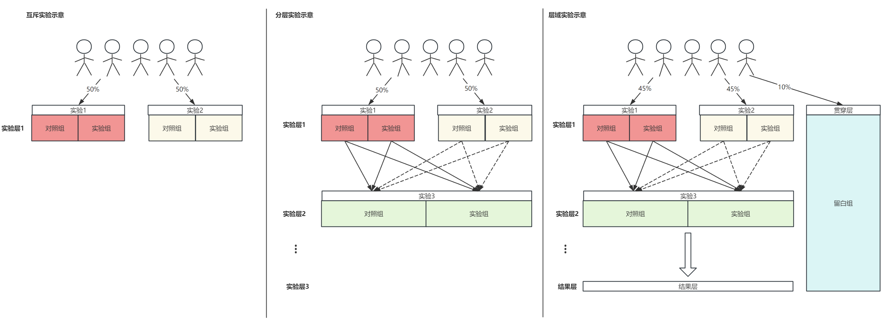

# 我的策略真的有效吗？——AB实验第3期

> 嗨，各位小伙伴们大家好呀，苏晓糖周末又来更新啦(今年的劳模真的不要颁给周末坚持更新的苏晓糖嘛[斜眼笑.emoji])！在前两期的内容发布后，收到了很多小伙伴们的鼓励和支持，在倍感压力的同时，也让我觉得我在做一件很性感很有意义的事。也真诚地希望能有更多的小伙伴们加入进来，多多交流，共同提高！本期内容主要聚焦AB实验的第二个环节**实验设计**，考虑到此环节的复杂度，苏晓糖会将其拆分为2-3期的内容进行展开，和苏晓糖一起享受本期的内容盛宴吧！
>

## 情景导入

在第2期中，苏晓糖使用简易的增长模型和ROI模型，对提升DAU的可能杠杆点进行了优先级评估，最终确定优化沉默用户的召回策略是最优选择。假设我们要通过提升沉默用户的召回率以提升DAU，你想要验证哪些假设并如何进行流量分配呐？请停下来10秒钟思考一下哦~

## 内容框架

本期内容主要聚焦于实验设计环节的实验假设库构建和实验分流方式选择展开，其中：

- 实验假设库的构建主要关注**如何产生全面的实验假设**和**如何对实验假设进行优先级排序**两个问题

- 实验分流方式选择主要介绍**互斥实验、正交实验和层域实验**等三种流量分配方式

  

## 构建实验假设库

在确定AB实验的目标之后，我们首先要做的是建设丰富全面的实验假设库，实验假设库主要包含两个核心信息：

- 影响核心指标的可能因素，也即进行实验验证的假设

- 每个可能影响因素的优先级，也即进行实验验证的顺序

  ### 实验假设

  生成丰富全面的实验假设库，主要有三种思路：

- 从**用户调研、用户反馈和内部讨论**出发，基于**用户×场景×需求**分析，哪些需求得到很好的满足，哪些需求未得到满足需要完善，为后续的优化提供更多的线索

- 从**竞品调研出发，收集竞品的玩法，推导竞品的背后逻辑**

- 从**用户视角出发，纵向拆解用户旅程**，然后使用4W1H(Who、When、Where、What、How)对用户旅程中的**每个环节进行横向拆解**推测可能得影响因素(Why)

  现在苏晓糖基于第3种思路对沉默用户的召回过程进行拆解，仅作为抛砖引玉使用，小伙伴们会如何拆解并产生哪些可能得假设呐？欢迎各位小伙伴在后台留言讨论哦~
  
  ### ICE模型

  在建设了丰富的实验假设库后，我们会面临另一个问题，即如何对实验假设进行优先级排序，从而实现有限资源和时间约束下的最优解。目前业界比较常用的分析模型是ICE模型，主要从I(Impact，影响度)、C(Confidence，信心度)、E(Effort，成本)三个维度进行评估，具体的有：

- **I(Impact，影响度)，影响度越高，评分越高**，主要从以下三个方面考虑：

  - **相较于目标或基准而言，有多大的提升空间 ，提升空间越大，重要度越高**。比如业界基准转化率是5%，我们的转化率只有1%,那我们就有4倍的提升空间。
  - **可以影响多大用户量级 ，影响的量级越大，重要度越高**。比如在APP一级Tab的实验影响要比更深层级Tab的实验影响大。
  - **对于北极星指标的影响有多大，能直接影响北极星指标的环节，重要度越高**。比如目标是提升GMV，那么在支付的环节实验要比商品详情页的环节重要度高。

- **C(Confidence，信心度)，信心度越高，评分越高**。主要从以下三个方面考虑：

  - **是否经历史实验验证有效的假设**。比如在商品详情页增加优惠倒计时有助于提升用户下单转化率，那也可预期在支付页面增加倒计时也将有助于用户完成支付。
  - **是否来源于行业验证有效的方案**。比如短视频直播间的礼品特效可以显著提升直播间内的互动参与，那也可预期在另一家短视频平台增加直播间的礼品特效将提升直播间的互动参与。
  - **是否有业务数据分析结果的支持**。比如发现用户在第1天完成某个功能的使用，后续的留存率更高，那可以猜测如果把新用户引导向该功能模块很有可能会提升新用户的留存率。

- **E(Effort，成本)，成本越低，评分越高。主要考虑是否涉及产品流程或业务流程的重建**。一般而言，凡是涉及到产品流程或业务流程的重建，投入的研发资源和时间成本相对更高。如仅是文案、元素或简单交互的调整，成本相对较低。

  现在有以下实验假设，表格中给出了苏晓糖的想法，小伙伴们会如何对以下假设如何进行评分呐？

  - 调整内容下发时间点可以提升用户的内容曝光率。数据分析发现用户在早晚高峰时期对内容的曝光率更高。
  - 将内容素材由文字调整为图文可以提升用户点击率。数据分析发现图文类内容点击率显著高于纯文字内容。
  - deeplink可以提升用户点击内容后回到APP的转化率。因为业界通过deeplink技术直接将用户从站外引流至目标的功能模块。

  | 实验假设                                      | I(Impact) | C(Confidence) | E(Effort) | 合计 |
  | --------------------------------------------- | :-------- | :------------ | :-------- | ---: |
  | 调整内容下发时间点可以提升用户的内容曝光率    | 4         | 3             | 5         |   12 |
  | 将内容素材由文字调整为图文可以提升用户点击率  | 5         | 3             | 5         |   13 |
  | deeplink可以提升用户点击内容后回到APP的转化率 | 4         | 5             | 2         |   11 |

## 选择分流方式

请大家回想一下AB实验的基本原理，如果忘记了可以回去复习一下第一期的内容哦~我们在进行流量分配利用时面临着实验结论可靠性和时间成本的权衡。假设我们将实验流量全部分配给一个实验，那我们就只能等待上一个实验完成再启动下一个实验，即不同实验之间完全串行。这种方法过于低效，为了提升流量的利用效率，衍生出了以下几种流量分配的方式：

- 互斥实验：将全部流量随机划分为若干部分，不同部分流量都用于不同实验，从而实现多个实验的并行。如下图所示，50%的流量用于进行实验1，50%的流量用户实验2，这样就实现了两个实验并行运行，而实验1和实验2即为互斥实验。互斥实验主要有两个优点：**①流量的利用效率翻倍提升 ②实验1和实验2互不干扰，适合并行的实验间存在互相影响的场景**。 但值得一提的是，互斥实验虽然有效的提升了流量的利用效率，但提升有限，随着实验的增加又会面临流量不够用的场景。

- 正交实验：为了进一步提升流量利用效率，正交实验在互斥实验的基础上引入了流量分层的概念，每个实验层都使用全部流量，层内可以并行进行若干个互斥实验，同时通过**流量重新打散，将流量均匀分配到下层实验中，从而实现层间的正交**，避免上层实验影响下层实验的结论有效性，如此便再次实现了流量利用效率的数倍提升。注：**避免上层实验对下层实验的影响，并非是上层实验不会影响下层实验，而是说上层实验对于下层实验的影响平均来看是相同的**。如图所示，实验3和实验1、实验3和实验2是正交实验，将经过实验1和实验2的流量重新打散后分配到实验3中。

- 层域实验：层域实验在正交实验的基础之上，引入了贯穿层的概念，即贯穿层始终作为留白组，作为最原始的baseline。如图所示90%的流量作为实验流量，10%的流量始终作为留白对照。此时即可以基于某个实验的结果评估相应策略的有效性，也可以对比留白组和结果层的表现，评估一系列策略组合的效果。因此**层域实验比较适合测算一个项目(可能会有若干个优化)的整体收益的**场景。

  假设现在的你需要进行实验流量的分配，你会如何选择流量分配方式呐？

## 资源推荐

- 《硅谷增长黑客实战笔记》——曲卉著
- 《关键迭代：可信赖的线上对照实验》——罗恩·科哈维（Ron Kohavi）+黛安·唐（Diane Tang）
- 《用户行为分析》——张溪梦 + 邢昊等著
