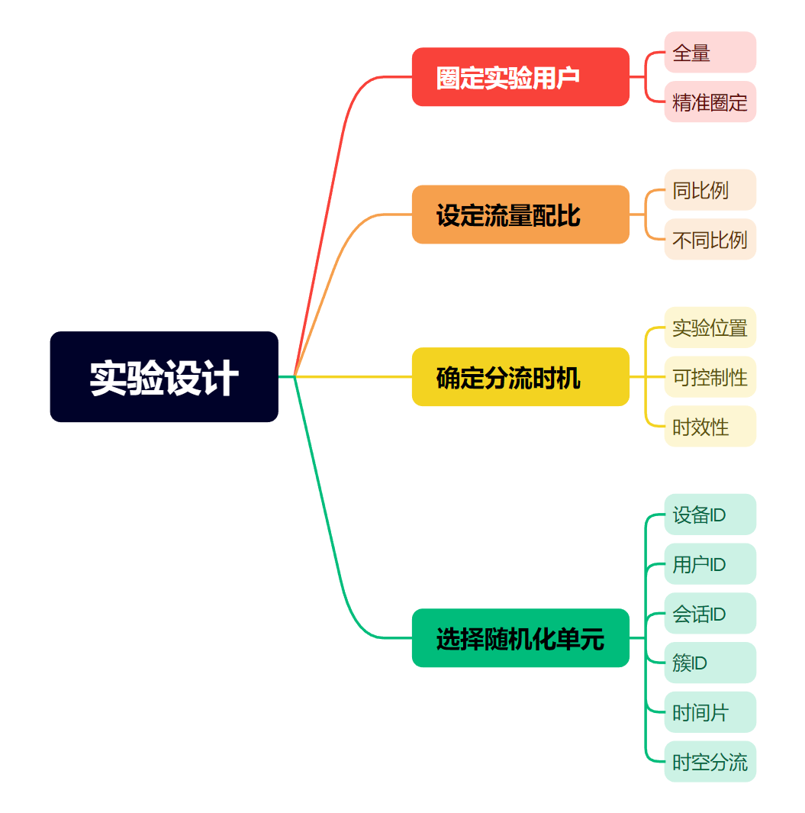

# 我的策略真的有效吗？——AB实验第4期

> 嗨~各位小伙伴们周末好哇，苏晓糖又来更新啦(斜眼笑.emoji)！在第3期内容中我们分享了实验设计中的建设AB实验假设库和流量分配的原则内容，今天我们会继续分享实验设计环节的内容。在此之前呐，我想再次感谢各位小伙伴的鼓励，让我觉得所做之事无比有趣。在这里想借用黄有璨大佬的一句话“唯有爱与用户不可辜负”，而我想说“唯有爱与读者不可辜负”，因自身水平有限，内容必有不足之处，还请见谅。当然苏晓糖也会努力提高自身水平，争取为大家分享更多更优质的内容。谢谢大家！好的，接下来请大家随苏晓糖一起开启本期的AB实验之旅吧！

## 情景导入

在第3期内容中，苏晓糖通过ICE模型对3个可能假设进行了评估，认为假设2(通过将内容素材由文字调整为图文可以提升内容的点击率)优先级最高。假如我们现在想通过AB实验验证该假设的正确性，你接下来会如何进行实验设计呐？(tips: 比如实验用户是谁？什么时候进行分流？如何选择分流单元？如何设定流量配比？如何设定指标？实验周期大概有多久？)请大家停下来思考10秒钟哦~

## 内容框架

 实验设计环节主要包含流量分配方式设计、实验用户圈定、设定分流时机，设定随机化单元、设定流量配比、实验指标设计、确定最小样本量和实验周期。本期内容将重点放在实验用户圈定、设定分流时机，设定随机化单元、设定流量配比四个问题上，主要框架如下：

## 圈定实验用户

## 设定流量配比

## 确定分流时机

## 选择随机化单元

