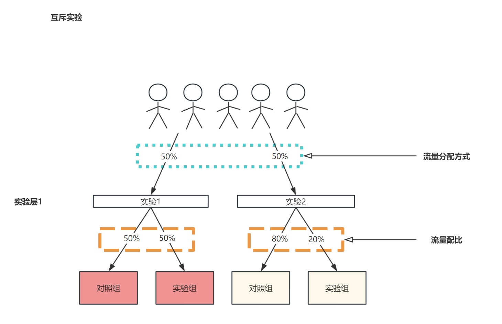

# 我的策略真的有效吗？——AB实验第4期

> 嗨~各位小伙伴们周末好哇，苏晓糖又来更新啦(斜眼笑.emoji)！在第3期内容中我们分享了实验设计中的建设AB实验假设库和流量分配方式选择，今天我们会继续分享实验设计环节的内容。在此之前呐，我想再次感谢各位小伙伴，你们的鼓励让我觉得所做之事无比有趣。在这里想借用黄有璨大佬的一句话“唯有爱与用户不可辜负”，而我想说“唯有爱与读者不可辜负”，因自身水平有限，内容必有不足之处，还请见谅。当然苏晓糖也会努力提高自身水平，争取为大家分享更多更优质的内容。谢谢大家！好的，接下来请大家随苏晓糖一起开启本期的AB实验之旅吧！

## 情景导入

在第3期中，苏晓糖通过ICE模型对3个可能假设进行了评估，认为假设2(通过将内容素材由文字调整为图文可以提升内容的点击率)优先级最高。假如我们现在想通过AB实验验证该假设的正确性，你接下来会如何进行实验设计呐？(tips: 实验群体是谁？什么时候进行分流？如何选择分流单元？如何设定流量配比？如何设定指标？实验周期大概有多久？)请大家停下来思考10秒钟哦~

## 内容框架

 实验设计环节主要包含流量分配方式设计、实验用户圈定、设定分流时机，设定随机化单元、设定流量配比、实验指标设计、确定最小样本量和实验周期。**本期内容将重点放在实验用户圈定、设定分流时机，设定流量配比、设定随机化单元四个问题上**，主要框架如下：

## 圈定实验群体

圈定实验群体就是确定哪些群体可以命中AB实验(随机进入对照组或实验组)或针对某些群体屏蔽对应的AB实验，主要有两种方式：全量和精准圈定。**基本原则是优先精准圈定，其次为全量命中实验**。以情景导入中的问题为例，苏晓糖建议是**直接圈定存量沉默用户而非全量用户进行实验**，可能原因：

- 业务上：一般而言，**不同生命周期的用户会采用不同的运营策略**，假设在此场景下直接对**全量用户进行AB实验，可能会对存量活跃用户和新用户的运营产生影响**(可能正向也可能负向)，为避免出现一些不可控的影响，应尽可能精准圈定实验策略影响的用户群
- 数据上：**精准圈定实验群体有助于降低指标方差，减少流量占用，缩短实验周期**。可以从以下两个角度解释：①**总体方差 = 组间方差 + 组内方差**，可以粗略认为精准圈定实验群体(组内)的指标方差相较于全量(总体)更小。②假设我们希望存量沉默用户中的50%进入对照组，50%进入实验组。假设实验用户是全量用户，实验分流通常可以保证全量用户的50%进入对照组，50%进入实验组，但**在数据量较小的场景下，可能出现存量沉默用户在对照组和实验组分配偏离目标**(比如49%:51%)。如果要实现目标的流量分配，则需要更长的实验周期以积攒更多数据量。

那在什么时候可以选择全量群体作为目标实验群体呐？通常是在以下两个场景：

- 没有较为明确的标签可以使用，不得不对全量进行实验
- 无法满足分流时机的时效性要求，在第3部分进行详细介绍

## 设定流量配比

设定流量配比就是在同一个实验中流量如何在对照组和实验组中进行划分，区别于在第3期中的流量分配方式的选择(主要是处理不同实验流量的分配问题)，以下图的互斥实验为例，实验1和实验2同处于实验层1作为互斥实验，分别使用总体流量的50%。实验1的流量配比为对照组 : 实验组=50% : 50%（分别占用总体流量的50%×50%=25%），实验2的流量配比为对照组 : 实验组=80% : 20%(分别占用总体流量的40%=50%×80%和10%=50%×20%)。

如何选择合理的流量配比呐？在苏晓糖看来主要遵循两种原则：

- **逐步放量原则**。假设实验位置对于企业的核心指标影响很大(比如收入)，为了避免实验策略出现负向或实验出现bug，导致影响核心指标，通常可以采取实验组小流量测试(如5%~10%)，在未发现指标显著负向或明显bug的情况下，逐步调高实验组的流量占比(如5%→10%→20%→30%)。

- **配比相同原则**。假设实验位置对于企业的核心指标影响很小，我们可以选择直接将分配给实验的流量均匀的分配到对照组和实验组中，原因是流量的均匀分配有助于降低指标方差。苏晓在此给出简单的证明：

  假设总体流量为$n$, 为不失一般性，仅有两个实验版本(一个对照组和一个实验组)，分别使用流量$n_{对照组}$和$n_{实验组}$ ，同时有$n_{对照组}+n_{实验组}=n$, 对照组和实验组的样本方差分别为$s^2_{对照组}$和$s^2_{实验组}$ ，两个总体均值之差的假设检验的在大样本下的指标方差为$var=\frac{s^2_{对照组}}{n_{对照组}}+\frac{s^2_{实验组}}{n_{实验组}}$, 为实现指标方差的最小化，我们将指标方差对对照组样本量进行求导数有：
  $$
  \begin{align}
  	\frac{dvar}{dn_{对照组}} &= d(\frac{(n-n_{对照组})s^2_{对照组}+n_{对照组}s^2_{实验组}}{(n-n_{对照组})n_{对照组}})/dn_{对照组}\\
  &=\frac{n^2_{对照组}s^2_{实验组}-(n-n_{对照组})^2s^2_{对照组}}{n^2_{对照组}(n-n_{对照组})^2}\\
  &=0\\
  解方程得\frac{n-n_{对照组}}{n_{对照组}}&=\frac{s_{实验组}}{s_{对照组}}，当s_{对照组}=s_{实验组}时有\\ n_{对照组}&=n_{实验组}=\frac{n}{2}
  \end{align}
  $$
  

## 确定分流时机

分流时机即什么时候调用分流接口，用来判断一个用户应该进入对照组还是实验组(应进入哪个实验版本)。**分流时机的选择通常由实验位置、可控制性、时效性、成本等四个因素决定**。具体有：

- **实验位置**：可以简单理解为实验组和对照组用户**看到的不同版本的页面或界面**
- **时效性**：一般而言，**越是靠近实验位置，时效性要求更强**。时效有两个层面的含义：**①调用AB实验系统分流接口返回用户所属版本的耗时 ②调用用户标签系统接口返回用户是否为实验群体的耗时**
- **可控制性**：研发**是否可以自主可控的植入**分流和用户标签查询的**代码**，用来控制一个用户应该看到哪个版本
- **成本**：AB实验可能在APP的任意位置进行，若每次都单独为每个实验开发分流代码，则需要较多的研发人力投入。**考虑到经济性可以在实验群体必经路径(比如APP启动时分流)上植入分流代码，避免重复性开发。但存在实验群体不精准的问题。**

假设我们希望验证邮件内容由纯文字调整为图文可以提升邮件存量用户的点击率的假设，简单梳理用户旅程，有以下结果：

- **实验位置：**邮件内容详情页
- **时效性：**时效性的要求从APP启动→打开邮件依次增强
- **可控制性：**APP启动(实验群体不精准)和发送邮件(实验群体相对精准)前可控制性较强，发送成功→打开邮件不可控制。
- **成本：**APP启动时分流成本较低，发送邮件前分流成本偏高

基于以上结果，我们可以得出合理的分流时机应当在APP启动时和发送邮件前分流，二者孰优孰劣取决于对于成本的敏感性和对于实验群体不精准(带来更高的指标方差，消耗更多的流量)的敏感性。

## 选择随机化单元

随机化单元，即使用用户的哪类信息进行Hash计算，将用户随机分配至不同实验版本中。**常见的随机化单元主要有页面ID、会话ID、设备ID、用户ID、簇ID、时空分流、时间片轮转等**。具体的有：

- **页面ID：用户每次进入一个不同页面都可能会被划分至不同的实验版本，样本量增加，但用户体验一致性很差**。以测试页面主题色对页面点击率的影响为例，对照组为冷色系，实验组为暖色系，则一个用户A可能在页面1看到的是冷色系，但是在页面2看到的是暖色系。

- **会话ID：用户每次开启一个新的会话(一连串的页面)都可能会被划分至不同的实验版本，样本量增加，但用户体验一致性较差**。仍旧以测试页面主题色对页面点击率的影响为例，则一个用户A可能在第一个会话中看到的所有页面都是冷色系，但是在第二个会话中看到的都是暖色系。

- **设备ID：设备ID通常适用于存在非登录态的实验场景**， **样本量较多，用户体验一致性较强**。仍旧以测试页面主题色对页面点击率的影响为例，则一个用户A可能在手机中看到的所有页面都是冷色系，但是在网页中看到的都是暖色系。

- **用户ID：同一个用户在整个实验运行期间只会被分配至某个版本之中，样本量较多，用户体验一致性很强**。仍旧以测试页面主题色对页面点击率的影响为例，用户A无论何时以何种设备访问页面都会看到相同的主题色，可以保证用户体验的一致性。

- **簇ID：将相近的用户划分至不同的簇中，然后使用簇ID进行分流，相同簇中的用户被划分至同一个实验版本中，常用于用户之间可能存在相互影响的场景**。假设某个社交APP想要测试新策略是否可以提升用户发消息的数量，若以用户ID分流则实验策略可能存在溢出效应，即用户A和用户B是好友关系，用户A被分配至实验组，用户B被分配至对照组，假设新策略是正向的，用户A发消息的数量提升，那就很可能带动对照组中的用户B的发消息数量提升，从而低估新策略的效果。

  

- **时空分流：将时间片ID和地域ID的组合信息用于分流，同一个地域的不同时间段只会生效一种策略，不同地域的相同时间段可能会生效不同策略，常见于双边市场且空间地域间溢出效应很弱的场景之中(比如滴滴、货拉拉)**。假设滴滴想测试新的用户补贴策略是否能提升用户完单数，若以用户ID分流则实验策略可能存在溢出效应，即处于同一区域中的用户A新策略，用户B原策略，在此区域内的司机C和司机D可能更愿意响应用户A的订单，而用户B则无司机响应，造成新策略效果的高估。

  

- **时间片轮转：仅使用时间片ID进行分流，不同时间段线上只会生效一种策略，常见于双边市场(比如快手、抖音直播场景)**。假设抖音想测试主播美颜功能是否可以提升用户的观看时长。若以主播ID分流则实验策略可能存在溢出效应，即主播A开启美颜，主播B没有美颜，假设美颜功能的效果是正向的，则主播A可能会抢占主播B的流量，从而造成新策略效果的高估。

  

选择随机化单元的基本原则：**若存在实验策略的溢出效应，应当选择簇ID分流、时空分流或时间片轮转，若对用户体验的一致性要求较高应采用用户ID或设备ID分流，若对用户体验的一致性要求不高可以采用页面ID或会话ID分流。**

| 随机化单元 | 颗粒度(星越少，颗粒度越细) | 用户体验一致性 | 指标方差(星越高，方差越小) |
| ---------- | -------------------------- | -------------- | -------------------------- |
| 页面ID     | ⭐                          | ⭐              | ⭐⭐⭐⭐⭐⭐⭐                    |
| 会话ID     | ⭐⭐                         | ⭐⭐             | ⭐⭐⭐⭐⭐⭐                     |
| 设备ID     | ⭐⭐⭐                        | ⭐⭐⭐            | ⭐⭐⭐⭐⭐                      |
| 用户ID     | ⭐⭐⭐⭐                       | ⭐⭐⭐⭐⭐          | ⭐⭐⭐⭐                       |
| 簇ID       | ⭐⭐⭐⭐⭐                      | ⭐⭐⭐⭐⭐          | ⭐⭐⭐                        |
| 时空分流   | ⭐⭐⭐⭐⭐⭐                     | ⭐⭐⭐            | ⭐⭐                         |
| 时间片轮转 | ⭐⭐⭐⭐⭐⭐⭐                    | ⭐⭐⭐            | ⭐                          |

## 资源推荐

- 《关键迭代：可信赖的线上对照实验》——罗恩·科哈维（Ron Kohavi）+黛安·唐（Diane Tang）
- 《硅谷增长黑客实战笔记》——曲卉著
