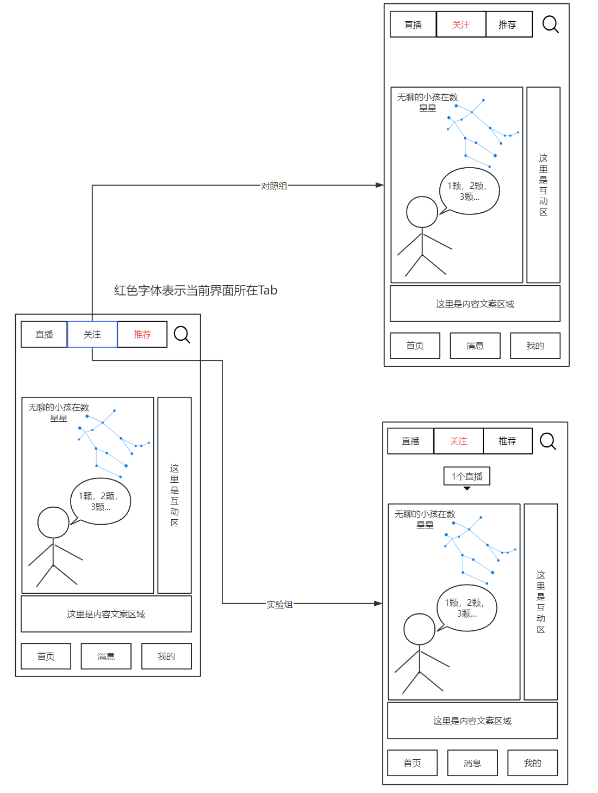
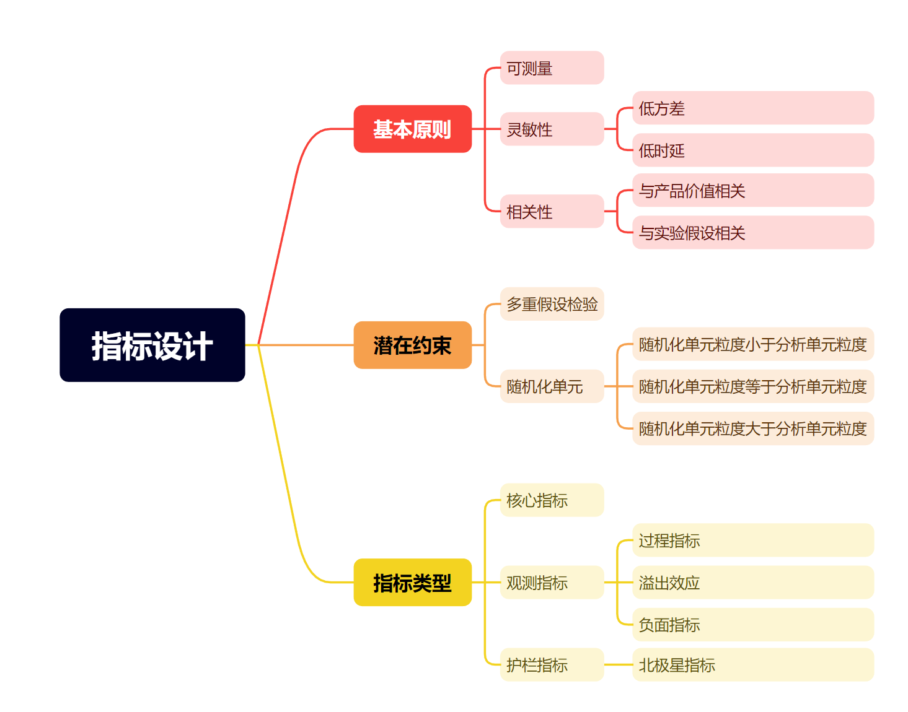
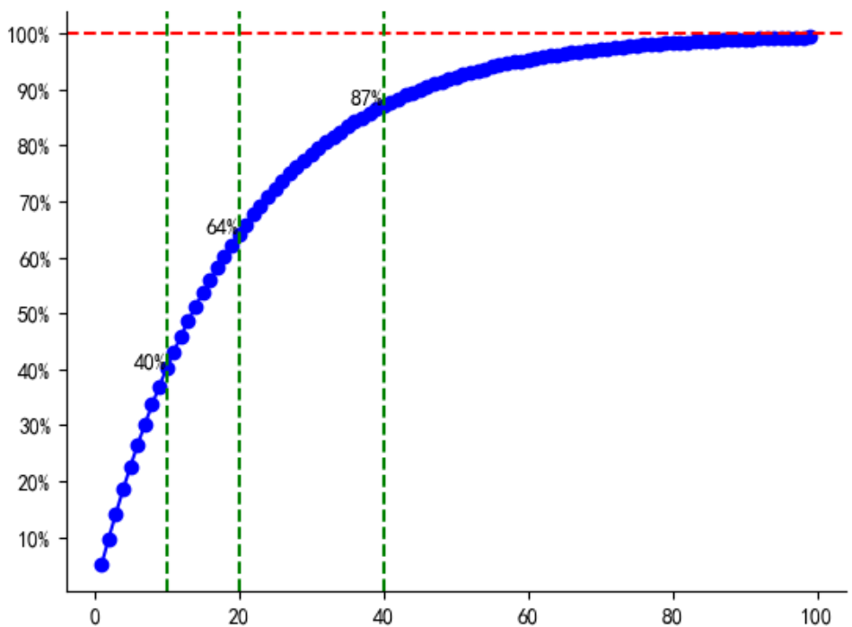
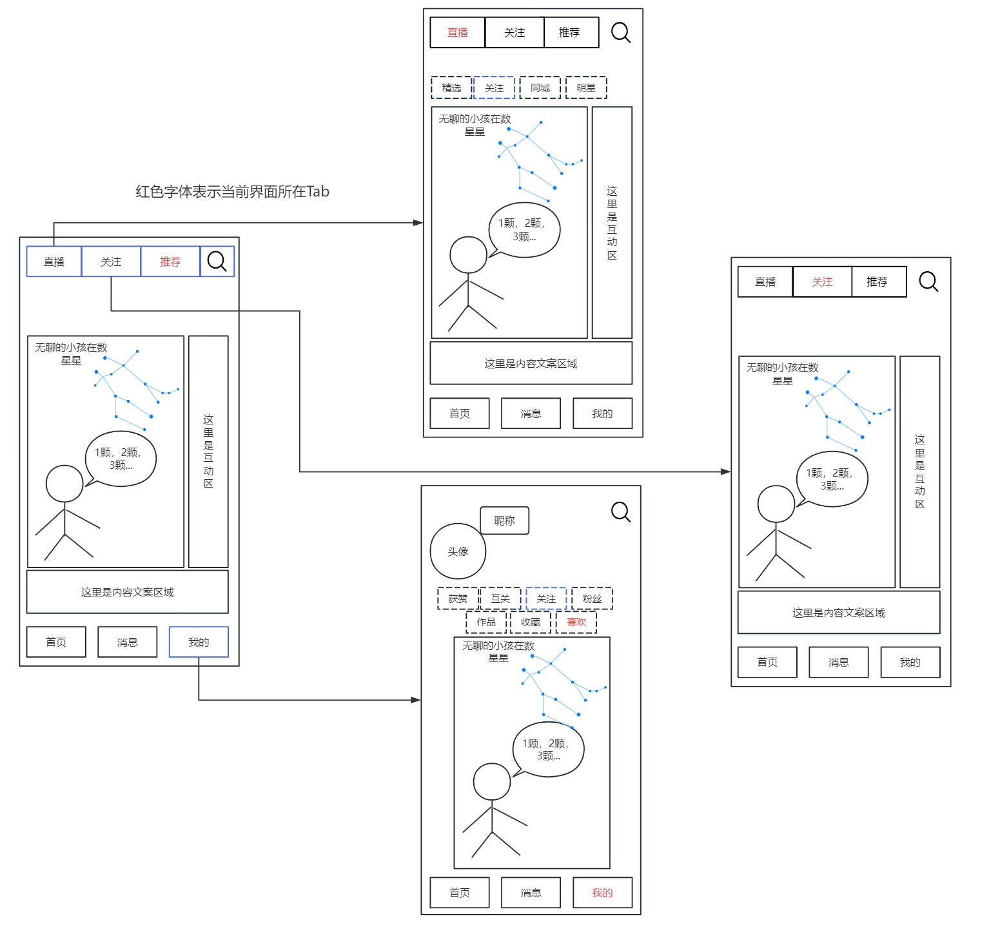

# 我的策略真的有效吗？——AB实验第5期指标设计

> 叮咚，叮咚~ 您的AB系列第五期内容已被苏晓糖送货上门，请注意查收哦 ~  在第4期内容中，集中讨论了实验设计环节中实验群体圈定、流量时机设定、分流时机设定、随机化单元选择等4个问题，第5期内容会将重点放在实验设计环节的**指标设计**上，好勒，接下来就跟随苏晓糖一起体会AB实验的指标设计之美吧~ 

## 情景导入

某日，苏晓糖在刷某音时意外发现，在关注tab的页面上方出现直播入口，点击下拉框后可以查看苏晓糖当前关注且正在直播的主播，如下图所示(避免侵权和违规只好手绘一个app界面啦，嘿嘿~)，苏晓糖怀疑自己可能成为了某音AB实验的小白鼠，但是他们的决策逻辑会是什么呐？大家可以思考一下哦 ~，苏晓糖会把自己的思考放在本期内容的附录中。回归正题，假设你是负责此AB实验的产品经理，核心逻辑是想通过降低用户搜索已关注主播的操作成本来提升用户的直播观看时长，你会选择观察哪些指标呐？请停下来思考10秒钟 ~

## 内容框架

在第4期内容中，集中讨论了实验设计环节中实验群体圈定、流量时机设定、分流时机设定、随机化单元选择等4个问题，**本期内容则主要讨论AB实验中如何设计合理的观察指**标。AB实验作为因果推断的黄金准测，观察指标设计的合理性直接决定了AB实验的结果，不好的指标设计，轻则浪费一个有潜力的产品优化，重则引导企业做出错误的商业决策。**指标设计主要包括以下三个部分：**

- **基本原则**
- **潜在约束**
- **指标类型**

## 基本原则

在进行AB实验的观察指标设计时，需要考虑三大原则：**可测量性、灵敏性、相关性**。

### 可测量性

**可测量性要求每个指标都应有清晰明确的定义**，比如留存率、浏览时长。与之相反，假如我们使用用户满意度这种高度抽象且容易引起争议的指标作为观察指标，就很容易出现公说公有理婆说婆有理的窘境。

### 灵敏性

灵敏性主要有两个层面的含义：低方差和低时延。其中：

- **低方差主要从降低最小样本量，缩短实验周期方向进行考虑**。一个指标的方差越小，所需要的最小样本量越小，实验周期越短，从而提升实验迭代的速度。比如在金融行业等头部效应比较明显的行业中，较容易受到大客户的影响，如果使用客户的人均资产作为观测指标，就需要更大的样本量，来减轻大客户对人均资产的影响。**一般而言，比率和比例类指标的方差低于绝对值类指标。**
- **低时延主要基于AB实验的弱项考量，AB实验擅长衡量策略的短期效应，而衡量长期效应的成本很高**。假设一个指标的时延非常高，比如在一些年费续订场景下的实验，如果使用用户的年费续订率作为观察指标，则至少要把AB实验的周期拉长到一年以上，很显然这对于企业来讲是难以承受的。

### 相关性

相关性主要有两个层面的要求：与产品价值相关和与实验假设相关。其中：

- **与产品价值相关要求我们需要时刻关注新策略主要解决了用户的哪些痛点和诉求**。以情景导入中的问题为例，该策略可能是为了帮助观看直播的用户降低关注主播的搜索成本，提升用户直播观看时长，最终提升用户整个APP的浏览时长。假设我们要从用户直播观看时长和用户的留存率中选择一个指标作为观察指标，你会如何选择呐？在苏晓糖看来用户直播观看时长优于用户的留存率，因为我们新策略的生效逻辑并不会直接反应在用户留存上(用户留存有其他更重要的影响因素，如优秀的推荐算法、更多的签约主播)。
- **与实验假设相关要求我们要关注策略生效的位置和用户群体**。仍旧以情景导入中的问题为例，假设我们要从用户直播观看时长和用户的商城GMV中选择一个指标作为观察指标，你会如何选择呐？很显然，我们要选择用户直播观看时长，因为我们的实验策略在关注tab生效，所以我们的策略原则上并不会直接影响到用户的商城GMV。

## 潜在约束

### 多重假设检验

我们在判断AB实验的策略有效性时会使用观察指标进行假设检验，假设我们对数个指标进行假设检验，就会导致我们犯一类错误的概率飙升，这就是多重假设检验带来的潜在问题。假设我们要进行n次假设检验，Ⅰ类错误率为5%，则n次实验中至少犯一次错误的概率是 $1-(1-5\%)^n$, 如下图所示当n=10时，我们至少犯一次错误的概率飙升至40%，n=20时，至少范一次错误的概率来到64%，后续随着n的增加，我们犯错误的概率逐渐逼近1。

目前解决多重假设检验主要有三种思路：

- 减少用于实验决策的观察指标数量
- 通过多指标的加权聚合为少数几个指标，使用加权后指标进行决策
- 基于假设检验的次数对Ⅰ类错误率的设定进行动态调整(如5%→1%→0.1%)

考虑到篇幅的影响，苏晓糖仅在此进行介绍可能得思路，在完成AB实验的整体流程分享后，苏晓糖会单独用数期内容来详细介绍AB实验常遇到的问题及对应的解决方案，敬请期待哦~

### 随机化单元

在介绍随机化单元约束之前，我想带领大家一起回忆两独立样本均值差假设检验的统计量计算公式，其中第一个等号使用两个随机变量的方差计算公式得出，第二个等号基于两个样本的独立性假设得出，第三个等号基于样本均值的定义得出，第四个等号基于每个样本都是从相应总体中独立重复采样得出。所以**在进行AB实验的指标假设检验时要重点关注设定的指标是否违背版本间独立(第二个等号)和版本内个体独立假设(第四个等号)**。
$$
\begin{align}
\frac{\bar{X_1}-\bar{X_2}-d_0}{\sqrt{var(\bar{X_1}-\bar{X_2})}}&=\frac{\bar{X_1}-\bar{X_2}-d_0}{\sqrt{var(\bar{X_1})+var(\bar{X_2})-2cov(\bar{X_1},\bar{X_2)}}}\\
&=\frac{\bar{X_1}-\bar{X_2}-d_0}{\sqrt{var(\bar{X_1})+var(\bar{X_2})}}\\
&=\frac{\bar{X_1}-\bar{X_2}-d_0}{\sqrt{var(\frac{1}{n_1}\sum_i{X_i})+var(\frac{1}{n_2}\sum_j{X_j})}}\\
&=\frac{\bar{X_1}-\bar{X_2}-d_0}{\sqrt{\frac{\sigma^2_1}{n_1}+\frac{\sigma^2_2}{n_2}}}\end{align}
$$
在进行指标设计时需要考虑随机化单元和分析单元的关系。**分析单元可以理解为指标粒度，或者理解为计算指标均值时除以的数字N所代表颗粒度，如果N是用户数则为用户粒度，如果N是会话数则为会话粒度**。苏晓糖建议观察指标的计算粒度最好与随机化单元粒度保持一致。原因如下：

- **假设随机化单元的粒度等于分析单元的粒度**。比如随机化单元和分析单元均使用用户ID，则分流的随机性可以保证用户ID粒度下的指标在进行统计量计算时天然保证版本间独立和版本内个体间独立的假设成立。
- **假设随机化单元的粒度小于分析单元的粒度**。比如随机化单元选择会话ID进行分流，而分析单元选择用户ID进行计算，这样会导致什么问题呐？是的，可能会出现同一个用户A的会话既在实验组出现又在对照组出现，我们在进行从会话ID粒度向上汇总至用户ID粒度时，会导致用户A既在对照组，又在实验组，**从而违背版本间独立性假设**。
- **假设随机化单元的粒度大于分析单元的粒度**。比如随机化单元选择用户ID进行分流，而分析单元选择会话ID进行计算，这样会导致什么问题呐？是的，可能会出现一个用户A的多个会话ID在同一个版本内出现，**从而违背版本内个体独立假设。出现这个问题时，通常采用bootstrap或delta method进行指标方差计算**。

## 指标类型

### 核心指标

**核心指标通常选择与本次实验最直接相关的1-2个指标，不宜过多**(过多可能导致多重假设检验的问题)，作为判断本次实验策略的有效性的主要依据。以情景导入中的问题为例，苏晓糖会选择将直播的观看时长作为核心指标。

### 观测指标

观测指标通常需要考虑三个方面的问题：

- **过程指标，辅助判断测试策略是否按照预期逻辑影响核心指标**。以情景导入中的问题为例，苏晓糖会将实验组中的人均直播入的点击率和人均关注tab的直播观看时长作为过程指标进行观测，在进行实验结果复盘时，基于过程指标表现辅助判断策略是否生效以及生效逻辑是否与预期表现一致(降低用户查找当前关注且正在直播主播的成本)。
- **溢出效应，用于辅助判断测试策略是否影响其他模块或页面的表现**。一般而言，我们的策略并非独立存在，新策略的上线必定会对系统中(APP)的其他模块，或多或是的产生影响，尤其是在某些位置增加一些功能或入口的场景。以情景导入中的问题为例，因为新策略会在关注tab的上方增加直播入口，大概率会影响用户在关注tab的内容消费，因此苏晓糖会额外观测人均关注tab的用户浏览时长和人均关注tab内容浏览数。
- **负面指标，辅助判断测试策略是否产生其他可能的负面影响，一般是我们希望降低的指标**。以情景导入中的问题为例，关注tab下的直播入口可能会影响用户在关注tab的内容消费，从而导致从该入口进入直播间的用户的取关率提升，因此苏晓糖会将人均取关率作为负面指标进行观测。

### 护栏指标

**护栏指标，通常是我们不能容忍有负向的指标**，比如我们的北极星指标，**即使新策略可以显著提升核心指标，但是对护栏指标出现负向，新策略也不能全量上线**。以情景导入中的问题为例，苏晓糖会将APP的浏览时长作为护栏指标，假设用户的新策略显著提升了用户的直播观看时长的同时，关注tab或推荐tab的浏览时长显著下降，且直播tab提升幅度小于其他模块下降的幅度，此时新策略几乎不会被全量上线。

基于以上的分析，在下表中，苏晓糖给出在情景导入的问题中可能会观察的相关指标和相关维度的评分，各位小伙伴们会选择观察哪些指标呐？欢迎各位小伙伴在评论区或公众号后台进行留言~

| 指标类型          | 指标名称                    | 可测量性 | 灵敏性 | 相关性 |
| ----------------- | --------------------------- | -------- | ------ | ------ |
| 核心指标          | 人均直播观看时长            | 5        | 4      | 5      |
| 观测指标-过程指标 | 人均关注tab的直播入口点击率 | 3        | 5      | 5      |
| 观测指标-过程指标 | 人均关注tab的直播观看时长   | 3        | 3      | 5      |
| 观测指标-溢出效应 | 人均关注tab浏览时长         | 4        | 4      | 5      |
| 观测指标-溢出效应 | 人均关注tab浏览量           | 4        | 3      | 5      |
| 观测指标-负面指标 | 人均取关率                  | 5        | 5      | 5      |
| 护栏指标          | 人均APP浏览时长             | 5        | 4      | 5      |

## 资源推荐

- 《关键迭代：可信赖的线上对照实验》——罗恩·科哈维（Ron Kohavi）+黛安·唐（Diane Tang）
- 《硅谷增长黑客实战笔记》——曲卉著

## 附录

苏晓糖为了推测某音的决策逻辑，从用户视角梳理了自打开APP->观看关注主播直播的可能路径：

- 推荐tab：推荐tab下不停浏览内容，关注的主播会被随机插入到当前的内容流中。

- 关注tab：点击关注tab，在关注tab下不停地浏览内容，关注的主播会被随机插入到当前内容流中。

- 全局搜索：点击全局搜索，输入主播名称进行查找

- 我的tab：点击我的tab，进入关注用户列表进行查看

- 直播tab：点击推荐tab，点击关注子tab查找当前关注的主播

  综合用户的可控性和操作便利性来看，直播tab > 我的tab > 全局搜索 > 关注tab > 推荐tab。既然直播tab可以帮助用户快速找到自己关注的主播，那为什么还要在关注tab下增加直播入口呐？苏晓糖推测某音可能是发现用户查找关注主播的流量主要集中在我的tab或者全局搜索两条路径而通过直播tab搜索的流量较少上，从用户视角看就是先筛选 “我关注的” 再筛选 “主播”。此外这种操作逻辑在其他的货架式直播平台上比较常见，因此此种策略存在一定的合理性。好的，苏晓糖就先YY到这里啦~ 小伙伴们你们怎么看呐?欢迎大家在评论区或后台留言哦~

  | 方式     | 用户可控性     | 操作便利性                   |
  | -------- | -------------- | ---------------------------- |
  | 推荐tab  | 用户基本不可控 | 很差，依赖于算法推荐         |
  | 关注tab  | 用户基本可控   | 较差，依赖于算法排序         |
  | 全局搜索 | 用户可控       | 差，需要手动输入主播名称搜索 |
  | 我的tab  | 用户可控       | 一般，至少点击3次完成查找    |
  | 直播tab  | 用户可控       | 好，2-3次点击即可完成查找    |

