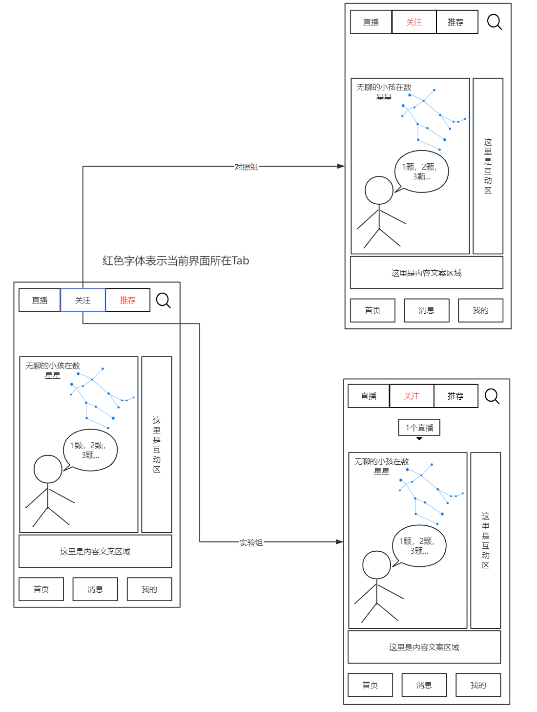
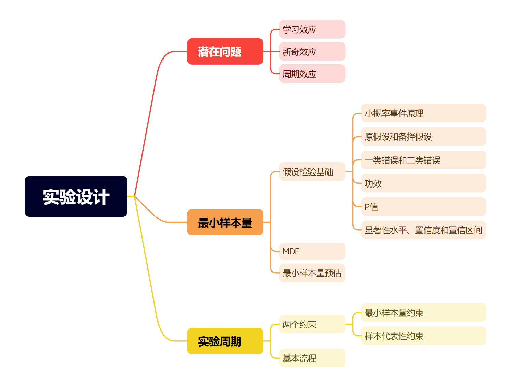
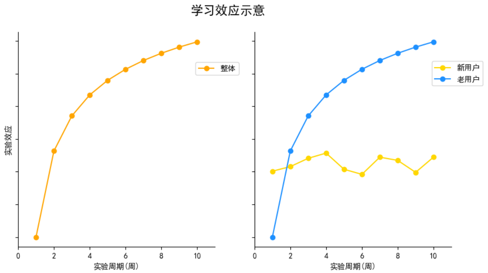
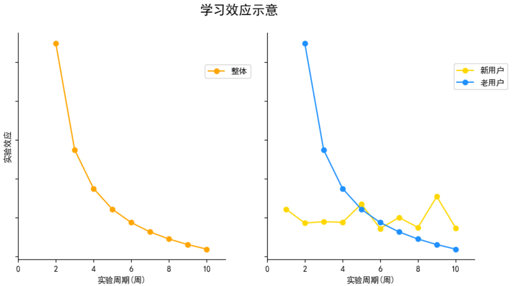
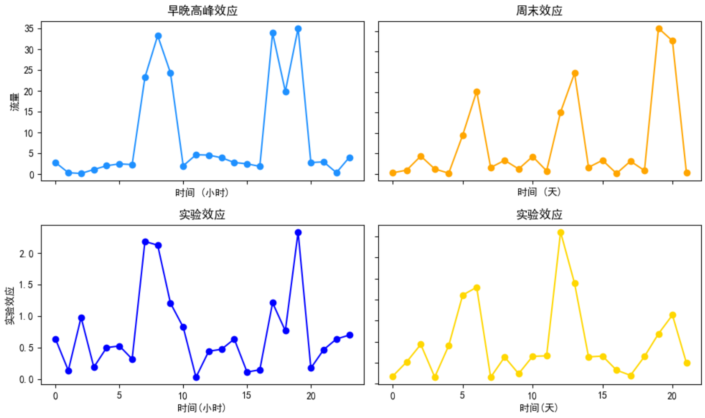
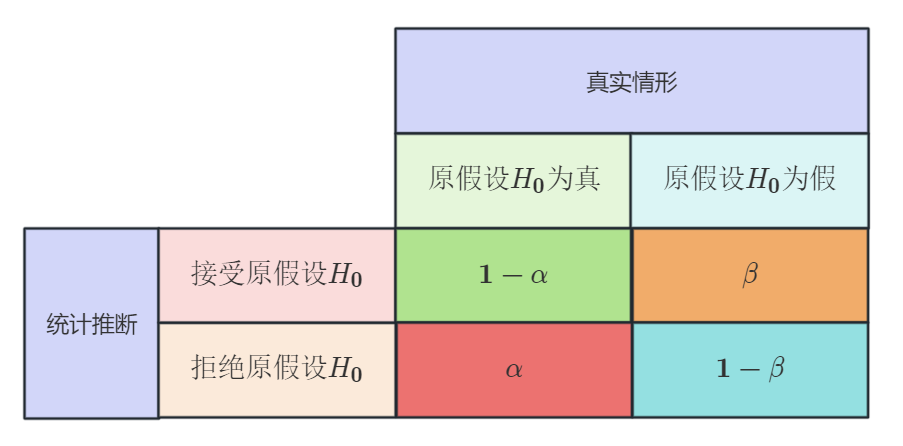
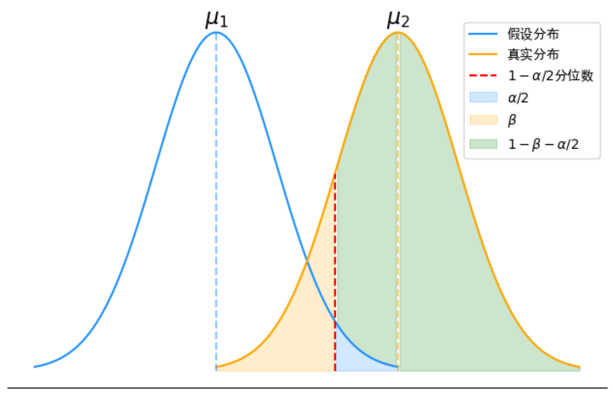
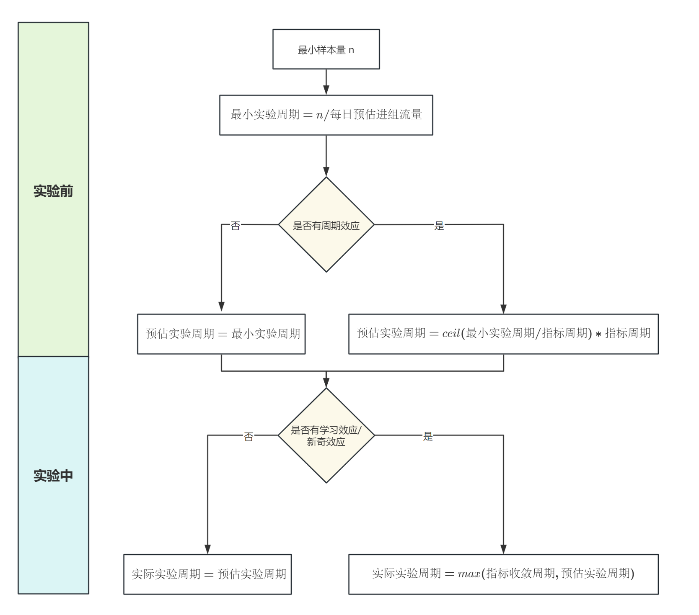

# AB实验第6期——一文讲透最小样本量和实验周期

> 嗨~ 各位小伙伴们大家周末好哇，苏晓糖(勤劳的小蜜蜂.jpg)又又又又来更新啦，熟悉苏晓糖AB系列的朋友应该发现了，是的苏晓糖的标题变了，以方便小伙伴们可以根据标题快速定位到每期的内容主题。在第3-5期的内容中苏晓糖介绍了AB实验中最为核心的实验设计环节，但这个环节还没有结束哦~ **本期内容仍会聚焦在实验设计环节**(这是实验设计环节的最后一期啦，我对天发誓，斜眼笑)中的**最小样本量和实验周期**的话题上，好勒，那就走吧，上车，请系好安全带！苏晓糖准备发车咯！

## 情景导入

在第5期中苏晓糖介绍了一个可能的某音AB实验的例子，本期仍旧以此为例，假如你是负责这个AB实验的产品经理，你会如何确定最小样本量和实验周期呐？请停下来思考一会儿哦~

## 内容框架

在第3-5期的内容中，苏晓糖依次介绍了实验设计环节中的**构建实验假设库、选择流量分配方式、圈定实验用户、设定分流时机、设定流量配比、设定随机化单元和指标设计**等问题，本期内容会聚焦在实验设计的**最小样本量**和**实验周期**两个问题上，主要内容如下：

- **潜在问题**
- **最小样本量**
- **实验周期**

## 潜在问题

### 学习效应

学习效应一般是指在我们上线新策略后，**实验用户或系统需要一定的习惯或学习时间**，导致实验效果在实验开始早期阶段偏低，随着时间推移，实验效果逐渐增大的现象。通常学习效应有两类：

- **用户学习效应**

  以情景导入中的问题为例，老用户可能已经习惯了原有的搜索自己关注主播的方式，但是随着时间推移这些用户会慢慢适应关注tab的新入口，老用户的流量逐步向关注tab的路径迁移。这就可能导致在实验早期实验效应较弱，随着随机推移实验效应逐步改善。

- **系统学习效应**

  以推荐系统的策略优化为例，推荐系统的在调整新策略后算法需要一定样本量进行学习逐步改进推荐效果，在实验早期可能出现推荐效果不明显甚至出现负向，但随着时间推移，算法学习到更多的样本后，推荐效果会逐步改善。

**如何识别实验中是否存在学习效应呐？**可以简单通过绘制实验效应的时间走势图或分别针对新老用户绘制实验效应走势图，看是否存在实验效应随时间推移逐步收敛的情况。如下图所示，横轴代表实验周期，纵轴代表实验效应，可以看到整体实验效应随着时间的推移提升并收敛至某一水平。同时区分新老用户来看，新用户的实验效应在某一水平上下波动，老用户实验效应与整体走势基本一致，由此可以推断我们的实验很大可能存在新奇效应。

### 新奇效应

新奇效应则与学习效应相反，有时在我们上线一个新策略时，**用户可能会出于对新功能或者新交互的好奇**，在实验早期阶段会高频使用新功能，导致实验效果非常显著，但随着时间推移，用户慢慢发现新功能没有用处，用户的使用频率会逐步下降，实验效果也逐渐减弱。以情景导入中的问题为例，假设新策略无效，在实验早期老用户可能会因为好奇频繁从关注tab入口进入直播间，随着实验推移，用户可能会慢慢回归至原始的操作路径。

**如何识别实验中是否存在新奇效应呐？**可以简单通过绘制实验效应的时间走势图或分别针对新老用户绘制实验效应走势图，看是否存在实验效应随时间推移逐步收敛的情况。如下图所示，横轴代表实验周期，纵轴代表实验效应，可以看到整体实验效应随着时间的推移逐渐减小并收敛至某一水平。同时区分新老用户来看，新用户的实验效应在某一水平上下波动，老用户实验效应与整体走势基本一致，由此可以推断我们的实验很可能存在新奇效应。

### 周期效应

**在不同类型业的务中不同类型的用户活跃时段可能不同，使得大盘的指标走势存在较为明显的周期效应，若仅在周期内的部分时段进行AB实验，选定时段的用户对于总体的代表性较弱，可能会导致我们得出错误的实验结论**。

以出行业务为例，可能存在比较明显的早晚高峰效应(左上角子图)和周末效应(右上角子图)，而两种效应的出现可能是由两种不同类型的用户带来，比如早晚高峰主要是上班组出行，而周末效应则主要为家庭出行。假设新策略对于上班族和家庭的影响存在差异，那我们在不同时间段进行实验，很可能会得到不同的实验结果。以左下角子图为例，假设新策略对上班族影响更大，但是我们仅在非早晚高峰期运行实验，则会造成实验效果的低估，相反，如果仅在早晚高峰运行实验，则会造成实验效果高估。以右下角子图为例，假设新策略对家庭出行影响更大，但是仅在工作日运行实验，则会造成实验效果的低估，相反，若仅在周末运行实验，则会造成实验效果的高估。

## 最小样本量

AB实验的基础是假设检验，若希望得出有效的结论，必须有一定样本量的支撑，而最小样本量就是在给定显著性水平(α)、统计功效(1-β)的情况下，能够检测出最小检测效应所需的最小样本量。为了帮助大家更好的理解最小样本量的计算，苏晓糖在此给出假设检验的统计学基础，如果小伙伴对于假设检验已经非常了解，可以直接下滑至MDE(最小检测效应)的部分。

### 假设检验基础

#### 小概率事件原理

- 基本含义：**小概率事件在一次随机实验中是不可能发生的**。如果小概率事件发生了，那么我们就有理由怀疑之前所做的相关假设的正确性

- 小概率事件原理在ABT中的使用

  - 做出假设: 实验组A和对照组B的指标无差异$ \mu_A - \mu_B = 0 $

  - 计算实验组A和对照组B的指标的实际差值$ diff_{实际} = \mu_{A实际} - \mu_{B实际} $

  - 如果计算出的实际差值与假设的差值相差很大，那么就有理由怀疑假设的正确性

####  原假设（H0）和备择假设（H1）

- 原假设（H0）：通常将希望收集证据予以拒绝的假设作为原假设

- 备择假设（H1）：将希望通过搜集证据予以支持的假设作为备择假设

- 原假设和备择假设：互斥性、完备性

- 检验方向

  

####  第一类错误（α）和第二类错误（β）

- 第一类错误（α）：弃真错误，也称显著性水平

- 第二类错误（β）：取伪错误

- 第一类错误和第二类错误都是针对于原假设而言的条件概率

- 基本理解

  - 第一类错误（α）$ \alpha=P(拒绝H_0|H_0为真) $

  - 第二类错误（β）$ \beta=P(接受H_0|H_0为假) $

  

- 图形化表示

  - 蓝色线条代表假设的随机变量分布，橙色线条代表真实的随机变量分布

  - 浅蓝色区域的面积就是第一类错误（α）

  - 浅黄色区域的面积就是第二类错误（β）

  - 统计功效（1-β）：浅绿色和浅蓝色的两块区域即为统计功效

    

#### 功效（1-β）

- 基本含义：当实际情况原假设为错误的时候，能够拒绝原假设的概率
- 功效一般取值为0.8
- 条件概率表示：

$$ 功效= 1-\beta=P(拒绝H_0|H_0为假) $$

- 图形含义: 浅绿色区域面积加浅蓝色区域面积

#### P值

- 基本含义：P值是抽取到现有样本或更极端情况样本的概率。
- P值是指的一个区间内的概率，而是一个点的概率
- 如何理解: P值反映了抽样样本均值偏离总体均值的程度大于等于本次抽样的样本均值偏离总体均值的概率
- P值是样本函数，随着抽样样本的变动而变动

#### 显著性水平、置信度和置信区间

- 显著性水平: 也就是第一类错误率（α），一般取0.05
- 置信度：1-α
- 置信区间：给定的显著性水平下，使用当前抽样样本统计量估计的总体均值可能的所处区间。置信区间同样也是样本的函数。

$$ P(\frac{|\bar{x}-\mu|}{\sigma/\sqrt{n}}\le{Z_\frac{\alpha}{2}}) = \alpha $$

$$ \bar{x}-Z_{\frac{\alpha}{2}}\frac{\sigma}{\sqrt{n}}\le{\mu}\le{\bar{x}+Z_{\frac{\alpha}{2}}\frac{\sigma}{\sqrt{n}}} $$

### MDE

MDE又称最小检测效应，期望本次实验可以带来的指标提升量。**此处的指标提升量为绝对值，而非相对值**，即假设大盘的点击率为5%，期望本次实验的实验组点击率为6%，则MDE为1%(6%-5%=1%)。

### 最小样本量预估

最小样本量就是在给定显著性水平(α)、统计功效(1-β)的情况下，能够检测出最小检测效应所需的最小样本量。影响最小样本量的3个因素：

- MDE(最小检测效应)：**在其他条件保持不变的情况下，最小监测效应越小，所需要的最小样本量越大**。图形化解释，最小监测效应减小时，真实分布(橙色线)向左移动，必然使得浅黄色区域面积增大，为使得功效保持不变，因此橙线必然要变得更加陡峭，即方差需要缩小，用来抵消中心线左移带来的浅黄色区域面积增大的影响，因此所需样本量会增大。

- 显著性水平(α)：**在其他条件保持不变的情况下，显著性水平(α)越小，所需要的最小样本量越大**。图形化解释，当显著性水平缩小时，红色线向右移动，必然使得浅黄色区域面积增大，为使得功效保持不变，因此橙线必然要变得更加陡峭，即方差需要缩小，用来抵消红色线右移带来的浅黄色区域面积增大的影响，因此所需样本量会增大。

- 统计功效(1-β)：**在其他条件保持不变的情况下，统计功效(1-β)越大，所需要的最小样本量越大。**图形化解释，当统计功效增大时，需要使得浅绿色面积增大，同时为保证最小监测效应保持不变，橙线必然要变得更加陡峭，即方差需要缩小，以提升浅黄色区域面积，因此所需样本量要增大。

  

**均值型指标双侧检验的最小样本量计算**：$n=\frac{2\delta^2(Z_{1-\frac{\alpha}{2}}+Z_{1-\beta})^2}{\Delta^2}$，其中n为每个版本所需的最小样本量，$\delta$为指标的标准差，$\Delta$为MDE

**比例型指标双侧检验的最小样本量计算**：$n=\frac{2\bar{p}(1-\bar{p})(Z_{1-\frac{\alpha}{2}}+Z_{1-\beta})^2}{\Delta^2}$，其中n为每个版本所需的最小样本量，$\bar{p}$为平均比例，$\Delta$为MDE

以情景导入中的问题为例，假设我们的核心指标为人均观看直播时长，我们期望本次实验可以将人均观看时长提升2.5分钟(即$\Delta=2.5$)，实验前一段时间的指标标准差为25分钟(即$\delta=25$), 假设我们取α=0.05，β=0.2，则我们的最小样本量为$n=\frac{2*25^2(1.96+1.28)^2}{2.5^2}≈2100$

## 实验周期

AB实验面临着实验迭代速度和统计结果置信性的权衡，为了同时兼顾效率和准确性的要求，我们必须谨慎的确定实验周期。通常来讲实验周期的确定主要面临两个方面的约束：**最小样本量约束和样本代表性约束**。

### 最小样本量约束

**最小样本量约束即我们的实验周期长度需要满足最小样本量的要求。基于最小样本量计算出一个预计的最小实验周期(预估的最小样本量÷预估的每日进组流量)**，在情景导入的例子中我们预估的最小样本量为2100，假设每天的进组流量为210，则预估的最小实验周期为10天。

### 样本代表性约束

在确定实验周期时也应当考虑**学习效应、新奇效应和周期趋势**三个问题影响。合理的实验周期应当至少覆盖若干个完整指标周期且需要等待学习效应和新奇效应收敛(如有)。如果实验周期无法覆观测盖指标的一个完整周期，实验期间的样本流量难以代表总体，容易得出有偏的实验结论。同理如果我们的实验周期短于学习效应或新奇效应收敛的周期，即提前结束实验，有可能让我们做出作为的商业决策。

一般而言，实验周期的确定可以遵循以下流程：

- **实验前：**基于预估的最小样本量和每日预估的进组流量计算出最小实验周期，假设观测的指标无周期效应，则预估的实验周期为最小实验周期，若观测指标存在周期效应，则预估的实验周期应该等于ceil(最小实验周期/指标周期)*指标周期，其中ceil表示向上取整。
- **实验中：**观察实验是否存在学习效应或新奇效应，假设不存在学习效应或新奇效应，则实际的实验周期为预估的实验周期。若存在学习效应或新奇效应，则实际的实验周期应当为指标收敛周期和预估的实验周期的最大值。

## 资源推荐

- 《关键迭代：可信赖的线上对照实验》——罗恩·科哈维（Ron Kohavi）+黛安·唐（Diane Tang）
- 《硅谷增长黑客实战笔记》——曲卉著
- 《深入浅出统计学》——道恩·格里菲斯(Dawn Griffiths)著
