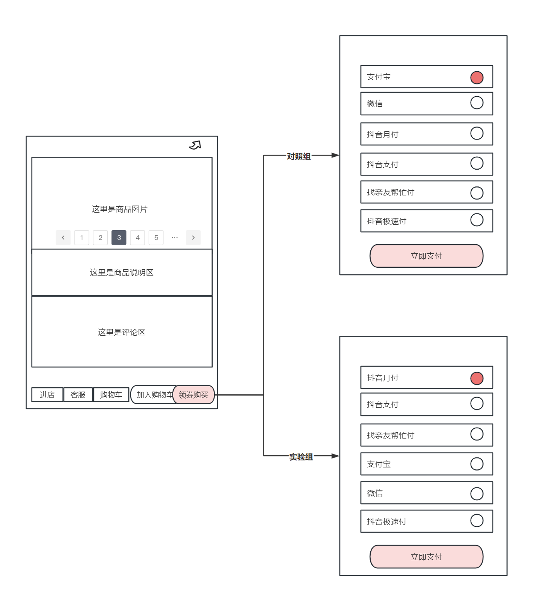
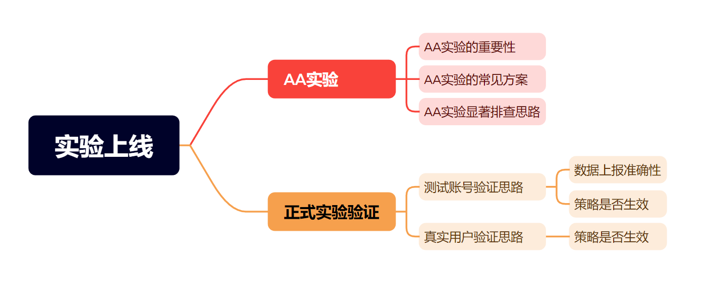
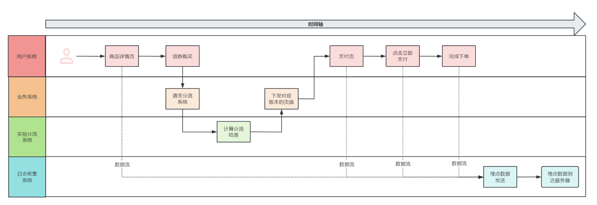
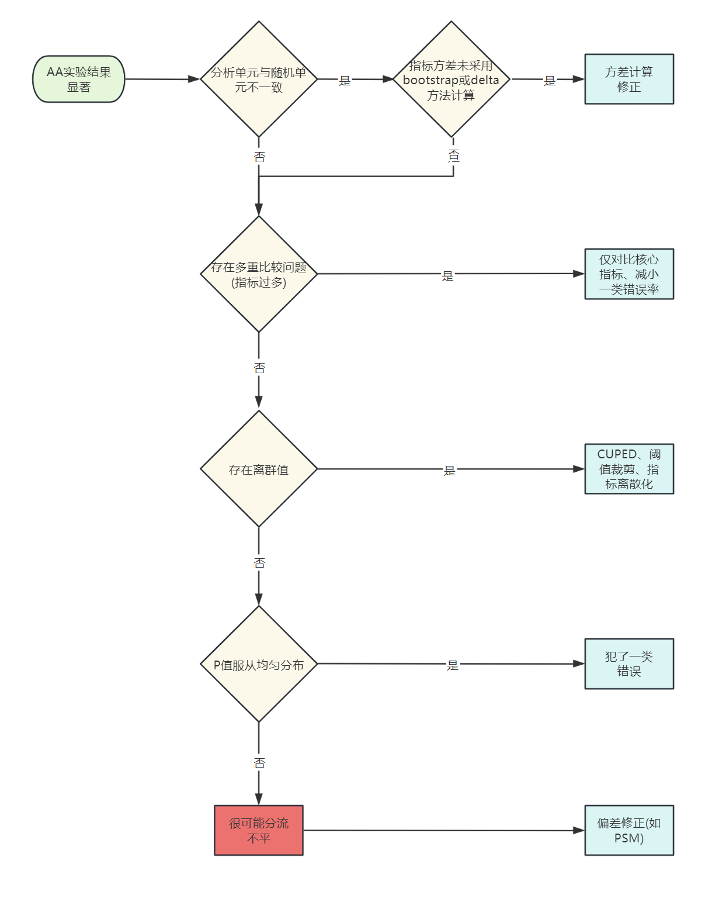
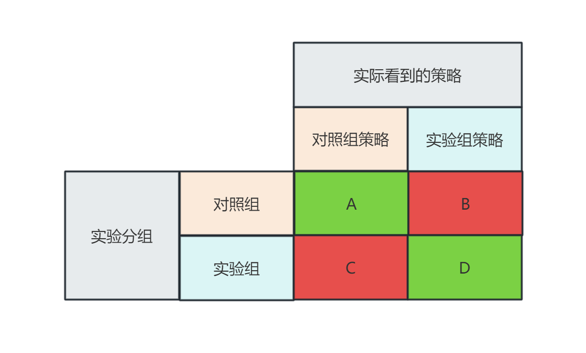
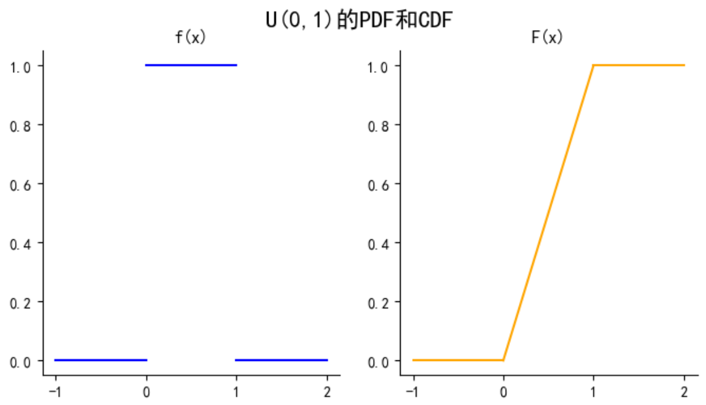

# 我的策略真的有效吗？——AB实验第7期

> 嗨，小伙伴们大家周末好呀，苏晓糖又给大家奉上周末小甜点喽~在AB系列内容的第3-6期中，苏晓糖聚焦于**实验设计环节，涵盖实验假设库构建、流量分配方式设计、实验用户圈定、设定分流时机，设定随机化单元、设定流量配比、实验指标设计、确定最小样本量和实验周期**等问题，而在本期内容中苏晓糖会重点讨论实验上线环节中的相关问题。好勒，那就跟着苏晓糖一起品尝一下周末小甜点吧 ~

## 情景导入

近年来，各互联网平台都在持续推出自有的支付通道(如抖音的抖音支付，美团的美团支付)，用户无需跳转至第三方支付平台，以提升用户的支付体验。假设你是抖音商城负责抖音支付的产品经理，想要验证在支付页面置顶抖音支付选项是否可以提升用户的支付转化率。接下来请思考你会如何设计AB实验呐？

## 内容框架

在AB实验系列第3-6期中详细介绍了实验设计环节中相关内容，相信大家对于实验设计已经有了相对充分的认识，在本期中会集中于讨论实验上线环节中AA实验和正式实验验证两个话题，具体内容如下：

- **AA实验：**重要性、常见方案、AA实验显著排查思路
- **正式实验验证：**测试账号验证、真实用户验证

## AA实验

不失一般性，以两个实验版本为例，AA实验就是指对照组和实验组均使用对照组策略，通过对比“空跑”实验组数据和对照组数据差异，协助验证实验设计的有效性。

### 重要性

使用AA实验，可以帮助我们验证实验设计的有效性，主要体现在以下方面：

- **协助验证AB实验分流的均衡性**。理论上讲，AB实验通过哈希分流来实现流量的均衡分配，但实际的分流结果是否与理论结果一致呐？AA实验为我们验证分流均衡性提供了一种可能，可以通过对比AA实验的对照组和实验组的指标差异来协助判断AB实验分流的均衡性，当AA实验指标显著时，我们需要当心AB实验分流的均衡性问题。

- **协助发现指标方差计算的问题**。当随机化单元和分析单元不一致时，尤其需要警惕。以情景导入中的案例为例，假设随机化单元为用户，分析单元为页面时(如下单率计算为sum(下单次数)/sum(支付页曝光次数))，指标方差需要使用bootstrap或delta方法计算。

- **协助发现指标离群值的影响。** 当观测指标易受离群值影响时，尤其需要警惕。在情景导入的案例中，使用GMV作为衡量指标，如果大客数量较少，很容易出现大客在不同版本间分布不均的问题，导致我们错误估计实验效果。**一般而言，比例型/比率型指标对于离群值的敏感度显著低于绝对值类指标。**

- **原始系统日志到实验结果的数据链路导致的数据失真**。从原始系统日志到实验结果，需要经过较长的数据链路，因此可能出现数据“失真”的问题。一般而言，客户端埋点数据会在积累到一定量级后或到达预定时间后，才会将数据打包发送到服务器，如下图所示。以情景导入中的案例为例，在计算下单率时，假设我们使用埋点数据到达服务器的时间作为起始点计算完成下单的人数，会遗漏掉那些在日志数据到达服务器时间之间完成下单的用户，可能导致实验效果的错误估计。

  

### 常见方案

进行AA实验有三类常见方式：

- **正式实验前：**在正式实验上线前，预留一段时间区间，线上运行AA实验，通过对比AA实验期间对照组和实验组之间的指标差异判断实验设计的有效性。但此方式成本很高，一般在直接影响商业收入等重要场景下使用。
- **正式实验中：**在正式实验中，而外预留一部分流量进行AA实验，即AAB实验，其中一个版本作为对照组，一个版本作为AA对照组，另一个版本作为实验组，可以通过实验期间的对照组和AA对照组之间的指标差异判断实验设计的有效性。考虑到很多业务场景下，可以实现动态调配流量在实验版本中的配比，因此较正式实验前运行AA实验的成本更低。
- **实验评估时：**在实验结果评估阶段中，通过实际分流的结果，进行回顾性对比分析，判断不同版本用户在实验前一段时间(建议回溯时间周期与实验周期相一致)的观测指标表现是否存在显著性差异。

### AA实验显著排查思路

在AA实验时发现结果显著，是否证明实验分流一定是不平的呐？其实不然，造成AA实验显著主要有5类原因：**指标方差计算错误，多重比较问题、存在离群值 、一类错误(偶然性)、分流不平**。

在发现AA实验结果显著时，可以按照下图的方式进行逐一排查验证：

- **验证是否存在分析单元与随机化单元不一致导致的方差计算错误问题**，如果方差计算错误，可以**通过bootstrap或delta方法进行方差修正**
- 验证是否存在**多重比较的问题**，比如指标过多，可以尝试仅**对比部分核心指标、Bonferroni法或Benjamini-Hochberg方法修正P值的阈值。**
- 验证是否存在**离群值**。如果存在离群值的影响，可以尝试使用**CUPED、阈值裁剪、指标离散化为二值变量、离群值剔除**等方式，减小离群值的影响
- 验证**P值是否符合服从均匀分布**(证明放置于附录中)。通过使用实验分流时的随机种子，**对实验用户进行离线分组若干次**(如1000次)，计算每次分组后的指标差异的P值，**若P值服从均匀分布，则可以说明，我们的AA实验犯了一类错误**。
- 如果数据均不能很好的验证以上问题，则说明**我们的实验分流很可能存在偏差**。此时我们可以通过一些**偏差修正方法(如PSM)**进行实验效果的估计。

## 正式实验验证

正式实验上线时还需要进行实验验证，主要有**实验上线前测试账号验证**和**实验上线后真实用户行为验证**。

### 测试账号验证

**正式实验上线前**一般会使用测试账号进行实验验证，主要验证两个问题：**策略是否生效、数据是否准确上报**

- **策略是否生效：**即对照组正常看到旧策略，实验组组正常看到新策略。**建议梳理所有可以进入到实验页面的路径，从每个路径下进入到实验页面，判断实验策略是否存在没有生效的情况**。以情景导入中的问题为例，在抖音APP中可能存在非常多的路径可以到达支付页面，如商城-商品详情页点击领券购买、商城-商品详情页点击加入购物车后下单、直播-直播间礼物点击充值、团购-详情页点击立即购买，分别使用对照组测试账号和实验组测试账号，沿着对应路径进入，**检查对照组是否仅看到抖音支付未置顶的页面，实验组是否仅看到抖音支付选项置顶的页面**。
- **数据是否准确上报：**需要确认不同实验版本下，用户埋点数据是否正常上报(如漏报、错报)。以情景导入中的案例为例，在使用测试账号进行验证时，关注主要路径下的页面曝光和点击等埋点事件是否存在漏报、错报以及事件上报时间戳与分流事件上报时间戳的先后顺序是否符合预期。

### 真实用户验证

正式实验上线后的第1天，在积累了一定数据量后，建议使用真实用户的行为数据，验证策略是否生效。正常情况下，对照组仅可以看到对照组策略，实验组组仅可以看到实验组策略，如下图所示，B=C=0。假设出现以下情况：

- **对照组看到实验组策略(即B≠0)：建议排查是否存在用户版本泄露(同个用户在不同版本横跳)、埋点数据错报的问题。**以情景导入中的案例为例，若对照组中的用户有抖音支付置顶页面事件的上报(即实验组策略)，需要排查对照组中的用户是否有出现在实验组或抖音支付未置顶页面事件上报错误。
- **实验组看到对照组策略(即C≠0)：建议排查是否存在不在预期内的路径跳转、埋点数据错报的问题。**以情景导入中的案例为例，需要排查是否有其他路径可以进入到支付页面且对应支付页面未被替换为抖音支付被置顶的页面 或抖 音支付未置顶页面事件上报错误。
- **如果 A+B≠总流量且B+C＝0：建议排查是否存在埋点数据漏报、分流事件上报时间戳晚于用户行为埋点数据上报的问题。**以情景导入中的案例为例，需要排查支付页面事件是否存在漏报、以及支付页面事件上报早于分流事件上报时间戳导致部分用户未被统计到。

## 资源推荐

- 《关键迭代：可信赖的线上对照实验》——罗恩·科哈维（Ron Kohavi）+黛安·唐（Diane Tang）
- 《硅谷增长黑客实战笔记》——曲卉著

## 附录

### 均匀分布

对于连续型随机变量X，若其概率密度函数f(x):

$当x\in[a, b]时，f(x)=\frac{1}{b-a},否则f(x)=0$, 则X服从于均匀分布。

同时均匀分布随机变量X的累积分布函数F(x):

$当x<=a时，F(x)=0,当a<x<=b时，F(x)=\frac{x-a}{b-a},当x>b时，F(x)=1$.

### AA实验的P值服从均匀分布证明

以双边检验为例，证明过程如下，第一个等号使用P值的定义，第四个等号是反函数变换和累积分布函数的单调性，第六个和第七个等号使用正态分布的对称性。基于下面的推导结果，以及P值的取值区间为0到1，因此基于均匀分布的定义，P值服从0到1的均匀分布。
$$
\begin{align*}P(P值<=\alpha)&=P(2(1-F(|x|))<=\alpha)\\
&=P(1-F(|x|)<=\alpha/2)\\
&=P(F(|x|)>=1-\alpha/2)\\
&=P(|x|>=F^{-1}(1-\alpha/2))\\
&=P(x<=-F^{-1}(1-\alpha/2)或x>=F^{-1}(1-\alpha/2))\\
&=F(-F^{-1}(1-\alpha/2))+(1-F^{-1}(1-\alpha/2))\\
&=(1-F^{-1}(1-\alpha/2))+(1-F^{-1}(1-\alpha/2))\\
&=\alpha
\end{align*}
$$
