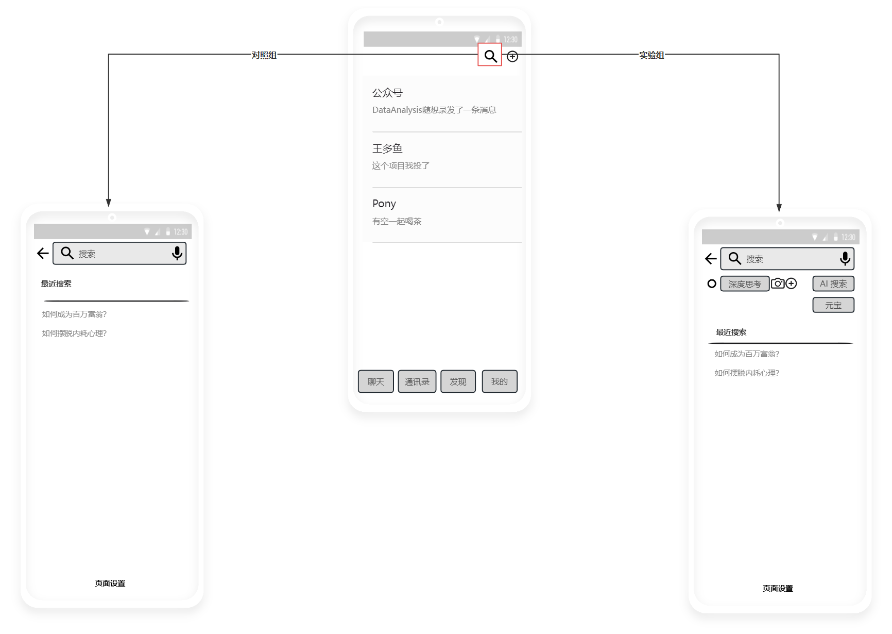
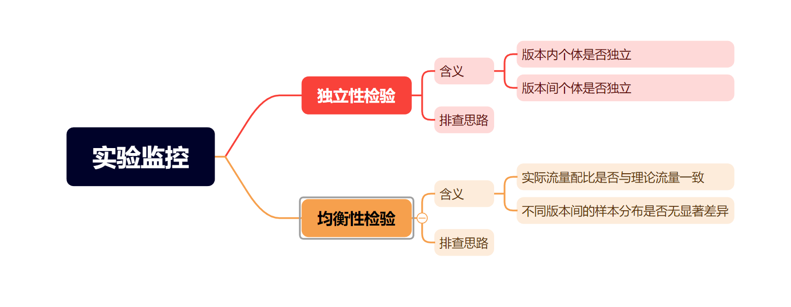
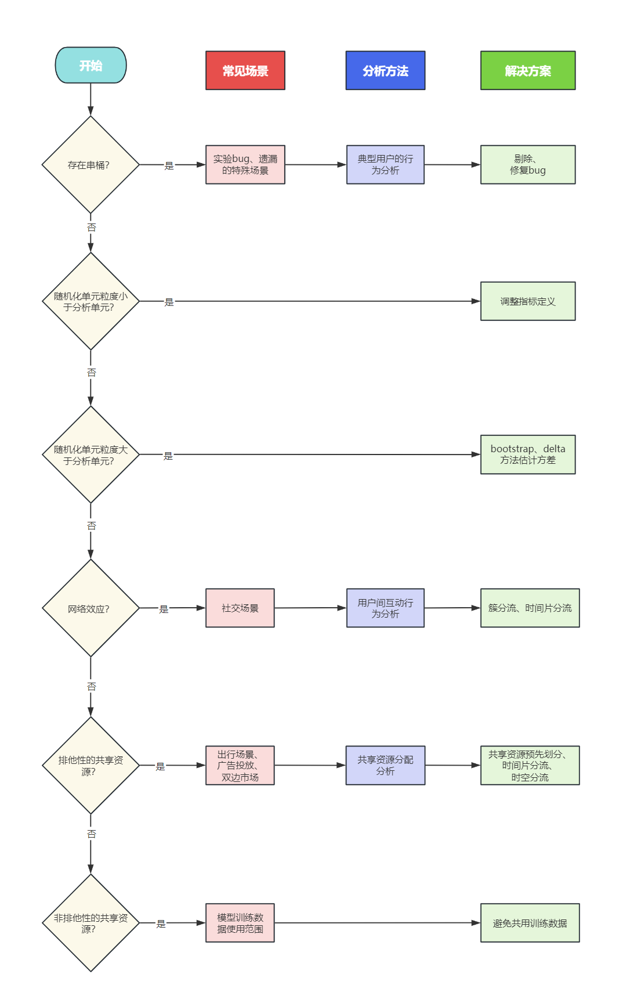
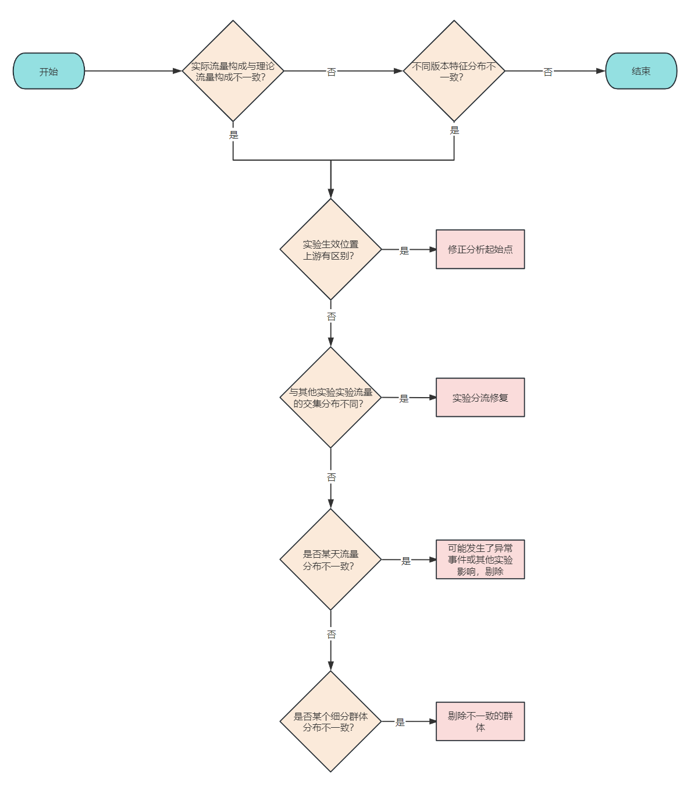

# 我的策略真的有效吗？——AB实验第8期

> 嗨~ 各位小伙伴们大家好哇，苏晓糖又带来了最新一期的内容~ 苏晓糖用了数期的篇幅集中探讨了目标确定、实验设计、实验上线三个环节中的常见问题，苏晓糖在**本期会重点讨论实验监控环节中**的相关问题，好嘞，跟着苏晓糖一起尽情享用本期的内容盛宴吧！

## 情景导入

在25年初的Deepseek横空出世后，各大互联网厂商纷纷开始在自己的AI应用内提供私有化部署的Deepseek模型并免费对外开发使用，腾讯针对旗下的AI应用元宝开始了烧钱买量，并在微信中为元宝引流，下图为微信APP中的搜索下前后界面变化，假设你是负责在微信搜索中增加AI搜索功能的产品经理，在实验上线后你会如何监控实验的运行状况呐？请停下来思考十秒钟，欢迎在评论区中给苏晓糖留言~

## 内容框架

在第7期中苏晓糖讨论了AA实验和正式实验的实验验证，而本期内容则会重点建设实验上线后的监控环节相关的问题，核心内容如下：

- 独立性检验：版本内是否独立、版本间是否独立
- 均衡性检验：实际流量配比是否与理论流量一致、不同版本间的样本分布是否无显著差异

## 独立性检验

AB实验结果的有效性的第一大前提条件是独立性假设，即实验中的每个个体(准确的讲应该是分析单元)都应该与其他个体保持独立，一般而言，独立性主要由正确的实验设计来保证，但在实验过程中可能有一些特殊场景导致违背独立性假设，同时也建议在实验过程中反复思考实验设计的合理性，以便发现错误并及时修正。

### 版本内个体是否独立

- **分析单元的粒度是否小于随机化单元的粒度**。以情景导入中的问题为例，假设随机化单元为用户ID，分析单元采用会话ID(如讲观察指标定义为sum(使用搜索的会话数)/sum(会话数))，因为每个用户可能产生多个会话，因此此时会违背版本内的个体独立性假设。
- **网络效应是否得到充分考虑**。以情景导入中的问题为例，微信作为用户信息交流的工具，很可能存在网络效应，假设随机化单元为用户ID，用户A和用户B为好友关系，且A为搜索的高频使用者，B为搜索的低频使用者，两个用户同时被分配至实验组，用户A在发现搜索的新功能后，很可能将信息传达给用户B，用户B可能出于好奇尝试新功能，如此一来很可能造成实验效果的高估。

### 版本间个体是否独立

- **分析单元的粒度是否大于随机化单元的粒度**。以情景导入中的问题为例，假设随机化单元为会话ID(同一个用户可能会被分流至不同的实验版本)，分析单元采用用户ID(如指标定义为人均搜索会话数)，此时某个用户A可能既在对照组，又在实验组，此时便会违背版本间个体独立性假设。
- **网络效应是否得到充分考虑**。以情景导入中的问题为例，假设用户A和用户B为好友关系，但A被分配至实验组，B被分配至对照组，在A发现微信搜索新功能后将其分享给B，但B发现其没有对应功能，用户B可能会因为“区别对待”减少搜索功能的适用，从而导致实验效果高估。
- **串桶**。实验分流可能存在bug，或者实验存在隐蔽性场景未在设计中充分考虑，导致同一个用户可能既在对照组，又在实验组，从而违背。
- **排他性的共享资源**。实验组和对照组共享一个固定的资源，实验组和对照组之间的资源抢夺，导致实验组和对照组之间的独立性假设违背。常见的场景包括广告投放场景的预算抢夺、出行场景的运力抢夺、酒旅场景下的酒店预订抢夺、计算资源的抢夺。以情景导入中的问题为例，假设对照组和实验组共享计算资源，假设实验组策略有效，实验组可能会挤占对照组的计算资源，导致对照组的搜索结果的返回用时延迟，对照组用户体验下降，从而导致实验效果高估。
- **非排他性的共享资源**。以情景导入中的问题为例，实验组和对照组的搜索模型共同使用实验组和对照组的用户搜索数据进行模型训练，随着时间的推移，对照组返回的搜索结果很可能与实验组返回的搜索结果趋同，从而导致实验效果的低估。

### 独立性检验的排查思路

在进行独立性假设排查时可以基本遵循以下思路，逐步排查**串桶、分析单元和随机化单元粒度、网络效应、排他性的共享资源和非排他性的共享资源**问题。

## 均衡性检验

**AB实验结果有效性的第二大前提条件是流量分配分均衡性假设**，流量均衡分配有两个层面的含义：**实际流量配比与理论流量配比无显著性差异、不同版本间的样本分布无显著性差异**。

### 实际流量配比与理论流量配比是否无显著差异

假设实际流量在不同版本间的分配与设置的理论流量分配存在较大差异，我们有理由怀疑流量分配分均衡性假设不成立。在检验实际流量配比和理论流量配比是否存在差异时，我们一般采用$\chi^2$检验进行。

假设理论流量构成为$对照组:实验组1:实验组2=p_0:p_1:p_2$, 且$p_0+p_1+p_2=1$总流量为N，则对照组、实验组1和实验组2的理论流量依次为$E_1=N*p_0，E_2=N*p_1,E_3=N*p_2$, 假设实际流量构成如下：

| 组别     | 对照组 | 实验组1 | 实验组2 | 合计 |
| -------- | ------ | ------- | ------- | ---- |
| 实际流量 | $O_0$  | $O_1$   | $O_2$   | N    |

**原假设**$H_0$：理论分布=实际分布

**备择假设**$H_1$：理论分布≠实际分布

**卡方统计量**:$\chi^2=\sum{\frac{(E_i-O_i)^2}{E_i}}=\frac{(E_0-O_0)^2}{E_0}+\frac{(E_1-O_1)^2}{E_1}+\frac{(E_2-O_2)^2}{E_2}$

**自由度**：$df=k-1=2, k为版本数$

**判断标准**（*α*=0.05）：若 $\chi^2>\chi^2_{0.95}(2)$则拒绝$H_0$

### 不同版本间样本的特征分布是否无显著差异

均衡性假设的另一层含义是**样本在实验开始前的特征分布应在不同版本间无显著性差异**。此处需要重点关注两个问题：

- **关注进行检验使用的样本特征应仅使用实验前的信息**，以避免实验策略对样本特征分布造成的影响，则可能导致我们得出错误的均衡性检验结论。以情景导入中的问题为例，假设新的AI搜索能够显著提升用户的搜索效率，从而减少实验组的搜索使用次数，那实验组和对照组之前的用户在实验期间的使用频率必然不同。
- **尽量选择对观测指标影响较大的用户特征**。比如用户的渠道、生命周期、新老用户以及实验前的观测指标。

进行特征分布的假设检验时常用的主要有两种：**适用于离散型特征的$\chi^2$检验**和**适用于连续型特征的t检验**。以情景导入中的问题为例，假设观测指标时用户搜索的使用频率，且新老用户对于搜索功能的使用频率有较大影响，则必然会发现用户在对照组和实验组的特征分布不一致。接下来苏晓糖分别就新老用户分布、实验前的用户搜索的使用频率进行特征分布的差异性假设检验。

#### **离散型特征-新老用户分布**

假设新老用户的流量在不同实验组中的构成如下：

| 版本   | 新用户          | 老用户          | 合计            |
| ------ | --------------- | --------------- | --------------- |
| 对照组 | $O_{11}$        | $O_{12}$        | $O_{11}+O_{12}$ |
| 实验组 | $O_{21}$        | $O_{21}$        | $O_{21}+O_{22}$ |
| 合计   | $O_{11}+O_{21}$ | $O_{12}+O_{22}$ | $N$             |

**原假设**$H_0$：对照组和实验组的新老用户构成一致

**备择假设**$H_1$：对照组和实验组的新老用户构成不一致

**计算期望频数**：$E_{ij}=\frac{第i行总频数 * 第j列总频数}{总样本数}=\frac{R_i * C_j}{N}$

| 版本   | 新用户                                                       | 老用户                                                       | 合计                |
| ------ | ------------------------------------------------------------ | ------------------------------------------------------------ | ------------------- |
| 对照组 | $E_{11}=\frac{(O_{11}+O_{21})*(O_{11}+O_{12})}{O_{11}+O_{12}+O_{21}+O_{22}}$ | $E_{12}=\frac{(O_{12}+O_{22})*(O_{11}+O_{12})}{O_{11}+O_{12}+O_{21}+O_{22}}$ | $R_1=O_{11}+O_{12}$ |
| 实验组 | $E_{21}=\frac{(O_{11}+O_{21})*(O_{21}+O_{22})}{O_{11}+O_{12}+O_{21}+O_{22}}$ | $E_{22}=\frac{(O_{12}+O_{22})*(O_{21}+O_{22})}{O_{11}+O_{12}+O_{21}+O_{22}}$ | $R_2=O_{21}+O_{22}$ |
| 合计   | $C_1=O_{11}+O_{21}$                                          | $C_2=O_{12}+O_{22}$                                          | $N$                 |

**卡方统计量**:$\chi^2=\sum_i\sum_j{\frac{(E_{ij}-O_{ij})^2}{E_{ij}}}=\frac{(E_{11}-O_{11})^2}{E_{11}}+\frac{(E_{12}-O_{12})^2}{E_{12}}+\frac{(E_{21}-O_{21})^2}{E_{21}}+\frac{(E_{22}-O_{22})^2}{E_{22}}$

**自由度**：$df=(r-1)*(c-1)=1, r为行数，c为列数$

**判断标准**（*α*=0.05）：若 $\chi^2>\chi^2_{0.95}(1)$则拒绝$H_0$

#### 连续型特征-实验前搜索的使用频率

**建议实验前连续型特征的统计周期与实验周期保持一致**。假设实验前对照组和实验组用户的人均搜索功能使用次数分别为为$\bar{x_1}和\bar{x_2}$, 标准差分别为$s_1和s_2$, 样本量分别为$n_1和n_2$。

**原假设**$H_0$：对照组和实验组的实验前的人均搜索使用频率无显著差异

**备择假设**$H_1$：对照组和实验组的实验前的人均搜索使用频率有显著差异

**t统计量：** $t=\frac{|{\bar{x_1}-\bar{x_2}}|}{\sqrt{s^2_1/n_1+s^2_2/n_2}}$

**自由度**：$df=\frac{(s^2_1/n_1+s^2_2/n_2)^2}{(s^2_1/n_1)^2/(n_1-1)+(s^2_2/n_2)^2/(n_2-1)}$

**判断标准**（*α*=0.05，双边检验）：若 $t>t_{0.975}(df)$则拒绝$H_0$

### 均衡性检验的排查思路

在发现AB实验的均衡性检验不通过时，可以通过以下流程进行逐一排查：

- **实验生效位置的上游是否存在区别**？假设在电商场景中用户的购物详情页投放不同的优惠策略(如买赠、满减)，但是用户在首页就看到了对应的优惠信息，此时就不应该将分析起点定为购物详情页曝光，而应该定在首页的曝光。
- **与其他实验的实验流量交集分布是否不同**？一般来讲，正交实验会把上游实验的流量打散至下游实验中。如果下游实验组直接将上游实验组的流量屏蔽，而下游的对照组无处理，则可能导致下游实验的流量分配不平衡，此时需要进行实验分流逻辑的修复。
- **是否某天的流量分布不平衡**？可能有实验早期的灰度、发生了异常事件或其他实验上线的影响。
- **是否某个细分群体分布不一致**？可能是该细分群体的浏览器版本、手机系统版本导致的bug等因素引起，一般可以做剔除处理。

## 资源推荐

- 《关键迭代：可信赖的线上对照实验》——罗恩·科哈维（Ron Kohavi）+黛安·唐（Diane Tang）
- 《硅谷增长黑客实战笔记》——曲卉著