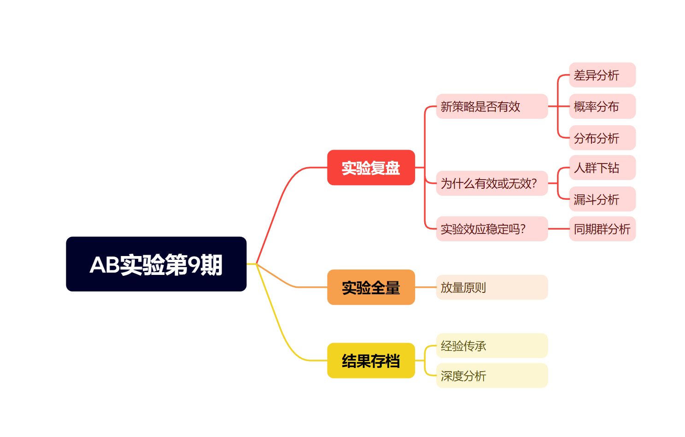
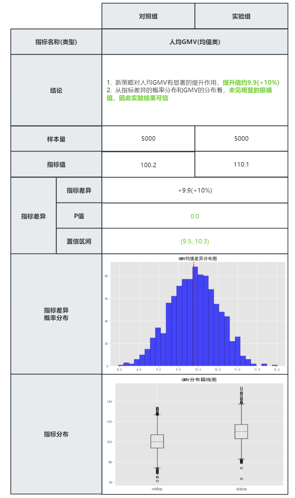
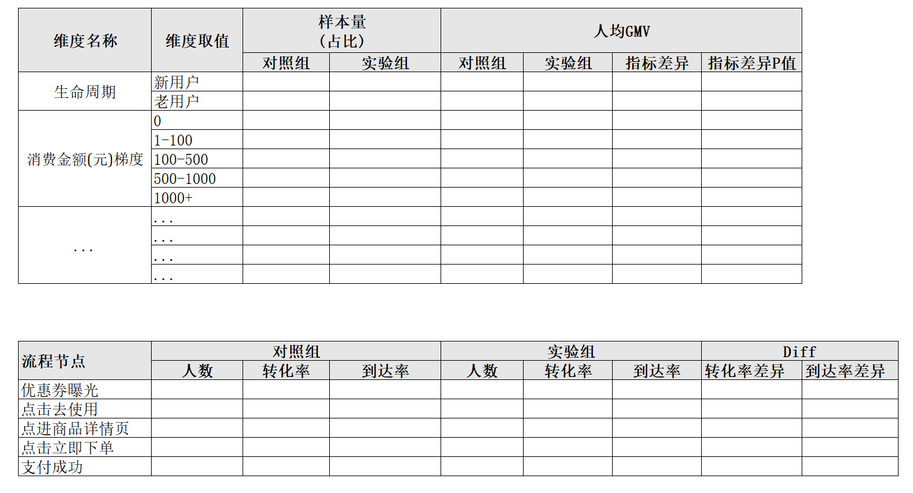
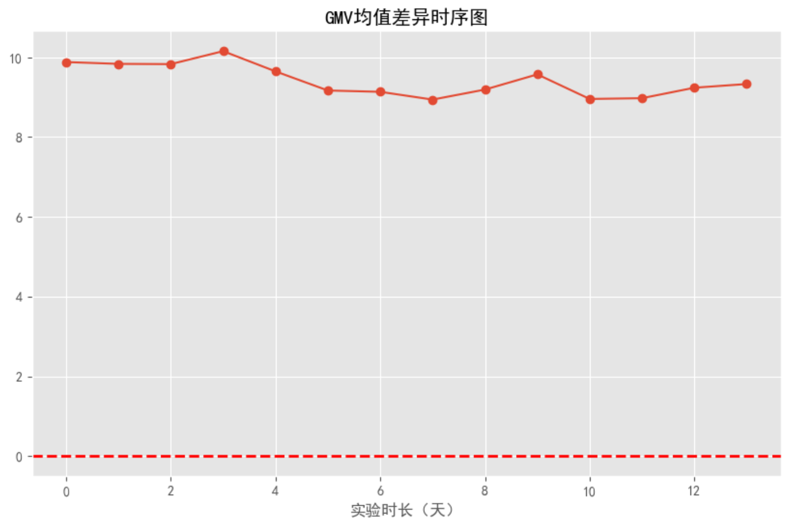
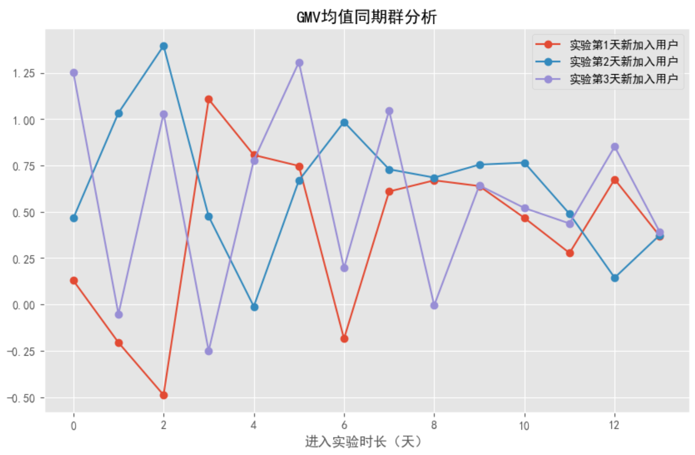
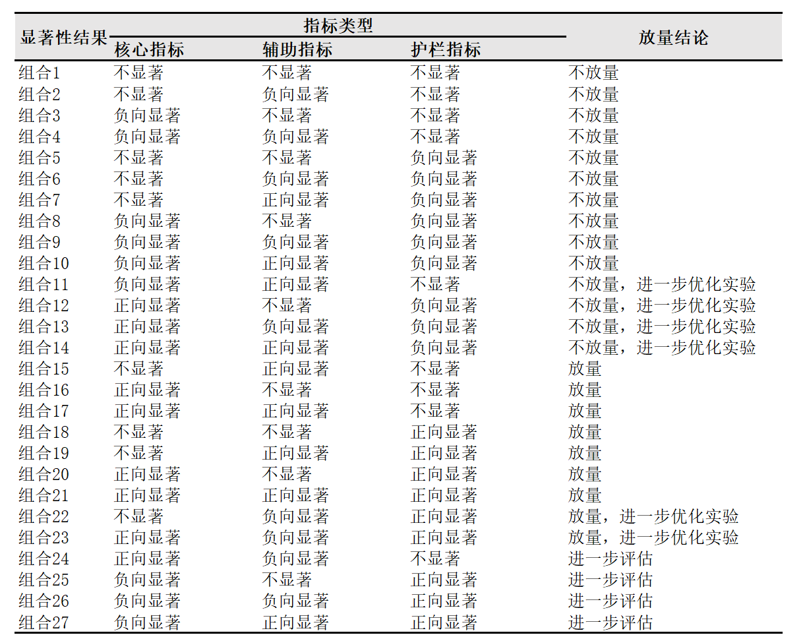

# 我的策略真的有效吗？——AB实验第9期

> 嗨，各位小伙伴们大家周末好呀~ 苏晓糖又来更新咯。苏晓糖用了8期内容的篇幅目标确定、实验设计、实验上线、实验监控等环节的常见问题，本期内容则主要聚焦在**实验复盘、实验全量、结果存档**三个环节的内容，保证量大管饱~ 好勒，那就跟着苏晓糖一起尽享本次的内容盛宴吧~ 

## 情景导入

某电商平台发放的优惠券核销率低于同行平均水平，为提升优惠券的核销率，运营同学认为大多数用户对优惠券的有效期无明显感知，因此增加优惠券过期倒计时功能以验证稀缺性对用户优惠券核销率和人均GMV的影响，如下图所示。假设你是这个实验的负责人，你会如何设计实验并分析实验数据呐？请停下来思考10秒钟~ 


## 内容框架

经历了AB实验前面若干个环节的捶打，恭喜你终于接近AB实验的终点，本期内容聚焦在AB实验的最后一公里，主要涵盖以下内容：

- **实验复盘**：新策略是否有效、为什么有效或无效、实验效应稳定吗
- **实验全量**：放量原则
- **结果存档**：经验传承、深度分析



## 实验复盘

实验复盘主要集中于回答：**新策略是否有效、新策略为什么有效或无效、实验效应是否稳定、学习到了哪些经验、总体收益如何计算**等几个问题，下面我们依次进行介绍：

### 新策略是否有效

判断新策略是否有效的方法就是对实验设计过程中制定的观测指标进行分析，指标分析主要涉及到：**指标差异显著性分析、指标差异概率分布分析、指标分布分析。**

**指标差异的显著性分析**，核心是基于假设检验方法，计算对照组和实验组的**观测指标差异的P值和置信区间**，但需要注意不同类型的指标的所使用的检验方法有区别，**人均类指标和PV转换率类指标一般采用t检验，而UV转化率类指标一般采用卡方检验**。以情景导入中的问题为例，假设随机单元选择用户ID，观测指标定义为：人均GMV($\frac{\sum_i{GMV_i}}{人数}$)、平均优惠券核销率($\frac{\sum_i{核销张数_i}}{\sum_i{总张数_i}}$)、优惠券核销人数占比($\frac{\sum_iI(核销张数_i>0)}{人数}$)，则人均GMV、平均优惠券核销率采用t检验，优惠券核销人数占比则使用卡方检验。

**指标差异的概率分布分析**, 核心是通过指标差异的概率分布辅助判断指标差异的大小，如果指标差异的分布远离0，则说明对照组和实验组之间的观测指标存在显著差异，否则差异较小。**指标差异的概率分布，一般采用bootstrap的方法获取**。

**指标分布分析**，主要使用箱线图探查人均类指标的分布**是否存在极端值**，**如果发现极端值，需要做进一步分析极端值产生的原因和对实验结果显著性的影响**。

因此以情景导入中的问题为例，新策略是否有效部分，针对每个指标输出如下图所示的数据结果：



### 新策略为什么有效或无效

在进行实验数据回收时除了关注新策略的有效性外，我们还需要回答新策略为什么有效的问题，即**新策略影响观测指标的机制，并为下一步的精细化运营或流程优化提供指引**。回答这个问题，主要从两个角度切入：**维度下钻和流程下钻**。

**维度下钻，主要关注新策略在人(用户群)、货(品类、优惠券的种类)、场(推荐场景、首页场景、不同时间段)下的表现差异**，试图从精细化运营的角度，回答策略生效或无效的逻辑。此外，**在进行维度下钻时，应使用不受实验策略影响的分类维度进行分析**。此类维度主要有两类：**不随时间发生变化的维度**(用户性别、生日等)、**随时间变化的维度但仅反映实验前信息的维度**(如实验开始前用户A的为低活跃用户，实验开始后为高活跃用户，应当使用用户A在实验前的低活跃标签，而不能使用实验开始后的高活跃标签，进行分析)。

**流程下钻，主要关注新策略从生效的起始点到实现观测指标之间的流程表现**，试图从产品流程优化的角度，回答策略生效或无效的逻辑。

以情景导入中的问题为例，苏晓糖会做以下事情：

- 分别针对生命周期、活跃度梯度、消费金额梯度、优惠券优惠力度、优惠券使用门槛、优惠券到期时长、优惠券适用场景、时间段(工作日/非工作日)等进行下钻分析，探查不同维度细分下，对照组和实验组的**人群比例和观测指标的差异**，探索是否存在表现较好和表现较差的群体，判断是否存在精细化运营的空间。

- 对从用户行为路径进行下钻分析，**优惠券曝光->点击去使用->点进商品详情页->点击立即下单->支付成功**。探索高转化和低转化的环节，判断是否存在产品流程优化的空间。

- 流程下钻与维度下钻进行交叉，如发现新用户的GMV提升显著高于老用户，可以进一步下钻新用户的流程漏斗挖掘可能的原因。

  

### 实验效应是否稳定

AB实验的一个假设是实验效应稳定，判断实验效应是否稳定，可以从两个角度进行分析：**累计指标差异的时序分析和指标同期群分析**。

**累计指标差异的时序分析**，通过时序图的稳定与否判断实验效应是否稳定。注意每天的计算并非仅统计每日新进实验用户或已进入实验用户在当天的指标表现差异，而是每天计算一个所用用户自进入实验第一天开始截止到当天的累计指标差异。以情景导入中问题为例， $第T+k日的人均累计GMV差异值=\frac{\sum_i{\sum_{t=0}^k{GMV_{实验组，it}}}}{\sum_{t=0}^kN_{实验组， t}}-\frac{\sum_i{\sum_{t=0}^k{GMV_{对照组，it}}}}{\sum_{t=0}^kN_{对照组 ，t}}$,其中$N_{实验组，t}$表示实验组在实验开始后的第t日新进组的用户数，$GMV_{实验组，it}$表示实验组用户i在实验开始后的第t日当天GMV贡献。假设出现累计指标差异持续缩小或持续扩大的趋势，可能预示着实验效应是不稳定的。



**指标同期群分析**，就是将每天新进组的用户看做不同的群体，然后观察这些用户在加入实验后第t天的对照组和实验组的指标表现差异。以情景导入中的问题为例，$第T+k日新进入实验的用户在加入实验后第t天的人均GMV差异=\frac{GMV_{实验组，T+k+t}}{N_{实验组，T+k}}-\frac{GMV_{对照组，T+k+t}}{N_{对照组，T+k}}$。



## 实验放量

### 放量原则

根据指标的类型(核心指标、辅助指标和护栏指标)和显著性结果(正向显著、负向显著和不显著)进行交叉，共有27类结果，是否放量的结论可以划分为5种：**不放量、不放量，进一步优化实验、放量，进一步优化实验、放量、进一步评估**。基本原则是：

- 护栏指标负向显著，不放量
- 核心指标正向显著，护栏指标不显著/正向显著，辅助指标不显著/负向显著，放量
- 核心指标、护栏指标、辅助指标同时出现负向显著和正向显著时，需要进一步评估

## 结果存档

在进行实验决策(放量或实验下线)后，无论实验收益是正收益、零收益亦或者负收益，苏晓糖都建议把实验分析结果和经验总结进行存档，用于经验传承和后续的深度分析。

### 经验传承

得到正向收益的策略固然是一件好事，但如果能从零收益和负收益的实验中获取到经验，也未尝不是一件好事，至少它们告诉我们哪些策略是无效的，以避免后续在错误的方向上投入更多的资源。因此将实验中获取到的经验和教训沉淀下来，无论是对于我们自己亦或是其他后来者，都会有极大的帮助。

### 深度分析

在进行了越来越多的实验后，我们可以基于沉淀下来的实验数据进行更加深度的对比分析。比如我们可以针对每次实验进行打标签如：优化目标、实验人群、营销心理学类型(比如稀缺、权威)、实验场景、营销抓手(短期利益、长期利益)、优化类型(产品/运营)、实验收益，基于数据的深入分析，可以进一步获取为了实现某个优化目标时，针对什么人在什么场景用什么抓手会更有效的结论，为后续的营销活动设计、精细化运营和产品优化，提供更多的先验知识。

## 资源推荐

- 《关键迭代：可信赖的线上对照实验》——罗恩·科哈维（Ron Kohavi）+黛安·唐（Diane Tang）
- 《硅谷增长黑客实战笔记》——曲卉著
- 火山引擎-DataTester帮助文档

## 附录

### 新策略是否有效涉及到的相关代码

#### 计算人均GMV的指标差异、t统计量、P值和95%置信区间

```python
import numpy as np
import matplotlib.pyplot as plt
from scipy import stats

# 设置中文显示
plt.rcParams['font.sans-serif'] = ['SimHei']  # 指定默认字体
plt.rcParams['axes.unicode_minus'] = False  # 解决负号显示问题

# 设置主题
plt.style.use('ggplot')

# 数据生成
# GMV
gmv_control = np.random.normal(100, 10, 5000)
gmv_treat = np.random.normal(110, 10, 5000)

# 计算 GMV的均值差异、t值、p值和置信区间
mean_diff = np.mean(gmv_treat) - np.mean(gmv_control)
sem = np.sqrt(np.std(gmv_control, ddof=1)**2/5000 + np.std(gmv_treat, ddof=1)**2/5000)
t_stat = mean_diff / sem
p_value = 2 * (1- stats.t.cdf(np.abs(t_stat), df=5000+5000-2))
conf_int = (mean_diff - sem * 1.96, mean_diff + sem * 1.96)
print(f"GMV均值差异: {mean_diff:.2f}\n t值: {t_stat:.2f}\n p值: {p_value:.4f}\n 95%置信区间: {conf_int}")
```

#### 指标差异的概率分布

```python
import numpy as np
import matplotlib.pyplot as plt
from scipy import stats

# 设置中文显示
plt.rcParams['font.sans-serif'] = ['SimHei']  # 指定默认字体
plt.rcParams['axes.unicode_minus'] = False  # 解决负号显示问题

# 设置主题
plt.style.use('ggplot')

# 数据生成
# GMV
gmv_control = np.random.normal(100, 10, 5000)
gmv_treat = np.random.normal(110, 10, 5000)
# 绘制GMV指标差异分布图
x = []
for i in range(1000):
    gmv_control_sample = np.random.choice(gmv_control, 1000, replace=True).mean()
    gmv_treat_sample = np.random.choice(gmv_treat, 1000, replace=True).mean()
    x.append(gmv_treat_sample - gmv_control_sample)
plt.figure(figsize=(10,6))
plt.hist(x, bins=30, alpha=0.7, color='blue', edgecolor='black')
plt.axvline(mean_diff, color='red', linestyle='dashed', linewidth=2)
plt.title('GMV均值差异分布图')
```

#### 指标分布

```python
import numpy as np
import matplotlib.pyplot as plt
from scipy import stats

# 设置中文显示
plt.rcParams['font.sans-serif'] = ['SimHei']  # 指定默认字体
plt.rcParams['axes.unicode_minus'] = False  # 解决负号显示问题

# 设置主题
plt.style.use('ggplot')

# 数据生成
# GMV
gmv_control = np.random.normal(100, 10, 5000)
gmv_treat = np.random.normal(110, 10, 5000)
#绘制GMV分布的箱线图
plt.figure(figsize=(8,6))
plt.boxplot([gmv_control, gmv_treat], labels=['对照组', '实验组'])
plt.title('GMV分布箱线图')
```
