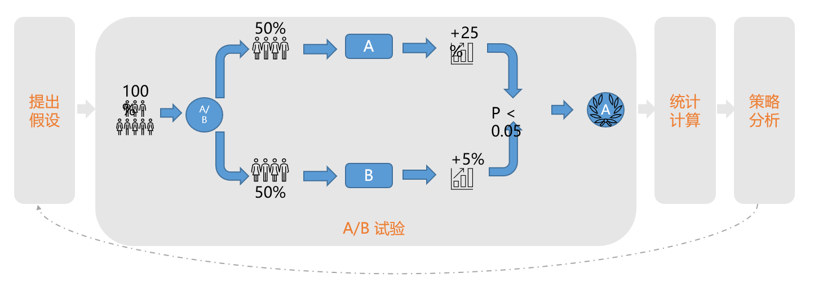

# 你的策略真的有效吗——AB实验第1期

> 嗨，亲爱的朋友们，好久不见，年更博主苏晓糖又要开始更新啦！啊？你说什么？这段时间去哪里啦？当然是忙着拯救世界去啦喂朋友(其实纯粹是因为懒.jpg)！分享AB实验相关内容的想法由来已久，苏晓糖会更多地结合自己的思考，阐述苏晓糖对AB实验的理解，希望能为大家带来更多的增量输入！当然因为自身水平有限，文中如有纰漏之处，还请批评指正，多多交流共同进步。好啦~闲话不多说，马上进入ABT系列文章的第一期吧~

## 情景导入

### 问题

小白作为一个新入行的策略产品，为整个产品的用户留存负责。近期为拉升用户留存，小白策划了一场所有**用户均可自主选择**是否参加的签到活动。活动复盘分析会上，小白认为**本次活动的收益等于参加活动用户的平均留存率减去未参加活动用户的平均留存率**。接下来请思考，小白的策略评估方式是否合理？若不合理，请给出理由并给出你认为合理的评估方式？

### 回答

- 小白的评估结果会受到选择偏差的影响，显然是不合理的。原因是：高活跃用户可能参与活动的意愿更强，低活跃用户参与活动的意愿偏弱，极端情况下，会出现参加活动的用户全是高活用户，未参加活动的用户全是低活跃用户，若直接使用参加活动用户的平均留存率减去未参加活动的平均留存率，则必然会导致活动效果的高估。
- 如何设计合适的评估方式呐？问题的核心在于如何构建一个合理的对比基准。目前业界较为常用的方法主要有三种：①实验方法，也即今天的主角 ②计量经济学方法(如PSM、DID、SC、RD) ③机器学习方法(常用于异质性处理效应研究的因果森林、DML、元学习)。OK，那就让我直接切入今天的主题AB实验。

## 核心框架

考虑到一部分朋友可能对于AB实验并不了解，我会在每一期内容前，增加内容框架一栏，帮助大家提前建立起每期的内容基本框架。本期内容我会主要介绍3个层次的内容：

- AB实验的基本原理
- AB实验的适用场景
- AB实验的基本流程

## 基本原理

在介绍AB实验的基本原理之前，我想请大家回忆一下初中生物学实验，如何验证温度对于玉米种子萌发的影响。基本方法是设置对照实验，比如对照组选择25℃，实验组设置10℃，其他的条件(如光照、湿度等)两组保持一致。一段时间后，观察两组玉米种子的萌发情况，我们就可以得出，玉米种子萌发需要合适的温度，并且25℃优于10℃。

而AB实验的核心逻辑与生物学的对照实验并无二致。如下图所示，为了验证新策略的有效性，AB实验就是将流量(或用户)**随机**分成若干组，不失一般性，假设随机分成对照组和实验组，其中对照组保持旧策略，实验组施加新策略，基于**假设检验**，通过观察对照组和实验组的指标表现，若两组指标存在显著差异，则认为新策略对于实验指标有显著影响(可能正向，也可能负向)。

为什么通过实验方法可以论证新策略的有效性呐？根本的原因是通过**流量的随机性划分**保证了不同组的用户构成具备相似性，从而能够直接直接基于对照组和实验组的指标表现得出科学合理的结论。在此需要强调的是，AB实验隐含了三个基本假设：

- 流量均衡。流量均衡有两个层面的含义：① 实际流量构成和理论流量构成一致，即假设实验设定对照组和实验组分别占用50%的流量，实际流量在对照组和实验组的分配应与实验设定无显著差异 ②对照组和实验组的流量构成(如用户特征分布)一致
- 独立性。独立性有两个层面的含义：① 对照组和实验组间不存在外溢效应，即实验组的个体表现不能影响对照组的个体表现 ②对照组或实验组组内部的个体直接不存在外溢效应， 即 以实验组为例，实验组中的个体A表现不能影响组内的其他个体表现
- 实验效应稳定。实验效应稳定有两个层面的含义：①实验效应稳定本质上是在假设新策略的短期效应等于长期效应。而AB实验的主要关注的还是策略的短期有效性 ②即使是AB实验衡量的短期，也应注意规避学习效应和新奇效应的潜在影响

## 适用场景

考虑到AB实验设计得当的话，可以适用于非常多的场景，因此苏晓糖想从不适用于做AB实验的场景切入，与之相对的反面则是AB实验的适用场景。不宜适用AB实验的场景主要有以下几个场景：

- 小流量场景。AB实验进行策略效果的评估要基于假设检验，因此必然需要有足够的样本量支撑，否则较难得出置信的结论
- 策略只能全量上线的场景。比如淘宝平台的佣金费率变更、滴滴在部分城市全量上线新的司机激励措施
- 策略已经上线的场景。比如针对部分用户发放优惠券，是否可以提升该群体的下单率

## 基本流程

AB实验的基本流程基本遵循以下几种步骤
