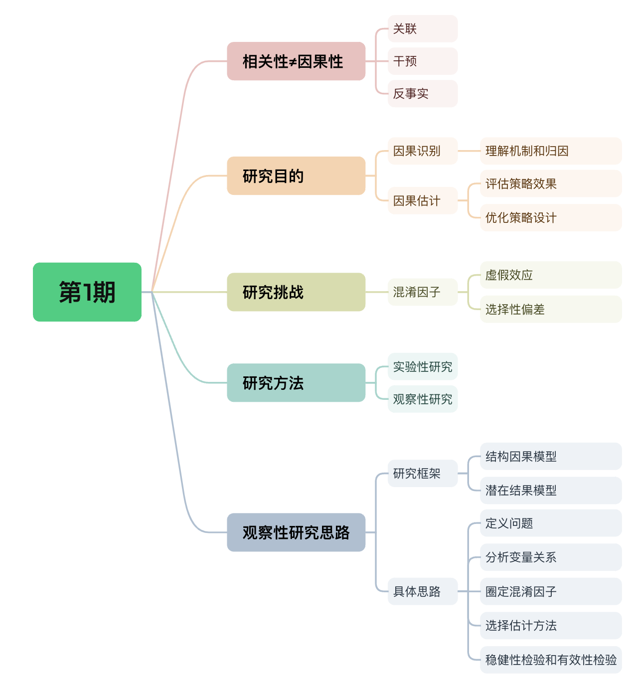

# 务实的因果推断——第1期

> 嗨~ 大家周末好，苏晓糖的AB实验系列内容暂时告一段落啦，希望对大家有所帮助~ 自今天开始，苏晓糖会新开一个系列内容——因果推断，主要聚焦于观测性研究(区别于实验性研究)，期望是可以借此系统性介绍因果推断的基本思想、使用场景，在实际落地使用时的问题及可能的解决方案。由于因果推断是一个非常复杂且庞大的领域，同时自身能力有限，如有谬误，还请通过评论区或后台留言进行批评指正。苏晓糖始终坚信，思想的碰撞一定可以激发出更多闪耀的火花~ 好啦，接下来就跟随苏晓糖一起进入今天的正文吧~ 

## 情景导入

社会学专业的小白同学偶然发现，某地每年的冰激凌销量和当年的盗窃事件发生量呈现显著的正相关关系，即当年的冰激凌销量越高，当年的盗窃事件发生量越高，那小白是否可以由此推导出通过削减当年的冰激凌销量可以降低当年的盗窃事件发生量的结论呐？我相信大家一定会立即脱口而出：不可以！那为什么呐？请大家停下来思考10秒钟哦~

## 内容框架

本期内容主要聚焦于介绍因果推断的核心框架，主要包含以下内容：

- 相关性≠因果性：关联、干预、反事实
- 研究目的：因果识别、因果估计
- 研究挑战：混淆因子导致的虚假效应、选择偏差
- 研究方法：实验性研究、观察性研究
- 观察性研究框架：结构因果模型、潜在因果模型
- 观察性研究思路

## 相关性≠因果性

因果推断领域中的大佬Judea Pearl，将因果关系研究自底向上划分为三个层次：**关联、干预、反事实估计**。其中：

- 第一个层级关联：在观察到某个事件X后，会获得哪些关于Y的信息，即$P(Y|X)$。比如，当我们观察到一个人抽烟后，那这个人得肺癌的概率是多少，即$P(Y=得肺癌|X=吸烟)$。

- 第二个层级干预：假如主动实施某个行动X，结果变量Y会怎样变化，即$P(Y|do(X))$。比如，如果政府禁止吸烟，那么居民得肺癌发病率会如何变化，即$P(Y=得肺癌|do(X=禁止吸烟))$。

- 第三个层级反事实估计：如果当时我实施不同的行动$x'$，结果变量Y会怎样，即$P(Y_{x'}|X=x,Y_x)$。比如，我在回家时，有路径A和路径B可以选择，我实际选择路径A，耗时30分钟，如果我当时选择路径B，会耗时多久，即$P(Y_B|X=A,Y_A=30)$。

  **三个层级逐渐递进，关联关注的是“看到的是什么”，干预关注的是”做了会怎样“，反事实估计关注的是”如果当时做了会怎样“。在因果效应估计层面，干预和反事实估计的差异，主要体现为干预侧重于平均处理效应(ATE)估计，而反事实估计侧重于个体处理效应(ATE)估计**。

  回到情景导入中的问题，为什么小白不能得出通过削减冰激凌的销量来降低盗窃事件发生量的结论呐？因为小白的分析结论仍停留在因果分析的第一个层级关联分析之上。在这个例子中，冰激凌销量和盗窃事件发生量的相关性可能是由某些共同的影响因素导致，比如气温。当气温升高时，冰激凌销量随之升高，同时，居民打开窗户的比例升高进而盗窃事件发生量提升。基于此案例，大家一定可以体会到相关性不等于因果性的内涵，即两个事件存在相关性，并不代表两个事件存在因果性。

## 研究目的

从情景导入的案例可以看出，当我们在研究某些事件之间关系时，若只考虑事件间的相关性而忽略事件间的因果关系研究，则很容易得出一些看似“合理”实则错误的结论。而**因果关系研究，主要服务于以下目的**：

- **因果识别—影响机制和归因分析，回答为什么的问题**。

- **因果估计—评估策略效果，回答好不好的问题**。

- **因果估计—优化策略设计，回答如何做的更好的问题**。

  以现实中的营销发券场景为例，假设我们发现发券用户群体的人均GMV相较于未发券用户显著更高。因果关系研究就是要解决以下三个问题：

- 判断发券是否为人均GMV提升的因。发券用户群体的人均GMV更高是因为发券这策略本身还是因为恰巧将券发给了人均GMV更高的用户。

- 计算人均GMV提升效应大小及ROI。在我们确认发券确实提升了人均GMV后，那人均GMV提升效应有多大，是否足以覆盖发券的成本。

- 识别发券策略的敏感人群。哪些用户群体对发券更加敏感(即人均GMV的提升很大远超过成本)，哪些用户群体对发券不敏感(即人均GMV提升很小不足以覆盖成本)。

## 研究挑战

**因果关系研究面临的最大挑战就是如何消除混淆因子(confounder)的影响，得出正确的因果结论**。**混淆因子通常来讲就是同时影响处理(treatment)和结果变量(outcome)的变量**。以营销发券的业务场景为例，处理即是否发券，结果变量即人均GMV，混淆因子则可能是用户活跃度，用户历史GMV。为什么在因果研究中消除混淆因子如此重要呐，主要有以下两个原因：

- **虚假效应**。即在未合理消除混淆因子影响的情况下，我们可能错误估计处理对结果变量的影响大小和方向。以情景导入中的问题为例，在我们未正确消除混淆因子(如气温)影响的情况下，我们甚至得出通过削减冰激凌可以降低盗窃事件发生量的荒谬结论。
- **选择偏差**。即处理组和控制组群体的用户特征存在天然差异，直接对比两个群体的结果变量引入的偏差。在营销发券的场景，假设券的面额设定为5元，在用户登录APP后自动完成券的下发，我们想评估发券对人均GMV的影响。在此场景下，用户的活跃度就可能是一个潜在的混淆因子，如果直接对比发券用户和未发券用户的的人均GMV，则可能高估发券的收益。因为用户活跃度越高，越可能收到券，同时活跃度越高的用户，其下单的概率越高，即发券用户天然活跃度更高且下单概率也更高。

## 研究方法

因果研究方法主要有两大类研究方法：实验性研究和观察性研究。

### 实验性研究

实验性研究就是进行随机对照实验，AB实验就是属于实验性研究的范畴。**通过随机性分配处理，使得处理组和控制组的特征分布接近，从而消除混淆因子的影响**，直接对比处理组和控制组的结果变量表现差异，即为处理变量对结果变量的因果效应。实验性研究可以称得上因果效应估计的黄金法则，但是不得不承认，实验性研究可能存在以下缺点：

- **耗时久，成本高**。例如在社会科学领域，想要验证职业技能培训是否可以提升参与者的薪酬水平。为了保证实验结论的稳健性，需要保证在各个区域、行业、年龄阶段和学历水平都有充足的样本量，同时还要追踪参与者在完成培训后的薪酬水平，可以想象这样的实验会投入巨大的时间和金钱。

- **机制研究缺失**。实验结果可以告诉我们处理变量对结果变量的因果效应大小，但并未告诉我们处理变量影响结果变量的作用机制。

- **潜在的伦理问题**。例如在医学领域，想要验证新药物对于癌症的治疗效果。假设新药物能够显著延缓癌症的发展速度，提升病人的存活时长。此时因为实验导致未使用新药物的病人失去了使用新药物的机会，降低了其潜在的存活时长。

  ### 观察性研究

  由于实验性研究存在以上缺点，因此观察性研究领域得以快速发展。**观察性研究就是直接使用已经观测到的数据**，基于研究方法的创新型设计(如准实验方法、研究设计的方法、机器学习方法)，来消除混淆因子对因果关系研究的影响。**观察性研究的好处在于简单高效且易于理解，但是如果存在不可观测的混淆因子，观察性研究给出的因果效应的估计结果可能存在偏差**。

## 观察性研究思路

实验性研究中的AB实验在AB系列文章中已有分享，因此不再进行赘述。苏晓糖在此会将内容重点放在观察性研究当中。在介绍观察性研究的具体思路之前，我想先介绍当前因果推断领域的主流研究框架。

### 研究框架

**观察性研究主要有两大类研究框架：结构因果模型和潜在因果模型**。其中：

- 结构因果模型(SCM)：本质是一种概率因果模型，使用DAG(有效无环图)和结构方程来描述数据生成过程，使用do算子、前门准则和后门准则对因果效应进行估计。

- 潜在结果模型(RCM)：对于一个个体(或群组)而言，接受处理的结果和未接受处理的结果我们只可以实际观察到其中一个，其他结果(即反事实结果)无法被观察到。而潜在结果模型就是通过研究方法设计估计个体(或群组)的反事实结果，并基于反事实结果进行因果效应计算。

  考虑到篇幅因素，本期内容不再针对以上两个框架进行详细介绍，后续内容会逐个进行更加详细的介绍。

### 具体思路

在我们了解了当前因果推断的两类主流框架后，在实际的业务场景当中应该选择哪种方法呐？苏晓糖的回答是两种方法各有优劣，互为补充，并非替代关系。通常在实际的业务场景中，我们会两种框架结合使用，一般会遵循以下步骤：

- **定义业务问题，确定我们要研究的对象或样本**。以影响发券为例，我们是要关注优惠券对发券群体的效果还是实际核销券的用户群体的效果，很显然这属于两个截然不同的问题。
- **借助结构因果模型的DAG，分析处理变量、结果变量和其他协变量之间的关系**。
- **借助结构因果模型的前门准则和后门准则，判断哪些协变量需要作为混淆因子纳入模型之中**。
- **选择潜在结果模型中特定的估计方法，估计因果效应**。
- **因果效应的稳健性和有效性检验**。

## 资源推荐

- **综述类文章**：Liuyi Yao, Zhixuan Chu, Sheng Li, Yaliang Li, Jing Gao, and Aidong Zhang. 2021. A Survey on Causal Inference. ACM Trans. Knowl. Discov. Data 15, 5, Article 74 (May 2021), 46 pages.
- **著作类**:
  - 《Caussal Inference in Statistics：A Primer》 Judea Pearl等著
  - 《Causal Inference: What If 》Jamie Robins等著
  - 《基本有用的计量经济学》赵西亮著
- **实践类**：https://github.com/matheusfacure/python-causality-handbook
