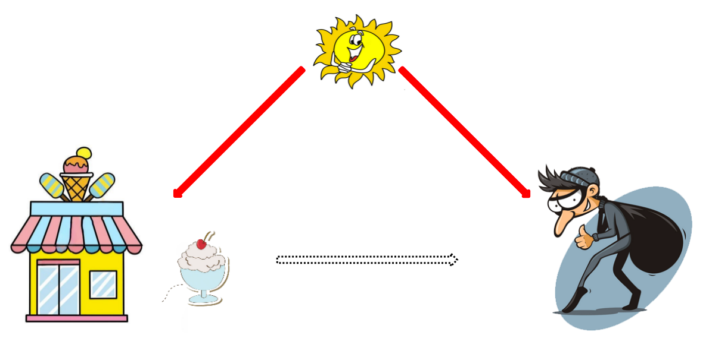
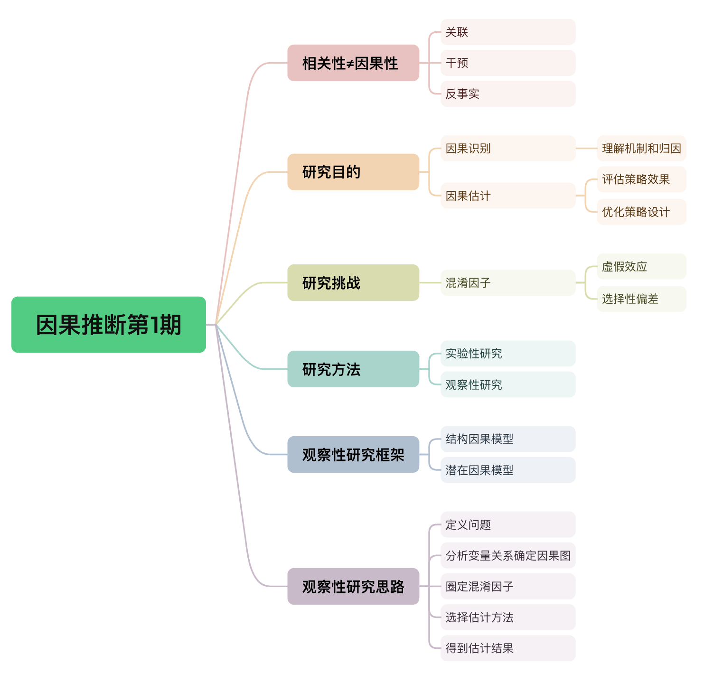

# 我的策略真的有效吗？——因果推断第1期

> 嗨~ 大家周末好，苏晓糖的AB实验系列内容暂时告一段落啦，希望对大家有所帮助~ 自今天开始，苏晓糖会新开一个系列内容——因果推断，主要聚焦于观测性研究(区别于实验性研究)，期望是可以借此系统性介绍因果推断的基本思想、使用场景，在实际落地使用时的问题及可能的解决方案。由于因果推断是一个非常复杂且庞大的领域，同时自身能力有限，如有谬误，还请通过评论区或后台留言进行批评指正。苏晓糖始终坚信，思想的碰撞一定可以激发出更多闪耀的火花~ 好啦，接下来就跟随苏晓糖一起进入今天的正文吧~ 

## 情景导入

社会学专业的小白同学偶然发现，某地每年的冰激凌销量和当年的盗窃事件发生量呈现显著的正相关关系，即当年的冰激凌销量越高，当年的盗窃事件发生量越高，那小白是否可以由此推导出通过削减当年的冰激凌销量可以降低当年的盗窃事件发生量的结论呐？我相信大家一定会立即脱口而出：不可以！那为什么呐？请大家停下来思考10秒钟哦~

## 内容框架

本期内容主要聚焦于介绍因果推断的核心框架，主要包含以下内容：

- 相关性≠因果性：关联、干预、反事实
- 研究目的：因果识别、因果估计
- 研究挑战：混淆因子导致的虚假效应、选择偏差
- 研究方法：实验性研究、观察性研究
- 观察性研究框架：结构因果模型、潜在因果模型
- 观察性研究思路

## 相关性≠因果性

因果推断领域中的大佬Judea Pearl，将因果关系研究自底向上划分为三个层次：关联、干预、反事实估计。其中：

- 第一个层级关联：在观察到某个事件X后，会获得哪些关于Y的信息，即$P(Y|X)$。比如，当我们观察到一个人抽烟后，那这个人得肺癌的概率是多少，即$P(Y=得肺癌|X=吸烟)$。

- 第二个层级干预：假如主动实施某个行动X，结果变量Y会怎样变化，即$P(Y|do(X))$。比如，如果政府禁止吸烟，那么居民得肺癌发病率会如何变化，即$P(Y=得肺癌|do(X=禁止吸烟))$。

- 第三个层级反事实估计：如果当时我实施不同的行动$x'$，结果变量Y会怎样，即$P(Y_{x'}|X=x,Y_x)$。比如，我在回家时，有路径A和路径B可以选择，我实际选择路径A，耗时30分钟，如果我当时选择路径B，会耗时多久，即$P(Y_B|X=A,Y_A=30)$。

  三个层级逐渐递进，关联关注的是“看到的是什么”，干预关注的是”做了会怎样“，反事实估计关注的是”如果当时做了会怎样“。在因果效应估计层面，干预和反事实估计的差异，主要体现为干预侧重于平均处理效应(ATE)估计，而反事实估计侧重于个体处理效应(ATE)估计。

  回到情景导入中的问题，为什么小白不能得出通过削减冰激凌的销量来降低盗窃事件发生量的结论呐？因为小白的分析结论仍停留在因果分析的第一个层级关联分析之上。在这个例子中，冰激凌销量和盗窃事件发生量的相关性可能是由某些共同的影响因素导致，比如气温。当气温升高时，冰激凌销量随之升高，同时，居民打开窗户的比例升高进而盗窃事件发生量提升。基于此案例，大家一定可以体会到相关性不等于因果性的内涵，即两个事件存在相关性，并不代表两个事件存在因果性。

## 研究目的

从情景导入的案例可以看出，当我们在研究某些事件之间关系时，若只考虑事件间的相关性而忽略事件间的因果关系研究，则很容易得出一些看似“合理”实则错误的结论。因果关系研究，主要集中服务于以下目的：

- 因果识别—影响机制和归因分析，回答为什么的问题。比如，当我们上线一个新功能后，发现使用新功能的用户付费率相较于未使用新功能的用户显著更高。在此场景下，因果关系的研究着重于解决归因问题，即用户付费率提升由使用新功能导致，或是因为使用新功能的用户本身付费率就高。
- 因果估计—评估策略效果，回答好不好的问题。比如，在进行完归因分析后，我们确定新功能对于用户付费率有正向提升作用后，如何估计新功能对全部用户的付费率提升效应大小，并进而判断新功能的ROI是否满足预期。
- 因果估计—优化策略设计，回答如何做的更好的问题。比如，

## 研究挑战

## 研究方法

## 观察性研究框架

## 观察性研究思路

## 资源推荐

- **综述类文章**：Liuyi Yao, Zhixuan Chu, Sheng Li, Yaliang Li, Jing Gao, and Aidong Zhang. 2021. A Survey on Causal Inference. ACM Trans. Knowl. Discov. Data 15, 5, Article 74 (May 2021), 46 pages.
- **著作类**:
  - 《Caussal Inference in Statistics：A Primer》 Judea Pearl等著
  - 《Causal Inference: What If 》Jamie Robins等著
  - 《基本有用的计量经济学》赵西亮著
- **实践类**：https://github.com/matheusfacure/python-causality-handbook
