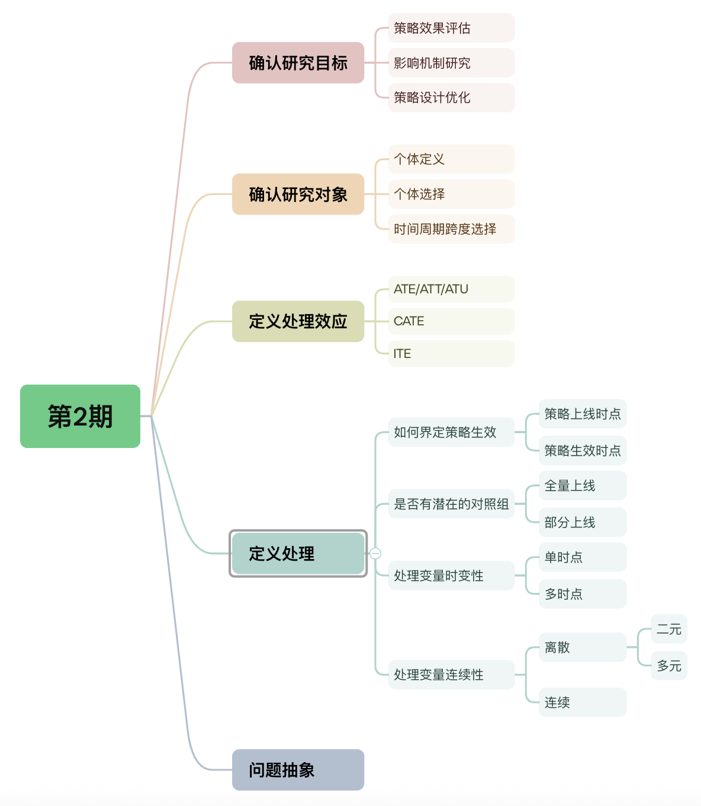

# 务实的因果推断——第2期

> 嗨~ 各位小伙们假期快乐呀~ 作为劳模的代表，苏晓糖又带来了最新一期的内容(我苏晓糖愿称苏晓糖为最强劳模！)，也希望可以给大家的快乐假期提供一点儿不一样的东西[斜眼笑.jpg] 在第一期内容中，苏晓糖介绍了因果推断领域的核心框架，那从本期开始，苏晓糖会沿着观测性数据因果推断的实践思路逐个介绍每个环节的常见的问题、方法及工具。好啦，闲话不多说，就跟随苏晓糖一起进入本期的内容吧~

## 情景导入

某内容APP的产品经理小白，为进一步提升用户的浏览时长，依据用户关注人数的数量，对打开APP的用户进行差异化承接，当用户关注人数>= N时，将用户的落地Tab(打开APP看到的第一个界面)调整为关注Tab，当用户关注人数 < N时，落地Tab保持为推荐Tab不变，策略全量上线，你会如何评估策略的收益，并提出可能的策略优化设计？请停下来思考10秒钟？

## 内容框架

在第1期中，苏晓糖谈到因果推断领域的实践思路，包含5步：定义问题、分析变量关系、确定混淆因子、选择估计方法、稳健性检验和有效性检验。本期内容会聚焦在如何定义因果推断问题上，值得注意的是，此环节定义的问题会影响到后续环节的样本选取以及估计方法的选择。本期内容先围绕问题定义的基本流程进行介绍，并在最后给出情景导入中的问题抽象：

- 确认研究目标(或侧重点)

- 确认研究对象

- 定义处理效应

- 定义处理变量

- 问题抽象

  

## 确认研究目标

因果推断，简单来讲就是研究**处理变量(treatment)对结果变量(outcome)**的**影响大小**的一门学科，其中可以**简单将对结果变量的影响大小理解为处理效应**。在第1期中，苏晓糖有谈及到，因果推断的三大核心目标：**策略效果评估、影响机制研究、策略设计优化**。以情景导入中的问题为例，我们的研究目的可以被定义为：

- 策略效果评估：新策略上线对于浏览时长影响有多大？正向、负向或无影响？
- 影响机制研究：新策略是如何影响到用户浏览时长的？通过内容供给量或内容的多样性影响？
- 策略设计优化：新策略在哪些用户群体上存在正收益、负收益或无收益？

在实际的情况下，对以问题关注程度存在行业的差异性，比如：

- 在互联网行业中，各个研究目的关注程度排序为策略效果评估 ≈ 策略设计优化 >> 影响机制研究
- 在社会科学领域，各个研究目的关注程度排序为策略效果评估 ≈ 影响机制研究 > 策略设计优化

## 确认研究对象

研究对象(或者研究样本)，即选取哪些样本评估策略效果。通常有3个维度的问题：**个体的定义、个体的选择和时间周期跨度的选择**。

**关于个体的定义，即数据的颗粒度是什么**。比如一个用户、一个企业、一个区域，也可以是一个用户群、一个企业群等。**个体的定义，这通常取决于数据的可得性**。一般而言，数据颗粒度越细，可以提供的信息越多。

**关于个体的选择，即选择哪些个体进行研究，这通常取决于业务的目标**。

- 全量个体。通常来讲，这在互联网行业中并不常见。以情景导入中的问题为例，如果把全量用户作为研究样本，对于业务目标(用户的浏览时长)而言没有任何的意义，因为在互联网行业当中可能存在大量的沉默用户(永远都不会再次打开你的APP)。但如果是在其他场景之下，如经济学领域研究高铁开通对于省份的全要素生产率的影响，则一般要选择全部的省份作为研究样本。
- 满足某种条件的个体，这在互联网行业最为常见。以情景导入的问题为例，因为业务目标为用户的浏览时长，仅活跃用户才可能存在浏览行为且可能被新策略影响到，因此可以将**策略上线后活跃的用户**作为研究对象。

**关于时间周期跨度的选择，即选择多长时间窗口的数据来对指定的用户群体进行研究，这通常取决于业务指标的周期性性质**。假如业务指标存在周期性，时间窗口应当覆盖策略生效前(或生效后)至少一个周期。以情景导入的问题为例，假设发现用户的浏览时长存在显著的周末效应，则时间周期跨度至少应该覆盖策略生效前(或生效后)的一周。此外仍需注意，**时间跨度不宜选择过长，否则可能会引入其他影响因素(如其他策略)，造成偏差**。

## 定义处理效应

为方便内容介绍，在此先引入本期内容的数学符号定义，以二元处理变量为例：

- 处理变量(treatment)$T_i\in\{0,1\}$, 表示个体i的处理变量取值，$T_i=0$表示个体处于未处理组，$T_i=1$表示个体处于处理组
- 结果变量(outcome)$Y_i(T_i)\in\{Y(0),Y(1)\}$, 表示个体i的处理变量取值为$T_i$时的结果变量取值
- 协变量(covarivate)$X=[x_{1},x_{2}..x_{n}]$,表示一系列样本特征，如收入水平、年龄、性别等，$X_i=[x_{i1},x_{i2}...x_{in}]^T$表示个体i协变量的观测。
- 样本空间$W$，表示全量的研究样本。

以情景导入中的问题为例，处理变量可以理解成关注人数是否>=N，结果变量可以理解为浏览时长，而**处理效应可以理解成浏览时长的变化**。由此可见，处理效应通常被定义为某种意义上的“差值”。

根据处理效应所定义的样本空间不同，可以将**处理效应简单的划分为：平均处理效应(ATE)、处理组平均处理效应(ATT)、未处理组平均处理效应(ATU)、条件平均处理效应(CATE)、个体处理效应(ITE)**。

- 平均处理效应(ATE)即在全量样本之上的处理效应，即：
  $$
  ATE=E[Y_i(1)-Y_i(0)|i\in W]
  $$

- 处理组平均处理效应(ATT)即在全量处理组样本之上的处理效应，即：
  $$
  ATT=E[Y_i(1)-Y_i(0)|T_i=1]
  $$

- 未处理组平均处理效应(ATU)即在全量未处理组样本之上的处理效应，即：
  $$
  ATU=E[Y_i(1)-Y_i(0)|T_i =0]
  $$

- 条件平均处理效应(CATE)即在协变量特定取值下的处理效应，即：
  $$
  CATE=E[Y_i(1)-Y_i(0)|X_i=\bold x]
  $$

- 个体处理效应(ITE)即在个体i上的处理效应，即：
  $$
  ITE_i=Y_i(1)-Y_i(0)
  $$

敏锐的小伙伴可以发现，对于个体i而言，结果变量中的$Y_i(0)$和$Y_i(1)$, 仅可被我们观察到其中一个，即当个体i为在处理组时，仅可观测到$Y_i(1)$，当个体i在未处理组时，仅可观测到$Y_i(0)$，因此以上定义的**每一类处理效应，均无法直接从观测数据中计算得出**。在此提前剧透一下，为每个个体估计不可观测的结果变量(反事实)，即潜在因果模型要解决的核心问题。同时**处理效应的定义也会影响我们在因果效应估计时所选择的具体方法**，比如倾向得分匹配(PSM)一般不用于CATE或ITE的估计。

最后，**选择何种类型的处理效应定义，通常取决于我们的研究目标或侧重点**。

- 影响机制研究，处理效应通常关注ATE/ATT/ATU和CATE
- 策略效果评估，处理效应通常关注ATE/ATT/ATU
- 策略设计优化，处理效应通常关注CATE和ITE

## 定义处理变量

**不同的估计方法适用的场景会有不同**，比如倾向得分匹配(PSM)难以处理连续型处理变量的场景，因此处理变量的定义，对于后续环节的估计方法选择至关重要。在定义处理变量时，需要重点考虑以下4个问题：

- **如何界定处理的时点**？这个问题尤其需要关注，在实际业务场景下，通常存在两个时间点：**策略上线时点和策略实际生效时点，这两个时点往往并不一致，而我们更关心的是策略实际生效的时点**。以情景导入中的问题为例，策略上线时点可能是某个具体的时间点(如10/01 下午2点)，但策略实际生效时点，却会存在个体差异，比如用户A当天下午5点活跃，用户B在次日上午8点活跃，因此两个用户的实际策略生效时点不同，且与策略上线时点不同。
- **是否有潜在的未处理组**？这个问题，通常取决于**处理是对全量个体生效还是部分个体生效**。比如双十一大促，全量用户都可以参与，因此此时不存在未处理组。而在情景导入的场景下，关注人数<N的用户则可以被定义为未处理组。
- **处理变量是否存在时变性**？也即策略实际生效的时点是否存在个体差异，由此也可以将处理变量区分为**单时点和多时点两类**。比如情景导入中的案例，会因用户的活跃时点的差异导致策略实际生效时点存在差异，因此可以将其定义为多时点的处理效应问题。另一个场景是在某个时点直接针对沉默用户进行优惠券的发放以召回用户，此时用户的策略实际生效点便不存在个体差异，因此可以将其定义为单时点的处理效应问题。
- **处理变量是否连续**？处理变量在实际业务中可能存在**离散(处理变量仅有有限的取值)和连续(处理变量的取值为无限)的两类场景**。比如情景导入中的案例，处理变量仅有两个取值(0和1,即关注人数<50人和关注人数>=50人)，因此这个问题为离散型处理变量的因果估计问题。连续型处理处理变量场景也较为常见，比如随机金额的优惠券发放对GMV的影响，此处的处理变量为优惠券金额，且金额可能取某个区间内的任意值，因此这个问题为连续型处理变量的因果估计问题。

## 问题抽象

我们现在回到情景导入中的问题，我们可以将其抽象为下面的业务问题：

- 研究目的：评估新策略对用户浏览时长的影响大小，并探索新策略的潜在优化空间

- 研究对象：策略上线后活跃过的全部用户，选取的时间窗口期为新策略实际生效前后各1周

- 处理效应：ATE 和 CATE

- 处理变量：用户活跃且关注人数>=N实际生效、存在潜在的未处理组、多时点处理变量、二元离散型处理变量

  我们这里再来回顾一下，研究本期内容的基本逻辑，可以遵循下图：

- 业务场景决定了研究目的、研究对象和处理变量的定义

- 研究目的和研究对象，共同决定了处理效应的定义

- 处理效应的定义、处理变量的性质和协变量(准确的说是协变量、处理变量、结果变量的关系)共同决定了估计方法的选择。

  

## 资源推荐

- **综述类文章**：Liuyi Yao, Zhixuan Chu, Sheng Li, Yaliang Li, Jing Gao, and Aidong Zhang. 2021. A Survey on Causal Inference. ACM Trans. Knowl. Discov. Data 15, 5, Article 74 (May 2021), 46 pages.
- **著作类**:
  - 《Caussal Inference in Statistics：A Primer》 Judea Pearl等著
  - 《Causal Inference: What If 》Jamie Robins等著
  - 《基本有用的计量经济学》赵西亮著
- **实践类**：https://github.com/matheusfacure/python-causality-handbook

