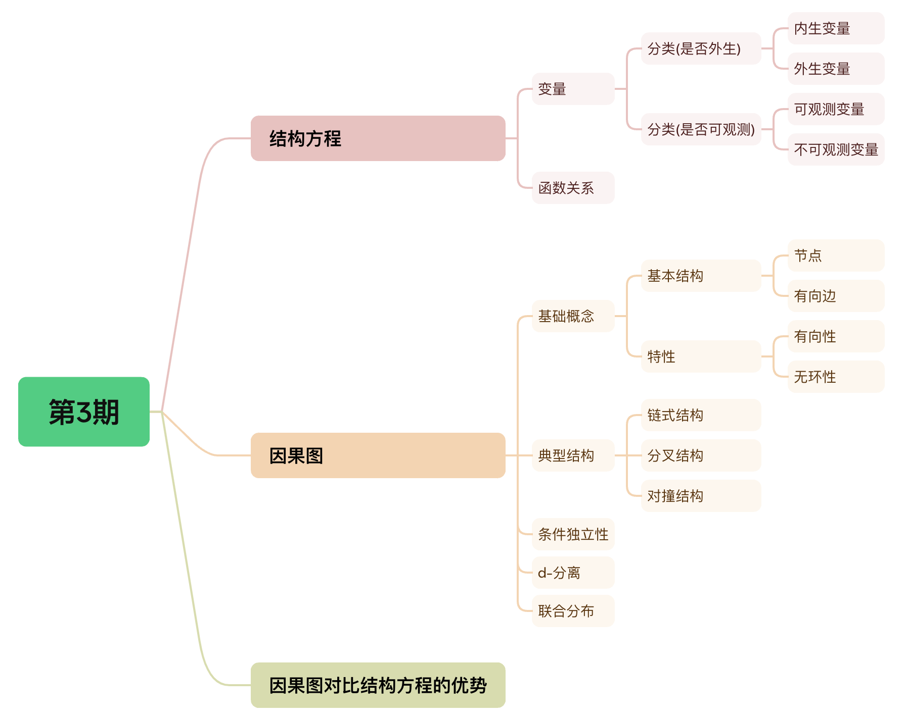
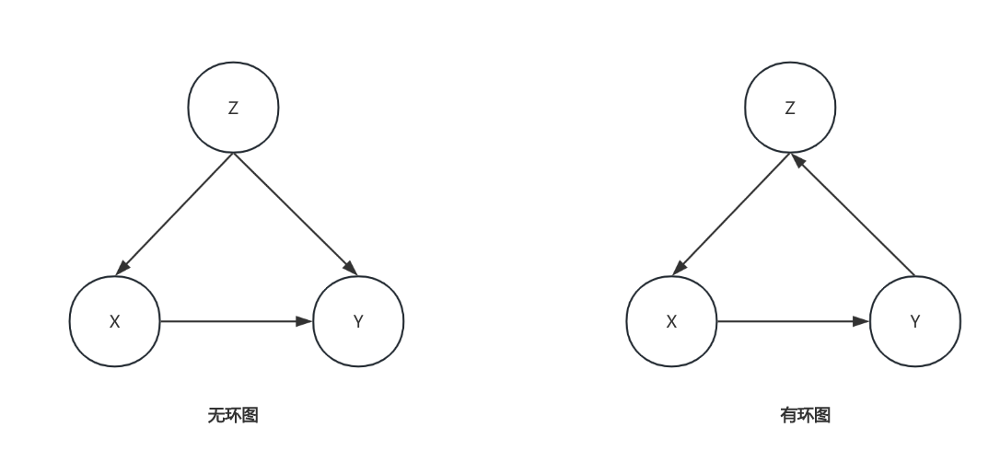

# 务实的因果推断——第3期

> 嗨，各位小伙伴们周末好呀，苏晓糖又带来了最新一期的内容~ 在第2期内容中，苏晓糖聚焦于因果推断的问题定义环节，继续沿着因果推断的实践思路，预计使用2-3期的内容篇幅系统介绍第2环节和第3环节。其中结构因果模型(SCM)是这两个环节的核心，因此今天会重点围绕结构因果模型中的结构方程和因果图进行展开，帮助大家更好地理解后续环节的操作逻辑，好啦，现在就跟随苏晓糖一起进入本期的内容吧~ 

## 情景导入

某电商平台APP，为刺激用户完成首单转化提升GMV，在未完成首单用户打开APP时，发放相同额度的优惠券，你会如何评估发券策略的ROI，并给出可能的策略优化方案？停下来思考10秒钟~ PS: 增量ROI =  (发券群体的实际GMV - 假设不发券的GMV) / 优惠券的成本

## 内容框架

在第1期中提及到将因果推断的实践划分为5个步骤：问题定义、分析变量关系、识别混淆变量、选择估计方法、稳健性检验和有效性检验。在第2期内容中已经介绍了问题定义，本期内容会重点介绍分析变量关系的使用的工具SCM模型，本质是一种概率因果模型，结构方程和使用因果图(有效无环图)来描述数据生成过程，使用do算子、前门准则和后门准则对因果效应进行估计。由于SCM模型涉及的内容较多，本期内容会重点介绍SCM模型的基本概念，包括：

- 结构方程：变量(特征)、函数关系

- 因果图：基本概念、**典型结构、条件独立性、d-分离**、联合分布

- 因果图对比结构方程的优势

  Tips: **请重点关注因果图部分的典型结构、条件独立性和d-分离内容**，其他内容作为背景了解即可。

## 结构方程

### 严格定义

结构方程本质就是用于描述现实世界中的特征之间因果关系的一组变量及一组函数关系。从形式来看就是，结构方程存在两个变量集合U和V，以及一组函数$f=\{f_X:W_X\rightarrow X|X\in V\}$, 其中$W_X \subset (U \cup V)-\{X\}$ 。其中U代表外生变量，V代表内生变量，结构方程简单来讲就是说当变量Y存在于$f_X$的定义域$W_X$中，则Y是X的直接原因。如果Y是X的直接原因或原因的原因(比如Y是Z的直接原因，Z是X的直接原因)，则Y是X的原因。

以情景导入中的问题为例，我们想要评估是否发券对GMV的影响，核心问题就会涉及到处理变量(**是否发券**)和结果变量(**用户GMV**)，此外我们可能还有一些合理的猜测，比如性别、活跃度、收入水平等(除此外**还包括一些其他不可观测地因素**)可能会影响到策略效果。假设在此场景下性别、收入水平是外生变量，活跃度、是否发券、用户GMV是内生变量，此时我们可以使用下面的结构方程对要研究的因果关系进行描述：
$$
U=\{U_1,U_2,U_3,U_4,U_5\}, V=\{活跃度,是否发券,用户GMV\}, f=\{f_1,f_2,f_3\}\\
U_1=性别\\
U_2=收入水平\\
活跃度=f_1(U_3)\\
是否发券=f_2(性别, 收入水平,活跃度,U_4)\\
用户GMV=f_3(性别, 收入水平,活跃度,是否发券,U_5)\\
其中，U_3,U_4,U_5是一些不可观测的因素
$$

### 变量分类

在严格定义之中，我们提及到外生变量和内生变量，本质来讲**内生变量和外生变量的区别是相较于所研究的具体场景(或系统)而言的**，并非有绝对的区分。其中：

- 外生变量：在所研究的场景(或系统)下，不受模型内其他变量影响的变量。如上面提到的性别，收入水平可以理解为外生变量。

- 内生变量：在所研究的场景(或系统)下，受其他内生变量或外生变量影响的变量。如上面提到的活跃度、是否发券、GMV可以理解为内生变量。

除了内生和外生的区分外，**变量还可以被区分为观测变量和潜在变量。二者间的区别在于变量的是否可观测**。其中：

- 观测变量：在所研究的场景(或系统)下，可以被测量的变量。比如上面提到的是否发券、用户GMV、用户活跃度等
- 潜在变量：在所研究的场景(或系统)下，无法被测量的变量。这里包含两层含义：未知的因素(比如上面提到的影响活跃度的$U_3$)和已知但不可测量的因素(如上面提到的收入水平)。

### 函数关系

**函数关系**，即结构方程中的$f$，**既可以为线性函数也可以为非线性函数**，用于表示变量之间的因果关系。如上面提到的$f_2$表示，性别、收入水平、活跃度、潜在变量$U_4$为是否发券的原因。

## 因果图

### 基本概念

在介绍因果图之前，我想先向大家介绍计算机科学领域中的有向无环图(DAG)的概念。有向无环图由一系列节点、边构成，具备有向(边有特定的方向)和无环性(即不存在从某个节点出发沿着边的方向经过若干节点后再回到该节点的路径)两个特征。如下图所示，左侧为三个节点(X、Y、Z)和三条有向边(X→Y、Z→X、Z→Y)构成的有向无环图，而右侧为有环图，因为存在X→Y→Z→X的路径。有向边X→Y表示X是Y的父节点，Y是Z的子节点，同理Z是X的父节点，因此我们也称Z是Y的祖先节点，Y是Z的后代节点。

在因果推断中，使用有向无环图来表示因果关系，因此也将其成为因果图。其中节点表示变量，有向边边表示单向的因果关系，如下图的无环图所示，X、Y和Z表示三个变量，有向边X→Y表示变量X是Y的直接原因，同理有Z是X和Y的共同的直接原因。无环形的特征保证不存在循环因果关系。

现在我们现在使用因果图对情景导入中的因果推断问题进行进行重新描述，在因果图中，我们可以很直观的看出变量之间的因果关系。比如潜在变量$U_3$是活跃度的直接原因，收入水平是是否发券和用户GMV的共同原因，活跃度和是否发券均是用户GMV的原因。

### 典型结构

在因果图中具有三类典型结构：链状结构、分叉结构、对撞结构。为不失一般性，使用三个节点来简化表示三类结构，其中：

- 链状结构：如下图示，结点X和Z之间只有一条单向路径，且Y是该路径中的中间结点。即X是Y的直接原因，Y是X的直接原因。以情景导入中的问题为例，潜在变量$U_3$、活跃度和是否发券的关系即对应因果图链状结构，即潜在变量$U_3$是活跃度的直接原因，活跃度为是否发券的直接原因。
- 分叉结构：如下图示，结点Y是X和Z共同的父结点，即Y是X和Z共同的直接原因(或原因)。以情景导入中的问题为例，活跃度、是否发券和用户GMV的关系即对应因果图的分叉结构，即活跃度是用户GMV和是否发券的共同原因。
- 对撞结构：如下图示，结点Y是X和Z共同的子结点，即X和Z是Y的直接原因(或原因)。以情景导入中的问题为例，收入水平、性别和用户GMV的关系即对应因果图的对撞结构，即收入水平和性别均是用户GMV的原因。

### 条件独立性

在概率论中，如果有随机变量X、Y、Z，对于所有x，y，z满足下式，则我们称在在Y的条件下，X和Z独立，即条件独立性。
$$
P(X=x|Z=z,Y=y) = P(X=x|Y=y)
$$
在因果推断中，我们可以很方便的使用因果图对变量之间的相关或独立性质进行描述。现在我们分别链状结构、分叉结构和对撞结构表示的条件独立性进行介绍。

- 链状结构的条件独立性。如果变量X和Z之间**只有一条**单向路径，Y是截断这条路径的任何一个(组)变量，则在Y的条件下，X和Z是独立的。在链状结构图中，为便于理解，假设我们有结构方程$Y=X+1;Z=Y×2$，当我们知道X为2时，我们一定可以根据结构方程计算出Z为6，即X和Z是无条件相关的。然而当变量Y的取值保持不变时，如Y=1，无论X如何，我们都知道Z为2，即变量X和Z在给定Y的条件下独立。
- 分叉结构的条件独立性。如果变量Y是变量X和变量Z的**共同原因**，并且X和Z之间**只有一条路径**，则X和Z在Y的条件下独立。在分叉结构中，为便于理解，假设我们有结构方程$X=Y-1;Z=Y+1$，当我们知道X为2时，我们一定可以通过结构方程计算出Z为4，即X和Z是无条件相关的。然而当变量Y保持不变时，如Y=1，无论X如何，我们都知道Z为2，即变量X和Z在给定Y的条件下是独立的。
- 对撞结构的条件对立性。如果变量Y是变量X和变量Z的**对撞节点**，并且X和Z之间**只有一条路径**，那么X和Z是无条件独立的，但是在Z或Z的任何子孙结点条件下是相互依赖的。在对撞结构中，为便于理解，假设我们有结构方程$Y=X-Z$，当我们知道X为2时，我们无法通过结构方程计算出Z的取值，即X和Z是无条件独立的。然而当Y的取值保持不变时，如Y=1，知道当X为2时，一定可以计算出Z为1，即变量X和Z在给定Y的条件下是相关的。

### d-分离

为了更好的使用因果图描述变量间的独立性质，我们在因果图中引入d-分离的概念。d-分离被分为两类：

- **不以任何节点为条件**。当说一对节点是d-分离的，指的是这两个变量是绝对独立的。

- **以某些节点为条件**。当说一对节点在给定某些节点是d分离的，指的是这两个变量在给定变量条件下是绝对独立的。一条路径会被一组节点Y阻断当且仅当：

  - 路径P中包含链状结构A→B→C或分叉结构A←B→C，且中间节点B在Y中(即以B为条件)；或者
  - 路径P中包含一个对撞结构A→B←C，且对撞节点B及其子孙结点都不在Y中
  

  如果Y阻断了X和Z之间的**所有路径**，则称X和Z在Y的条件下是d-分离的，也即X和Z在Y的条件下是相互独立的。

再次回到情景导入中对应的因果图中，我们知道U3和是否发券之间共有两条路径：

- 路径1：$U_3\rightarrow活跃度\rightarrow是否发券$

- 路径2：$U_3\rightarrow活跃度\rightarrow用户GMV\leftarrow是否发券$

  从路径上看，路径1为典型的链状结构，路径2为链状结构和对撞结构，因此活跃度既可以同时阻断路径1和路径2，因此是否发券和$U_3$在活跃度保持不变的条件下是d-分离的，即是否发券和$U_3$在活跃度保持不变的条件下是相互独立的。相反用户GMV不在路径1中，同时又是路径2中的对撞节点，因此是否发券和$U_3$在活跃度保持不变的条件下是d-连通的。

  

### 联合分布

在因果图模型中，模型中的变量的联合分布可以通过对图中所有“家庭成员”计算条件分布概率$P(子节点|父节点)$的乘积给出。即：
$$
P(x_1,x_2,...,x_n)=\prod_iP(x_i|pa_i)
$$

其中$pa_i$是变量$x_i$的所有父节点。该式使用了变量间的普遍成立的条件独立性质。以上面提到的三种经典结构为例进行简单证明：

- 链状结构的联合概率分布为$P(X,Y,Z)=P(X)P(Y|X)P(Z|Y)$。证明如下，其中第1-2个等号根据条件概率公式得到，第3个等号使用链状结构的独立性得到。
  $$
  \begin{align}
  P(X,Y,Z) &=P(X)P(Y,Z|X)\\
  &=P(X)P(Y|X)P(Z|Y,X)\\
  &=P(X)P(Y|X)P(Z|Y)
  \end{align}
  $$

- 分叉结构的联合概率分布为$P(X,Y,Z)=P(Y)P(X|Y)P(Z|Y)$。证明如下，其中第1个等号根据条件概率公式得到，第2个等号使用分叉结构的独立性得到。
  $$
  \begin{align}
  P(X,Y,Z)&=P(Y)P(X,Z|Y)\\
  &=P(Y)P(X|Y)P(Z|Y)
  \end{align}
  $$

- 对撞结构的联合概率分布为$P(X,Y,Z)=P(X)P(Y|X,Z)P(Z)$。证明如下，其中第1-2个等号根据条件概率公式得到，第3个等号使用对撞结构的独立性得到。
  $$
  \begin{align}
  P(X,Y,Z)&=P(X)P(Y,Z|X)\\
  &=P(X)P(Y|Z,X)P(Z|X)\\
  &=P(X)P(Y|Z,X)P(Z)
  \end{align}
  $$
  

## 因果图对比结构方程的优势

在我们知道结构方程中的所有函数关系以及外生变量的分布时，我们可以得到变量间的联合分布以及各个边缘概率之间的关联。既然结构方程在因果推断领域如此强大，为什么还需要因果图这个工具呐？Pearl给出了2点理由：

- 我们往往对于变量间的相关和独立性质更关心，通过**因果图的节点间的路径分析，可以更加直观简单的得出变量间的关系**。

- 我们往往并不知道所有的函数关系和外生变量的分布，但**因果图可以**在不知道这些信息的条件下，**有效地表达联合分布**。

  在此结构因果模型的两个基础工具结构方程和因果图，均已经介绍完成，在这里苏晓糖**建议大家重点关注因果图中的三种典型结构、d-分离、以及条件独立性质即可**，这三个部分熟练运用，对于我们后续的分析变量间的关系(比如因果发现)，确定影响识别因果效应估计的混淆因子至关重要。

## 资源推荐

- **综述类文章**：Liuyi Yao, Zhixuan Chu, Sheng Li, Yaliang Li, Jing Gao, and Aidong Zhang. 2021. A Survey on Causal Inference. ACM Trans. Knowl. Discov. Data 15, 5, Article 74 (May 2021), 46 pages.
- **著作类**:
  - 《Caussal Inference in Statistics：A Primer》 Judea Pearl等著
  - 《Causal Inference: What If 》Jamie Robins等著
  - 《基本有用的计量经济学》赵西亮著
- **实践类**：https://github.com/matheusfacure/python-causality-handbook
