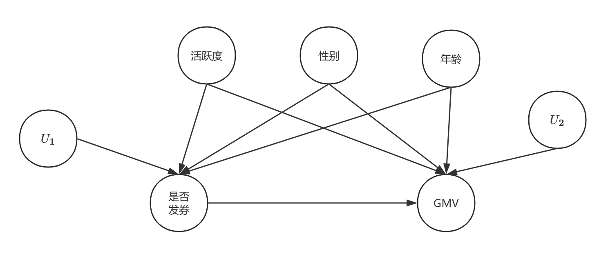

# 务实的因果推断——第4期

> 嗨，各位小伙们周末好呀:happy: ~  鸽了一周后，苏晓糖又带来了最新一期的内容~ 我们再次回想一下因果推断的实践思路：定义问题、因果图分析变量关系、因果图圈定混淆因子、选择因果效应的估计方法、稳健性检验和有效性检验。今天苏晓糖会围绕因果发现这个问题展开，毕竟只有获得因果图，才能基于因果图分析变量关系~ 好勒，那就进入今天的正式内容吧~ 

## 情景导入

以<font color=red>第3期</font>的问题为例，某电商平台APP，为刺激用户完成首单转化提升GMV，在未完成首单用户打开APP时，发放相同额度的优惠券，你会如何评估发券策略的ROI，并给出可能的策略优化方案？为了解决这个问题，我们需要先从观测数据中推导出一副因果图。在此我们先假设真实的结构方程和因果图如下：
$$
\begin{align}
是否发券&=I\{ 最近30天活跃天数+ I\{性别=女\} × 2  + I\{年龄 >=30 且 年龄 <= 50 \} × 2 + norm(0, 1) × 2> 20 \} \\
GMV&=最近30天活跃天数 × 100 + I\{性别=女\} × 50 + I\{年龄 >=30 且 年龄 <= 50 \}  × 30 \\&+I\{是否发券=1\}*200+ norm(0, 1)×50\\
其中&, I\{· \}为示性函数。
\end{align}
$$


## 内容框架

在本期内容中，我们会重点介绍如何从观测性数据中推断因果图，也即因果发现。考虑到因果发现是一个十分庞大的领域，若详细介绍各类因果发现算法，显然偏离了本系列内容的主线。因此在本期内容中，会聚焦于各类算法的核心原理、假设，适用条件，以及如何对获得的因果图进行检验。本期主要包含以下：

- 因果图的获得：先验知识、从观测数据中学习、混合方法
- 因果图的检验：针对有先验知识的因果图、针对使用观测数据学习的因果图


## 因果图的获得

基于对先验知识的利用程度，可以将因果发现的方法分为3类：先验知识获取、观测数据学习、观测数据学习时融入先验知识的混合方法。

### 先验知识

使用先验知识获取完整因果图的方法在学界较为常见，先验知识的通常来自于理论推导、历史文献、专家知识、历史经验或猜想。在此不做过多介绍。

### 使用观测数据学习

在业界中使用观测数据进行学习因果图方法更为普遍，在此会重点介绍常见的各类算法的核心原理、假设和适用条件。总体而言，基于适用的数据类型可以将因果发现算法分为3大类：针对截面数据的方法、针对时间序列数据的方法、针对面板数据的方法。

#### 针对截面数据的方法

针对截面数据的方法，又可以划分为**基于约束的学习方法、基于分数的学习方法、基于函数因果模型的学习方法、现代连续优化方法**。

1. **基于约束的学习方法**，其基本思想是在因果马尔科夫条件[^1]和因果忠实性假设[^2]下，借助变量间的条件独立性来推断因果图的结构，即如果两个变量在给定某个变量集合的条件下相互独立，那这两个变量间没有直接的因果关系，代表性的算法为PC算法和FCI算法。其中：

   - PC算法。其基本原理是从一个全连接的无向图出发，**利用条件独立性**逐渐移除边，最后结合移除边时生成的分离集，使用对撞结构和定向规则确定边的方向。

   - FCI算法。FCI算法属于PC算法的改良版本，**用于处理存在未观测混淆变量的情况**，它会输出一个部分有向无环图，其中包含潜在混淆因素的表示。

     > [!TIP] 
     >
     > 优点：对于数据生成过程没有函数假设；同时可以处理高维数据。
     >
     > 缺点：在样本量较小或高维稀疏的样本时，进行条件独立性检验可能不可靠；两种算法均不能确定唯一的因果图，只能识别马尔科夫等价类[^3]。

2. **基于分数的学习方法**，其基本思想是通过搜索因果图的空间，为每个因果图打分，**选择分数最高**的图。评分函数通常反映拟合优度和图的复杂性，常见的评分函数如贝叶斯信息准则(BIC)，其代表性算法为GES算法。

   - GES算法，则是从一个空图开始，通过两步贪心搜索逐步添加边(向前步)和删除边(向后步)来优化评分函数。

   > [!TIP]
   >
   > 优点：通过评分函数，同时考虑模型复杂度和拟合优度；评分函数基于图的整体结构，通常比基于约束的方法更稳定。
   >
   > 缺点：搜索成本很高，尤其是在变量较多的场景下；评分函数的设定会影响因果图结果；一般而言只能识别马尔科夫等价类。

3. **基于函数因果模型的学习方法**，其基本思想是将因果关系假设为一个特定的函数形式，即结果变量等于原因变量加噪声变量。如果X是Y的原因，则$Y=f(X)+e_1$，其中$e_1$是独立于X的噪声变量，如果反向$X=f(Y)+e_2$ ，$e_2$与Y不独立，此时使用**噪声的独立性**来识别因果方向，其代表性算法为LiNGAM和ANM。其中：

   - LiNGAM算法。LiNGAM**假设函数是线性的，且噪声是非高斯的**，利用独立成分分析(ICA)来估计模型，从而确定唯一的因果图。

   - ANM算法。ANM算法假设**Y是X的任意函数加上与X独立的噪声**。通过检验在X→Y和Y→X两个方向上噪声与原因的独立性，来确定因果方向。如果只有一个方向满足独立性，则该方向为因果方向。

     > [!tip]
     >
     > 优点：两种方法都可以识别出唯一的因果图；不需要预设因果图的顺序。
     >
     > 缺点：假设特定的函数形式和数据生成过程，假设严格；对于数据量和噪声分布较敏感。

4. **现代连续优化方法**，其主要思想是**将图搜索的组合优化问题，转化一个连续优化问题**，其奠基算法为Notears算法，后续的连续优化方法的变种，均可以看到Notears算法的影子。

   - Notears算法，其给出了有向无环图的无环性约束的代数表达式$trace(e^{W∘W})=d$，其中∘ 代表逐元素相乘，W为有向无环图的加权邻接矩阵，巧妙的将组合优化问题转化为连续优化问题。

     > [!tip]
     >
     > 优点：避免了组合搜索，可以使用梯度下降算法对问题进行高效优化；扩展性很强，可以处理几十个变量的中等规模问题。
     >
     > 缺点：假设数据生成过程是线性的；某些场景下不如基于约束的学习方法。

#### 针对时间序列数据的方法

针对时间序列数据的因果发现，代表性算法为格兰杰因果模型和PCMCI算法。其中：

1. 格兰杰因果模型。**格兰杰因果模型基于向量自回归模型，基本思想是假设在预测Y时，加入其他变量过去的信息比只使用Y的过去信息时能获得更好的预测，则称X是Y的格兰杰原因**。基本步骤是分别拟合Y的自回归模型和包含X的向量自回归模型，然后使用F检验判断两个模型的预测误差的差异大小。如果差异很小，则说明X不是Y的格兰杰原因，否则X是Y的格兰杰原因。

   > [!tip]
   >
   > 优点：适用于有先验理论的快速检验和低维系统(变量数较低)
   > 劣势：假设时间序列平稳；变量之间是线性关系；容易受到混杂变量的影响；

2. PCMCI算法。PCMCI算法是**将PC算法扩展到时间序列，基本思想是在给定所有其他变量（包括时间滞后）的条件下，如果X和Y仍然相关，则存在直接的因果关系**。

   > [!tip]
   >
   > 优点：适用于高维系统(变量数较多)；可以检验瞬时关系；可以处理非线性关系；探索性的因果发现；
   >
   > 缺点：假设时间序列是平稳的；条件独立性检验的选择可能影响结果；假设不存在未观测的混杂变量的影响。

#### 针对面板数据的方法

针对面板数据的因果发现，代表性算法为面板VAR。**面板VAR可以看作是VAR的扩展，基本思想是在考虑变量间时间序列动态的同时，控制不可观测地个体固定效应**，从而得到更纯净的因果效应。


### 混合方法

在使用观测数据进行因果图学习时融入先验知识，但不同算法对先验知识的融入的支持程度不同。PC、FCI、GES、PCMCI、格兰杰因果模型、面板向量自回归，对先验知识的融入有较好的支持度，如通过控制哪些边是否删除，或纳入哪些变量作为原因变量，而基于函数模型的方法，如LiNGAM和ANM对于先验知识的融入的支持度较差。

## 因果图的检验

基于采用不同方法获得因果图，我们可以使用不同的方式对其进行检验，若检验通过，则可以一定程度上提升我们对于所得因果图正确性的信心。

### 先验知识获得

基于先验知识获得因果图，在此特指完全依赖先验知识获得因果图，虽然先验知识的来源通常具备一定的“权威性”，但也建议进行一些基本的检验。主要有两类方法：

1. **使用观测数据学习因果图，用来验证先验因果图**。假设学习的因果图，与先验知识建立的因果图基本一致，则说明我们的先验知识是相对可靠的。
2. **基于先验的因果图隐含的条件独立性，使用观测数据进行检验**。**离散型变量通常可以采用卡方检验，连续型变量可以采用 fisher Z检验**。

### 观测数据学习获得

使用观测数据学习获得因果图检验，主要方法分为两类：

1. **结合先验知识判断，学习的因果图是否存在违背先验或直觉的情况**。以情景导入中的问题为例，假如在我们学习的因果图中发现，是否发券是性别的原因，但是从生物学角度来讲，个体性别只取决于其从父方得到染色体是X还是Y。因此可以认定我们获得的因果图是错误的。

2. **稳健性检验**。学习的因果图的正确与否，可能与观测数据的样本量、观测数据是否满足所用方法的假设相关。因此为避免我们学习的因果图错误，导致我们后续因果效应估计使用错误的因果图，通常建议进行稳健性检验，以判断当前学习结果的稳定性。在进行稳健性检验时可以尝试以下方法：

   - **更换算法**。通过更换因果发现算法，使用相同的观测数据进行学习，假设更换算法得到结果与当前结果一致，可以提升我们对结果的正确性的信心。

   - **更换样本**。假设不同变量间存在真实的因果关系，则其因果关系不应该随我们使用的观测样本变化而变化。因此，当我们尝试更换新的观测数据进行因果图学习时，假设学习结果与当前结果一致，可以增强我们对结果的正确性的信心。

     > [!tip]
     >
     > 原则上讲，稳健性检验一般并不能直接证真或证伪，即 稳健性检验结果与当前结果不同，无法证明当前结果错误，同理，稳健性检验结果与当前结果一致，也无法证明当前结果正确。但当稳健性检验结果与当前结果一致，可以增强我们对当前结果正确性的信心

## 附录-实验

### 数据生成

```python
#生成模拟数据
# 是否发券取决于用户的活跃度、性别、年龄， 高活跃度用户更容易发券， 女性用户更容易发券， 中年的用户更容易发券
# 用户GMV取决于 活跃度、性别、年龄和是否发券
num_samples = 100000
np.random.seed(0)
activity_level = np.random.randint(1, 11, num_samples)  # 活跃度
gender = np.random.choice([0, 1], num_samples)  # 性别，0表示男性，1表示女性
age = np.random.randint(18, 61, num_samples)  # 年龄，18到60岁
coupon_issued = (activity_level + gender * 2 + (age >= 30) * 2 + (age <= 50) * 2 + np.random.randn(num_samples) * 2) > 10
coupon_issued = coupon_issued.astype(int)
gmv = (activity_level * 100 + gender * 50 + (age >= 30) * 30 + (age <= 50) * 30 + coupon_issued * 200 + np.random.randn(num_samples) * 50)
data = np.concatenate([activity_level.reshape(-1,1), gender.reshape(-1,1), age.reshape(-1,1), coupon_issued.reshape(-1,1), gmv.reshape(-1,1)], axis=1)
```

### 算法实现

```python
def pc(data):
 	from causallearn.search.ConstraintBased.PC import pc 
 	cg = pc(data, alpha=0.05, indep_test='fisherz')
   cg.draw_pydot_graph(labels=['activity_level', 'gender', 'age', 'coupon_issued', 'gmv'])

    
def fci(data):
  from causallearn.search.ConstraintBased.FCI import fci
  from causallearn.utils.GraphUtils import GraphUtils
  cg2 = fci(data, alpha=0.05, indep_test='fisherz')
  pdy = GraphUtils.to_pydot(cg2[0], labels=['activity_level', 'gender', 'age', 'coupon_issued', 'gmv'])
  pdy.write_png('fci_result.png')
  
def ges(data):
  from causallearn.search.ScoreBased.GES import ges
  from causallearn.utils.GraphUtils import GraphUtils
  record = ges(data_scaled)
  pdy = GraphUtils.to_pydot(record['G'], labels=['activity_level', 'gender', 'age', 'coupon_issued', 'gmv'])
  pdy.write_png('ges_result.png')

```

## 概念解释

[^1]: 在一个有向无环图（DAG）中，每个变量在给定其父变量的条件下，独立于其非后代变量。
[^2]: 设G是一个DAG，P是一个概率分布。如果P相对于G满足因果马尔科夫条件，并且P中的每一个条件独立性关系都对应于G中的一个d-分离关系，那么P相对于G是忠实的。如果分布P相对于G是忠实的，那么我们可以通过检验条件独立性来唯一地确定G的某些特征（比如骨架和v-结构）。
[^3]: 不同的因果图可能表示相同的条件独立性关系，因此无法仅从观测数据中区分它们。这些图被称为是马尔科夫等价的。两个有向无环图（DAG）是马尔科夫等价的，当且仅当它们具有相同的骨架（即忽略边的方向后，图的边集合相同）和相同的v-结构（即对撞结构，形如X→Y←Z，且X和Z不相邻）。如X→Y→Z和X←Y←Z就是马尔科夫等价类。
