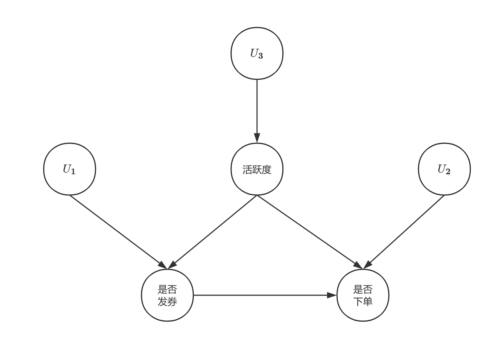
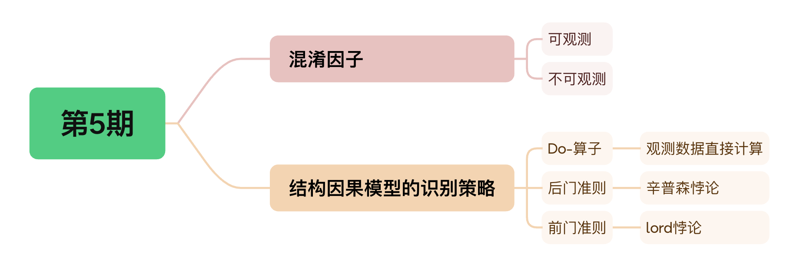
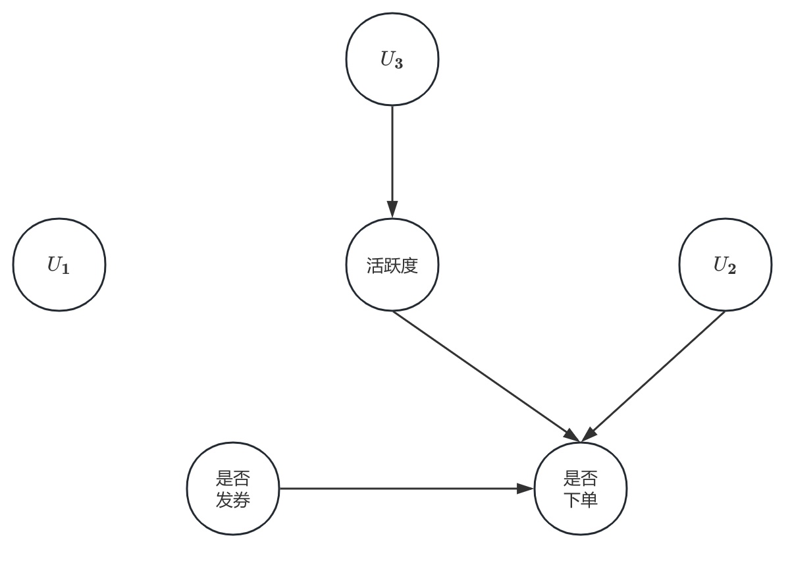
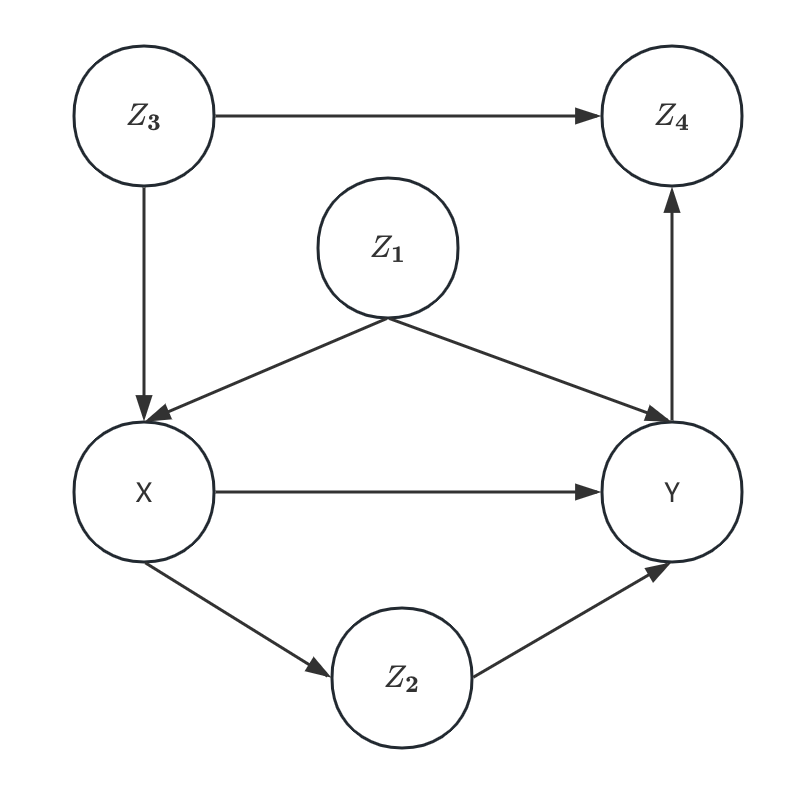
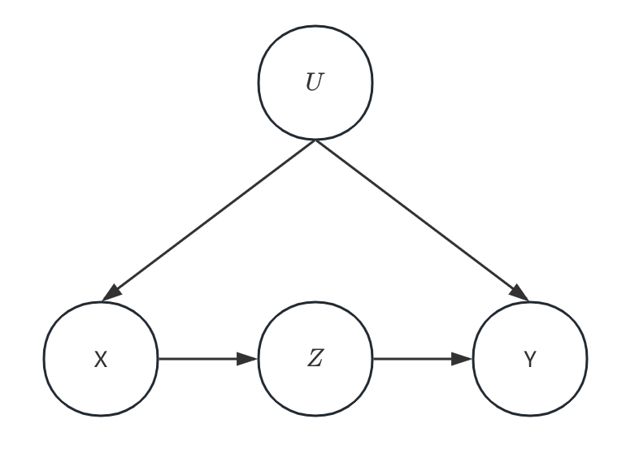
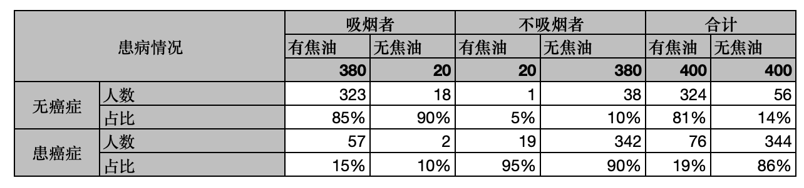

# 务实的因果推断——第5期

> 嗨~ 各位小伙伴们周末好呀~ 苏晓糖又带来了最新一期的内容吆~  在第4期内容中，苏晓糖介绍了进行因果发现的常见方法，在获得因果图后，接下来就是进行因果推断实践思路的第3个环节：基于获取到的因果图中识别混淆因子。 因此本期内容将聚焦在混淆因子以及结构因果模型的因果效应识别策略。好勒，我们就快速进入今天的正题吧~

## 情景导入

以第3期的问题为例，某电商平台APP，为刺激用户完成首单转化提升GMV，在未完成首单用户打开APP时，发放相同额度的优惠券，你会如何评估发券策略的ROI，并给出可能的策略优化方案？为介绍方便起见，假设我们的因果图如下，其中用户的活跃度是是否发券和是否下单的共同原因，$U_1,U_2,U_3$分别是影响是否发券、是否下单和活跃度的不可观测因素：

## 内容框架

在使用因果发现的方法确定因果图后，接下来便是基于因果图确认混淆因子，而结构因果模型的处理混淆因子的思想，有助于我们深入理解潜在因果模型，因此本期内容将会围绕以下话题进行展开：

- 混淆因子：可观测、不可观测
- 结构因果模型的识别策略：Do-算子、后门准则、前门准则

## 混淆因子

在第1期中我们讨论过混淆因子，即处理变量和结果变量的共同原因，以情景导入中的问题为例，用户活跃度是同时影响发券和下单的混淆因子，如果我们直接对比发券用户和未发券用户的下单率，很可能会高估发券策略对用户下单的影响。因为高活跃用户更可能收到优惠券，同时高活跃用户的下单率可能更高，因此发券用户群中可能天然有更多的高活跃用户，从而发券用户群的下单率也会更高。因此我们在进行因果效应估计时，需要消除混淆因子的影响，否则我们难以获得纯净的因果效应估计。

根据是否可以观测，可以将混淆因子分为可观测和不可观测两类。不同类型的混淆因子的在因果效应估计的过程中的处理难度和方式存在差异。可观测的混淆因子处理难度要显著低于不可观测地混淆因子，同时部分场景下，不可观测地混淆因子可能会导致我们的因果效应无法估计。

## 结构因果模型的识别策略

结构因果模型消除混淆因子的核心工具：Do-算子、后门准则、前门准则。其中Do-算子，在结构因果模型中最基础性的工具，后门准则是基于Do-算子处理可观测的混淆变量的工具，前门准则是基于Do-算子处理不可观测地混淆变量的工具。

### Do-算子

在情景导入中的场景下，假设我们直接使用条件期望$E[Y|T=1]-E[Y|T=0]$用来估计ATE，会存在偏差。

为了解决这个问题，结构因果模型引入了Do-算子用来表示干预的ATE，即
$$
ATE=E[Y|do(T=1)] - E[Y|do(T=0)]
$$
为不失一般性，以$E[Y|T=1]$和$E[Y|do(T=1)]$为例，条件期望和Do-算子表达式之间主要存在两层面的差异：

- 条件期望表示在T=1的组中结果变量的平均值，而Do-算子表达式则表示假设所有个体的处理变量T都取1时结果变量的平均值。更通俗一点讲，条件期望有筛选的含义，即在全体中筛选出所有T=1的个体，然后计算这部分个体结果变量的平均值。而Do-算子表达式不存在任何筛选的含义，仅是假想在所有个体的处理变量取某个值时结果变量的平均值。以情景导入中的问题为例，条件期望表示发券用户群的下单率，而Do-算子表达式则表示假设所有用户都发券时的下单率。

- 从是否影响影响因果图的角度来看，条件期望不影响因果图的结构，而Do-算子表达式可能会改变因果图的结构。具体来讲，Do-算子会将所有指向干预变量的边删除，然后基于剩下的因果图进行因果效应估计。以情景导入中的问题为例，在使用Do-算子表达式后，因果图变为如下，下面的因果图发生了如下变化，活跃度→是否发券和$U_1$→是否发券的两条边均被删除：

  

### 校正公式

使用Do-算子进行因果效应估计，就是基于改变后的因果图进行因果效应的估计。我们用以下校正公式计算因果效应，其中Z代表处理变量的父变量，证明过程放置在附录中进行。
$$
ATE = \sum_z(E[Y|T=1,Z=z] - E[Y|T=0,Z=z])P(Z=z)
$$
以情景导入中的问题为例，假设我们有以下数据，发券组下单率为80%，未发券组下单率为36%，同时我们发现高活跃用户在发券组中占比高达80%，而在未发券组占比仅20%，因此如果直接使用两个值作差作为处理效应的估计，则可能会高估发券对下单的影响。

| 组别 | 活跃度=高活跃 | 活跃度=低活跃 | 合计           |
| ---- | ------------- | ------------- | -------------- |
| 发券 | 80(下单70人)  | 20(下单10人)  | 100(下单80人)  |
| 无券 | 20(下单12人)  | 80(下单24人)  | 100(下单36人)  |
| 合计 | 100(下单82人) | 100(下单34人) | 200(下单116人) |

接下来我们使用校正公式进行因果效应的估计：

- 在高活跃用户群中，有
  $$
  (E[下单|发券,高活跃]-E[下单|未发券,高活跃])P(高活跃)=(\frac{70}{80}-\frac{12}{20})×\frac{80+20}{200} = 13.75\%
  $$

- 在低活跃用户群中，有
  $$
  (E[下单|发券,低活跃]-E[下单|未发券,低活跃])P(低活跃)=(\frac{10}{20}-\frac{24}{80})×\frac{80+20}{200} = 10\%
  $$
  因此发券对下单转化的影响为23.75%(13.75%+10%)，很显然，真实的因果效应，显著低于发券组和未发券组下达率的差值54%

### 后门准则

后门准则即：在给定的有向无环图中的一对有序变量(X,Y)，如果变量集合Z同时满足：

- Z阻断了X和Y之间的所有的后门路径(即指向X的路径)

- Z中没有X的后代节点

- 不会产生新的后门路径

  则称Z满足关于(X,Y)的后门准则。如果变量集合Z满足(X，Y)的后门准则，那么X对Y的因果效应可以由下式计算：

$$
E[Y|do(X=x_1)]-E[Y|do(X=x_2)]=\sum_z(E[Y|X=x_1,Z=z]-E[Y|X=x_2,Z=z])P(Z=z)
$$
以下图为例，X和Y之间共有4条路径，依次为:$X\rightarrow Y,X\leftarrow Z_1 \rightarrow Y,X\rightarrow Z_2 \rightarrow Y, X\leftarrow Z_3 \rightarrow Z_4 \leftarrow Y$，那么哪些变量集合满足(X,Y)的后门准则呐？显然 $\{Z_1\}$ 和$\{Z_1, Z_3\}$和$\{Z_1,Z_3,Z_4\}$均是满足后门规则的变量集合，所有包含$Z_2$，包含$Z_4$但不含$Z_3$的集合均不满足后门规则。因为$Z_2$是X的后代节点，而$Z_4$为对撞节点，如果以$Z_4$作为条件的同时不以$Z_3$为条件，必然会打开新的后门路径$X\leftarrow Z_3 \rightarrow Z_4 \leftarrow Y$。

### 前门准则

后门准则一般适用于混淆因子可观测的情况下，但是当混淆因子不可观测时，并不代表因果效应不可识别。在某些情况下，我们可以使用前门准则对因果效应进行估计。

前门准则即：在给定的有向无环图中的一对有序变量(X,Y)，如果变量集合Z同时满足：

- Z切断了所有X到Y的有向路径
- X到Z没有后门路径
- 所有Z到Y的后门路径都被X阻断

则变量集合Z被称为满足关于有向变量对(X,Y)的前门准则。如果变量集合Z满足前门准则且$P(x,z)>0$,那么X对Y的因果效应可以用下式子进行估计：
$$
\begin{align}
E[Y|do(X=x_1)]-E[Y|do(X=x_2)] &= \sum_yyP(Y=y|do(X=x_1))-\sum_yyP(Y=y|do(X=x_2))\\
&=\sum_y y\sum_zP(Z=z|X=x_1)\sum_{x'}P(Y=y|X=x',Z=z)P(X=x')\\
&-\sum_y y\sum_zP(Z=z|X=x_2)\sum_{x'}P(Y=y|X=x',Z=z)P(X=x')
\end{align}
$$
前门准则的证明放置在附录之中。如下图所示，U是不可观测地混淆因子，Z是满足前门准则的变量集合。

以吸烟对肺癌患病率影响的案例为例，假设X表示是否吸烟，Y表示是否患肺癌，Z表示肺部是否有焦油沉积，U表示基因。我们现在有以下数据，我们如何使用前门规则对吸烟对肺癌患病率的因果效应进行估计呐？

根据因果效应的定义我们有：
$$
E[Y=患肺癌|do(T=吸烟)] - E[Y=患肺癌|do(T=不吸烟)]
$$

- 固定所有个体都吸烟时，基于前门准则，患肺癌的概率为：
  $$
  \begin{align}
  E[Y=患肺癌|do(T=吸烟)] &=P(患肺癌|do(吸烟))\\
  &=P(有焦油|吸烟)P(患肺癌|do(有焦油)) +P(无焦油|吸烟)P(患肺癌|do(无焦油)) \\
  &=P(有焦油|吸烟)(P(患肺癌|有焦油,吸烟)P(吸烟)+P(患肺癌|有焦油,不吸烟)P(不吸烟)) \\
  &  +P(无焦油|吸烟)(P(患肺癌|无焦油,吸烟)P(吸烟)+P(患肺癌|无焦油,不吸烟)P(不吸烟))\\
  &=\frac{380}{400}(\frac{57}{380}×\frac{400}{400+400}+\frac{19}{20}×\frac{400}{400+400})\\&+\frac{20}{400}(\frac{2}{20}×\frac{400}{400+400}+\frac{342}{380}×\frac{400}{400+400})\\
  &=54.8\%
  \end{align}
  $$

- 固定所有个体都不吸烟时，基于前门准则，患肺癌的概率为：
  $$
  \begin{align}
  E[Y=患肺癌|do(T=吸烟)] &=P(患肺癌|do(不吸烟))\\
  &=P(有焦油|不吸烟)P(患肺癌|do(有焦油)) +P(无焦油|不吸烟)P(患肺癌|do(无焦油)) \\
  &=P(有焦油|不吸烟)(P(患肺癌|有焦油,吸烟)P(吸烟)+P(患肺癌|有焦油,不吸烟)P(不吸烟)) \\
  &  +P(无焦油|不吸烟)(P(患肺癌|无焦油,吸烟)P(吸烟)+P(患肺癌|无焦油,不吸烟)P(不吸烟))\\
  &=\frac{20}{380+20}(\frac{57}{380}×\frac{400}{400+400}+\frac{19}{20}×\frac{400}{400+400})\\&+\frac{380}{20+380}(\frac{2}{20}×\frac{400}{400+400}+\frac{342}{380}×\frac{400}{400+400})\\
  &=50.3\%
  \end{align}
  $$
  因此吸烟提升了个体的肺癌患病率约4.5%

## 资源推荐

- **综述类文章**：Liuyi Yao, Zhixuan Chu, Sheng Li, Yaliang Li, Jing Gao, and Aidong Zhang. 2021. A Survey on Causal Inference. ACM Trans. Knowl. Discov. Data 15, 5, Article 74 (May 2021), 46 pages.
- **著作类**:
  - 《Caussal Inference in Statistics：A Primer》 Judea Pearl等著
  - 《Causal Inference: What If 》Jamie Robins等著
  - 《基本有用的计量经济学》赵西亮著
- **实践类**：https://github.com/matheusfacure/python-causality-handbook

## 附录

### 校正公式的证明

在此给出简单的证明，其中：

- 第2个等号使用条件期望的定义得到
- 第3个等号使用Do-算子的定义得到，$P_m$代表Do-算子修正后因果图对应的概率分布
- 第4个等号使用全概率公式得到
- 第5个等号使用条件概率公式得到
- 第6个等号为交换积分顺序得到
- 第7个等号，基于Do-算子修正后的因果图的性质(条件概率不变和边缘概率不变)得到
- 第8个等号，基于条件期望的定义式得到

$$
\begin{align}
ATE&=E[Y|do(T=1)]-E[Y|do(T=0)]\\
&=\sum_yyP(Y=y|do(T=1)) -\sum_yyP(Y=y|do(T=0))\\
&=\sum_yyP_m(Y=y|T=1)-\sum_yyP_m(Y=y|T=0)\\
&=\sum_yy\sum_zP_m(Y=y,Z=z|T=1)-\sum_yy\sum_zP_m(Y=y,Z=z|T=0)\\
&=\sum_yy\sum_zP_m(Y=y|T=1,Z=z)P_m(Z=z)-\sum_yy\sum_zP_m(Y=y|T=0,Z=z)P_m(Z=z)\\
&=\sum_z(\sum_yyP_m(Y=y|T=1,Z=z))P_m(Z=z)-\sum_z(\sum_yyP_m(Y=y|T=0,Z=z))P_m(Z=z)\\
&=\sum_z(\sum_yyP(Y=y|T=1,Z=z))P(Z=z)-\sum_z(\sum_yyP(Y=y|T=0,Z=z))P(Z=z)\\
&=\sum_zE[Y|T=1,Z=z]P(Z=z)-\sum_zE[Y|T=0,Z=z]P(Z=z)\\
&= \sum_z(E[Y|T=1,Z=z] - E[Y|T=0,Z=z])P(Z=z)
\end{align}
$$

### 前门准则的证明

要证明前门准则成立，即证明下式成立：
$$
P(Y=y|do(X=x_1)) =\sum_zP(Z=z|X=x_1)\sum_{x'}P(Y=y|X=x',Z=z)P(X=x')
$$
首先：X对Z的因果效应可以使用下式估计，因为X和Z之间没有后门路径：
$$
P(Z=z|do(X=x_1)) = P(Z=z|X=x_1)
$$
其次：Z对Y的因果效应可以使用校正公式进行估计，因为X阻断了X和Y之间的后门路径
$$
P(Y=y|do(Z=z)) = \sum_{x'}P(Y=y|Z=z,X=x')P(X=x')
$$
再次，X固定为$x_1$时，通过$Z=z_1$的路径影响y，此时有概率
$$
P_{z_1}(Y=y|do(X=x_1)) = P(Z=z_1|do(X=x_1))P(Y=y|do(Z=z_1))
$$
最后，将所有Z的影响路径求和有
$$
\begin{align}P(Y=y|do(X=x_1)) &= \sum_zP_z(Y=y|do(X=x_1))\\
&=\sum_zP(Z=z|do(X=x_1))P(Y=y|do(Z=z))\\
&=\sum_zP(Z=z|X=x_1) \sum_{x'}P(Y=y|Z=z,X=x')P(X=x')
\end{align}
$$
此时结论得证。

