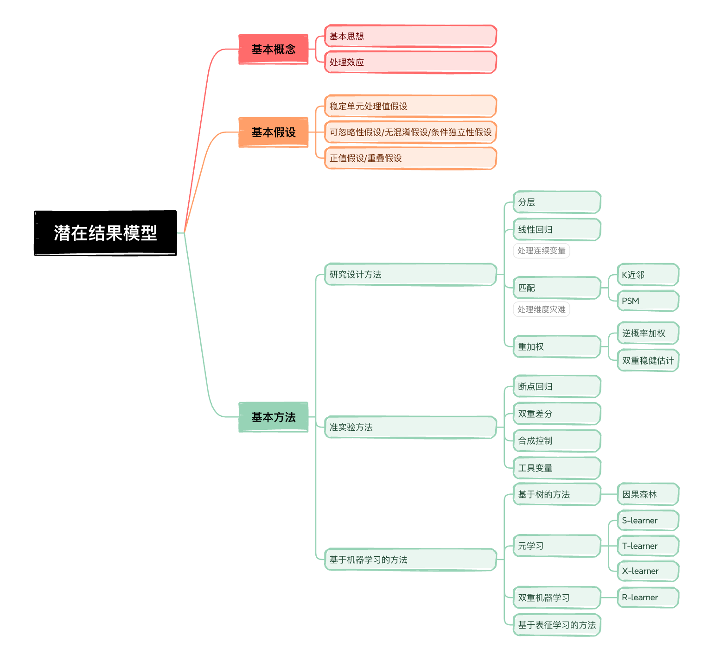

# 务实的因果推断——第6期

> 嗨~ 各位小伙伴们周末好呀~ 很开心又和大家见面~ 请让我们再一起回想一下，因果推断的实践思路，依次是：①定义问题；②因果图分析变量关系；③因果图圈定混淆因子；④选择因果效应的估计方法；⑤稳健性检验和有效性检验。前5期内容我们基本将前三个环节介绍完毕。本期及后面若干期内容则会将重点放在第4个环节：选择因果效应的估计方法，此处特指潜在因果模型相关的方法。为了帮助大家更好的理解各种因果估计方法，本期则会将重点放在潜在因果模型整个框架的介绍之上。好勒~ 跟着苏晓糖一起进入今天的正式内容吧~ 

## 情景导入

以第3期的问题为例，某电商平台APP，为刺激用户完成首单转化提升GMV，在未完成首单用户打开APP时，发放相同额度的优惠券，你会如何评估发券策略的ROI，并给出可能的策略优化方案？

## 内容框架

我们用了3期内容讲述结构因果模型，通过因果图、do-算子和前后门准则估计因果效应，而潜在结果模型又是如何估计因果效应的呐？苏晓糖会用数期内容去介绍，潜在结果模型的基本框架、基本假设以及常用方法，而本期内容则会聚焦于潜在结果模型的框架层面的介绍，主要包含以下内容：

- 基本概念：基本思想、处理效应定义
- 基本假设：稳定单元处理值假设(SUTVA)、可忽略性假设(Ignorability)、正值假设(Positivity)
- 基本方法：研究设计方法、准实验、基于机器学习的方法

## 基本概念

### 基本思想

以情景导入中的问题为例，如果我们直接对比发券和未发券用户的下单转化，由于高活用户更可能获得优惠券且自然下单转化的可能性更高，可能导致严重高估优惠券对下单转化的正向影响，浪费营销费用。那么如何解决这个问题呐？通常来讲我们有两种思路：

- 在群体层面，通过某种方式，获取发券用户群体的可比未发券群体，进而估计平均处理效应
- 在个体层面，通过某种方式，获取发券用户假设在未发券条件下的潜在结果，估计个体处理效应后，进而计算平均处理效应。

而**潜在结果模型基本也是秉持着这两种思路，衍生出了众多的方法，即要么为处理组寻找可比的对照组(或为对照组寻找可比的处理组)，要么为处理组个体计算反事实(或为对照组个体计算反事实)**。

### 处理效应

在第2期中，我们有详细介绍各类处理效应的定义，包括平均处理效应(ATE)、处理组平均处理效应(ATT)、对照组平均处理效应(ATU)、条件平均处理效应(CATE)、个体处理效应(ITE)。因此在此，不再做过多的介绍，如果有新来的小伙伴，可以点击文中链接进行查看哦~

## 基本假设

潜在结果模型的有效性建立在以下三个重要假设之上：稳定单元处理值假设(SUTVA)、可忽略性假设(Ignorability)、正值假设(Positivity)。因此我们在使用潜在结果模型的时，要时刻警惕当前场景是否满足这三个假设。接下来，就由苏晓糖给大家详细介绍这三个核心假设。

### 稳定单元处理值假设(SUTVA)

稳定单元处理值假设，即每个个体的潜在结果(即$Y_i(0),Y_i(1)$)不会受到其他个体的影响，且同一个处理，不存在不同版本。该假设暗含了两层假设：

- 每个个体之间都是独立的，不存在个体间的交互影响。熟悉AB实验的小伙伴一定对此比较了解。如果对AB实验不了解的小伙伴也可以点击链接，查看AB实验系列内容。如以情景导入中的问题为例，简单来讲，该假设是在假设发券用户下单不会直接影响到未发券用户的下单。
- 每类处理只有一个版本。以情景导入中的问题为例，简单来讲，该假设是在假设发券用户收到的优惠券金额应该保持一致，如果优惠券金额存在个体间的差异，应该将其视作不同的处理。

如何验证稳定单元处理值假设是否成立呐？苏晓糖认为，这更多的基于对具体的业务过程进行判断。假如我们的业务场景是邀请拼单类场景，发券用户可能会邀请未发券用户进行拼单，此时假设很难成立。又比如我们发放的优惠券存在不同的优惠金额(比如10/20/30元)或优惠方式(买赠/满减等)，我们就需要将不同的类型的优惠券，视作不同的处理版本。

### 可忽略性假设(Ignorability)

可忽略性假设，也叫无混淆假设或条件独立性假设，即在给定协变量的条件下，处理变量与潜在结果独立，即
$$
W⊥(Y_i(0),Y_i(1))|X
$$
可忽略性假设包含两层含义：

- 在协变量X相同时，个体的潜在结果(或分布)应该相同，无论个体是否收到处理。即：
  $$
  P(Y_i(0), Y_i(0)|X=x,W=W_i) = P(Y_j(0), Y_j(0)|X=x,W=W_j)
  $$

- 在协变量X相同时，个体受到处理的概率(或处理分配机制)应该相同，无论个体潜在结果如何取值。即：
  $$
  P(W|X=x,Y_i(0),Y_i(1))=P(W|X=x,Y_j(0),Y_j(1))
  $$

如果以情景导入中的问题为例，可忽略性假设是在说，假设两个用户的特征相同(比如渠道、活跃度)，此时有：

- 这两个用户的潜在结果应该一致，即假设发券，两个个体下单概率相同，且假设不发券，两个个体下单概率相同。

- 这两个用户被发券的概率应该相同，或者说都应该服从相同的概率分布。

  | 是否发券 | W=0  | W=1  |
  | :------: | :--: | :--: |
  | 概率(P)  | 1-P  |  P   |

那么如何证明可忽略性假设是否成立呐？理论上讲该假设很难被证真，但是我们可以通过一些方法证伪。比如我们可以观察处理组和未处理组的个体不同特征(同时影响结果变量和处理变量的特征)的分布是否存在显著性差异，如果存在，则说明该假设不成立，可以参考AB实验系列的第8期。当然假设检验方法，可能存在参数检验和非参数检验两大类方法，至于非参数检验方法，苏晓糖计划单开一期内容进行介绍。

### 正值假设(Positivity)

正值假设，也叫重叠性假设，即对于协变量X的任何取值，处理概率应该介于0到1之间。即
$$
0 \lt P(W=w|X=x) \lt 1, \forall w \quad and \quad x
$$
正值假设是在说，假设对于协变量X的某些取值x，其永远都会被处理，或这永远都不会被处理，则对于协变量X取值为x的个体而言，永远只能观察到一种结果，那么估计此类个体的处理效应是没有意义的。其实也可以理解为，正值假设要求估计处理效应时存在可变性。

## 基本方法

潜在结果模型框架中包含众多的方法，但总体而言，可以分为：统计设计方法、准实验方法、基于机器学习的方法。在本期内容中仅介绍各类方法的常见方法，具体的操作细节，苏晓糖会在后续的各期内容中进行详细介绍~

### 统计设计方法

基于研究设计的方法，**通常基于观测数据，使用统计方法调整，使潜在结果模型的假设尤其是可忽略性假设成立**。此类方法主要包括**分层方法、线性回归方法、匹配方法(如K近邻、PSM)、重加权方法(如逆概率加权、双重稳健估计等)**。此类方法假设较强，只有到所有的混淆变量都被合理的处理时，才可能得出无偏的因果效应估计。

### 准实验方法

基于准实验的方法，多是**基于“外生”冲击的准实验分配来模拟随机对照实验**。它不依赖于控制所有的混淆变量，但是依赖于某种特殊的数据生成过程来估计因果效应。相较于统计设计方法而言，其假设更弱，也更容易满足。常见的方法包括**双重差分、断点回归、合成控制、工具变量法**。

### 基于机器学习的方法

基于机器学习的方法，本质上讲并非是单独的方法，更多是将机器学习的强大与因果推断的方法结合，嵌入到前两类方法中。此类方法多**用于处理复杂的高纬数据和异质性评估**。此类方法主要包括**基于树的方法(比如因果森林)、元学习(如S-learner、T-learner、X-learner)、双重机器学习(如R-learner)、基于表征的学习方法**等。

## 资源推荐

- **综述类文章**：Liuyi Yao, Zhixuan Chu, Sheng Li, Yaliang Li, Jing Gao, and Aidong Zhang. 2021. A Survey on Causal Inference. ACM Trans. Knowl. Discov. Data 15, 5, Article 74 (May 2021), 46 pages.
- **著作类**:
  - 《Caussal Inference in Statistics：A Primer》 Judea Pearl等著
  - 《Causal Inference: What If 》Jamie Robins等著
  - 《基本有用的计量经济学》赵西亮著
- **实践类**：https://github.com/matheusfacure/python-causality-handbook

